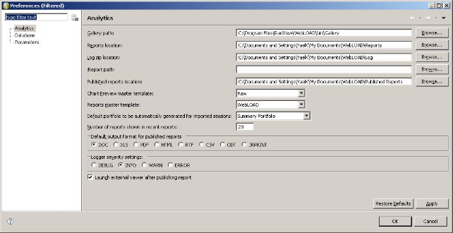
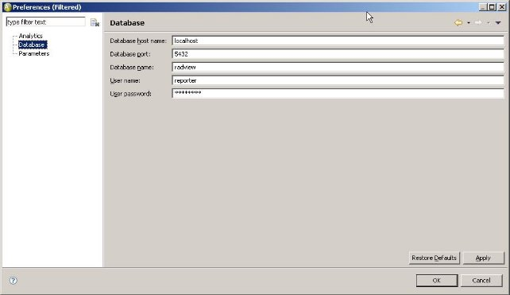
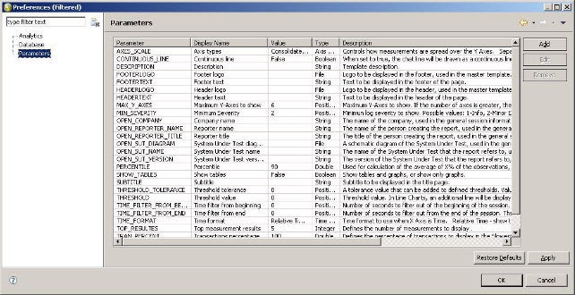

# Defining Your Preferences

You can define your default preferences for the following:  

- **Analytics Preferences** – General display and file location preferences (see[Defining Your Analytics Preferences](#defining-your-analytics-preferences). 
- **Database Preferences** – Preferences related to the WebLOAD Analytics PostgreSQL Load Session Repository (see[Defining Your Database Preferences](#defining-your-database-preferences). 
- **Parameters Preferences** – Customize your template parameters globally (see [Defining Your Parameter Preferences](#defining-your-parameter-preferences). 

## Defining Your Analytics Preferences

WebLOAD enables you to define default Analytics parameters relating to saving and storing templates, reports, and log files. You can define the number of recently used reports and recently used sessions available to view in WebLOAD Analytics. You can also specify a path to Jasper iReport to enable you to access it directly from WebLOAD Analytics. 

**To define the Analytics preferences:** 

1. Select **Window** > **Preferences**. The Preferences window opens, displaying the Analytics preferences by default. 

   

   

2. Edit the Analytics preferences, according to the information in the following table: 

   | **Preference**                                               | **Description**                                              |
   | ------------------------------------------------------------ | ------------------------------------------------------------ |
   | Gallery Path                                                 | The default location in  which your templates and template categories are stored.  Edit the path, or click **Browse** to specify a different default location. |
   | Reports location                                             | The default location to which your WebLOAD  reports are saved.  Edit the path, or click **Browse**, to specify a different default location. |
   | Log zip location                                             | The default location to which zipped log  files are saved.  Edit the path, or click **Browse** to specify a different default location. |
   | iReport path                                                 | The location of the JasperSoft  iReport.exe application file.  Use this field to enable  editing templates in JasperSoft iReport or launch JasperSoft iReport directly  from WebLOAD Analytics. This option is only applicable if you have JasperSoft  iReport installed on your machine (see [*Using JasperSoft   iReport* ](templates.md#using-jaspersoft-ireport). |
   | Published reports location                                   | The default location to which your WebLOAD  reports are published.  Edit the path, or click **Browse**, to specify a different default location. |
   | Chart Preview master  template                               | The master template that WebLOAD uses for your  charts. The following master templates are available:  Ÿ **Raw** –  Displays only the actual data (table/graph). The title page, opening page,  background, footers, and so on, are not included in the report.  Ÿ **WebLOAD** – In addition to displaying the actual data, displays also a title page, and footers/headers with page  numbers, logos, etc.  **WebLOAD with  background** –  In addition to the items displayed in the **WebLOAD** master template, displays also a background image. |
   | Reports master template                                      | The master template that WebLOAD uses for  your reports. The same master  templates available for Charts are available for Reports (Raw, WebLOAD,  WebLOAD with background). |
   | Default portfolio to be  automatically generated for imported sessions | The portfolio that WebLOAD  Analytics automatically generates when you import a Load Session. The default  portfolio is the Summary portfolio.  Select **None**  to disable this function. |
   | Number of reports shown in  recent reports                   | The number of recently used reports you  want to display in the Recent Reports tab. |
   | Default output format for  published reports                 | The default format in which your reports are  published.  Select the format you want your reports to  be published in by default from the options listed. |
   | Logger severity settings                                     | The minimum severity level of errors that  are logged. Used for support purposes only. |
   | Launch external viewer  after publishing report              | Select this option to open a published  report in its native application immediately after publishing. When this  option is not selected, the published report is not opened. |

   

3. Click **OK** to save changes, 

   -Or- 

   Click **Restore** **Defaults** to restore preferences to the factory default settings.

   

## Defining Your Database Preferences

WebLOAD Analytics enables you to define default parameters relating to the WebLOAD Analytics Load Session Repository, including username and password details. In order to connect to a remote database, additional configuration for that remote database may be necessary (for more information, see the *WebLOAD Installation Guide*). 

**To define your database preferences:** 

1. Select **Window** > **Preferences**. The Preferences window opens displaying the Analytics preferences by default. 

1. Click **Database**, 

   -Or- 

   Type Database in the type filter text field, and press **Enter**. The Database preferences are displayed. 

   

   

1. Edit the Database preferences, according to the information in the following table: 

   | **Preference**     | **Description**                                              |
   | ------------------ | ------------------------------------------------------------ |
   | Database host name | The host on which the database is located.                   |
   | Database port      | The port used to access the database.                        |
   | Database name      | The name of the database.                                    |
   | User name          | The database user name.  The user name is defined during installation. |
   | User password      | The database password.  The password is defined during  installation. |

1. Click **OK** to save changes, 

   -Or- 

   Click **Restore** **Defaults** to restore preferences to the factory default settings. 

## Defining Your Parameter Preferences

The Preferences window enables you to define default parameters relating to the charts and reports you produce using WebLOAD Analytics.  

Parameters can be applied locally to individual charts, or globally to all charts and reports. If the same parameter is defined locally, the local parameter overrides the global parameter.  

For information about applying parameter preferences locally, to individual templates, see[*Modifying Chart Parameters* ](changing_chart_settings.md#modifying-chart-parameters).

**To display the global parameter preferences:** 

1. Select **Window** > **Preferences**. The Preferences window opens displaying the Analytics preferences by default. 

1. Click **Parameter**,  -Or- Type Parameter in the type filter text field and press **Enter**. The Parameters preferences are displayed. 

   

This table provides a description of the default parameters and their functions. 

| **Parameter**                | **Description**                                              | **Valid Values**                                             | **Applicable Templates**                                     |
| ---------------------------- | ------------------------------------------------------------ | ------------------------------------------------------------ | ------------------------------------------------------------ |
| AXES_SCALE                   | Controls how measurements are spread over the  Y-axes.  Ÿ Separate Y-Axes – each  measurement is shown on its own axis.  Ÿ Single Y-Axis – all  measurements are shown on a single  axis, using a single scale. Values that are an order of magnitude smaller may  appear as zero.  Ÿ Consolidate Y-Axes by type  – show measurements of the same type/unit on the same axis and scale.  Ÿ Auto scale to single  Y-Axis – show all measurements on a single, 0-100 scaled axis. Each measurement is scaled accordingly.  Ÿ Show only trends – show  all measurements without scale. The actual values cannot be understood from  the graph. This option is used to compare  trends. | Specify one of the  following:  Ÿ Separate Y-Axes  Ÿ Single Y-Axis  Ÿ Consolidate Y-Axes by type (default value)  Ÿ Auto scale to single  Y-Axis  Ÿ Show only trends | All interactive templates.                                   |
| COMMENTS                     | Any additional comments,  displayed under the *Additional Comments*  heading on the opening page. | Enter the text you wish to  display.                         | General Session  Information  All interactive templates      |
| CONTINUOUS_ LINE             | Defines whether to draw  the chart line as a continuous  line, bridging over missing data points.  Set to True when data  points are likely to be missing  (such as in a Transactions Over Time charts). | Select True or False.                                        | All interactive templates                                    |
| FOOTERLOGO                   | The logo or image that you  wish to display in the footer.   | Enter the path to the  image that you wish to use, in the format:  \\pathname | Master templates                                             |
| FOOTERTEXT                   | The text that you wish to  display in the footer of the page. | Enter the text you wish to display.                          | Master templates                                             |
| HEADERLOGO                   | The logo or image that you  wish to display in the header.   | Enter the path to the  image that you wish to use, in the format:  \\pathname | Master templates                                             |
| HEADERTEXT                   | The text that you wish to  display in the header of the page. | Enter the text you wish to display.                          | Master templates                                             |
| MAX_Y_AXES                   | Determines the maximum number of Y-axes to show.  If the number of Y-axes in  your repot is greater than this value, the Y-axes are consolidated to a  single axis (similar to AXES_SCALE = Auto scale to single Y-Axis). | Enter a numerical value (Default = 6).                       | All interactive templates.                                   |
| MIN_SEVERITY                 | The minimum log severity level to show. The  levels are:  1 – Info  2 – Minor error 3 – Error  4 –  Severe error | Enter a numerical value from 1 – 4.                          | Errors By Severity Error Per Second Log Messages  Log Summary |
| OPEN_ COMPANY                | The company name that you wish to display on the  opening page. | Enter the text you wish to display.                          | General Session  Information                                 |
| OPEN_ REPORTER_ NAME         | The name of the person creating the chart,  displayed on the opening page. | Enter the text you wish to display.                          | General Session  Information                                 |
| OPEN_ REPORTER_ TITLE        | The title of the person creating the chart,  displayed on the opening page. | Enter the text you wish to display.                          | General Session  Information                                 |
| OPEN_SUT_ DIAGRAM            | A schematic diagram of the SUT to which the chart  refers, displayed on the opening page. | Enter the path to the  image that you wish to use, in the format:  \\pathname | General Session  Information                                 |
| OPEN_SUT_ NAME               | The name of the System Under Test (SUT) to which  the chart refers, displayed on the opening page. | Enter the text you wish to  display.                         | General Session  Information                                 |
| OPEN_SUT_ VERSION            | The version of the SUT to which the chart refers,  displayed on the opening page. | Enter the text you wish to  display.                         | General Session  Information                                 |
| PERCENTILE                   | Defines a value below  which X percent of the observations fall.  For example, the 20th percentile is the value  below which 20 percent of the observations may be found. In other words, a  test score that is greater than 85 percent of the scores of people taking the  test is referred to as being at the 85th percentile. | Enter the percentage of  results you wish to display (Default = 90). | Failed  Transactions Slowest Transaction  Transactions  Summary |
| SHOW_ TABLES                 | Defines whether to show tables and graphs, or show  only graphs. | Select True or False.                                        | All                                                          |
| SUBTITLE                     | The subtitle that you wish to display in the title  page.    | Enter the text you wish to  display.                         | Master  templates                                            |
| THRESHOLD_ TOLERANCE         | Defines a tolerance range, above the  threshold value. Results in the chart table that fall within the threshold  tolerance range are displayed in yellow.  On line graphs, a line representing the tolerance  threshold is displayed. | Enter a numerical value  above the threshold value, to define the range (Default = 0). | Regression templates  All interactive templates              |
| THRESHOLD                    | Defines a threshold value above which results are highlighted in  your chart.  Results exceeding the  threshold value are displayed in red.  On line graphs, a line representing the tolerance value is displayed. | Enter a numerical  threshold value (Default = 0).            | Regression templates  All interactive  templates             |
| TIME_FILTER_ FROM_ BEGINNING | Defines the number of  seconds to trim from the beginning of a session, by default.  This is useful if there is  often a lot of noise at the beginning of a session | Enter a numerical value  (Default = 0)                       | All templates with a time  filter                            |
| TIME_FILTER_ FROM_END        | Defines the number of  seconds to trim from the end of a  session, by default.  This is useful if there is often a lot of noise at  the end of a session | Enter a numerical value  (Default = 0).                      | All templates with a time  filter                            |
| TIME_FORMAT                  | The time format to use  when the X-axis represents time.  Relative Time – shows the  time that elapsed since session start time.  Absolute Time – shows the  full time.  Absolute Date – shows the full date and time.  Relative Seconds – shows  the number of seconds that elapsed since session start time. | Specify one of the following:  Ÿ Relative Time (default value)  Ÿ Absolute Time  Ÿ Absolute Date  Relative Seconds | All interactive templates.  Relevant when the X-axis represents time. |
| TOP_RESULTS                  | The default number of  displayed measurements, starting from the first measurement in the list.  The number zero (0)  indicates all specified measurements. | Enter a numerical value (Default = 0)                        | All interactive templates                                    |
| TRAN_PERCENT                 | Defines the percentage of transactions you  wish to display in a chart.  This parameter takes  precedence over the TRAN_QTY parameter. | Enter a numerical value (Default = 100).                     | Slowest Transactions  Transactions with Most  Failures       |
| TRAN_QTY                     | Defines the number of transactions you wish  to display in a chart.  This parameter is relevant if the TRAN_PERCENT  parameter is zero (0). | Enter a numerical value (Default = 10).                      | Slowest Transactions  Transactions with Most Failures        |

**To apply a parameter to your charts or reports globally:**  

1. From the parameters displayed in the Preferences window, select the parameter you wish to edit and click **Edit**. The Edit Parameter window appears. 

1. Edit the relevant fields and click **OK**. The parameters table is updated to reflect your changes. The parameter is applied each time you create a new chart or report. 

   

**To add a new parameter to the parameters list:**  

1. In the Parameters tab of the Preferences window, click **Add**. The Add Parameter window appears. 

1. Enter information for the new parameter, according to the following table: 

   | **Field**       | **Description**                                              |
   | --------------- | ------------------------------------------------------------ |
   | Parameter Name  | The name of the parameter.                                   |
   | Display Name    | The name that is displayed in the template  parameters list. |
   | Parameter Type  | The type of parameter:  Ÿ String  Ÿ Integer  Ÿ Double  Ÿ Positive Integer  Ÿ Positive Double |
   | Parameter Value | The value of the parameter.                                  |
   | Description     | A short description of the function of the  parameter.       |

   

1. Click **OK**. The parameter is added to the parameters list and the change is applied to the Templates Gallery. 

**To remove a parameter from the parameters list:**  

- From the list of parameters displayed in the Preferences window, select the parameter you wish to remove and click **Remove**. The parameter is removed from the list. 

  > **Note:** RadView recommends that you do not remove any parameters. To restore the  default list of parameters, click **Restore Defaults**. When selecting Restore Defaults, all existing parameters and their associated values are restored to their default settings.
