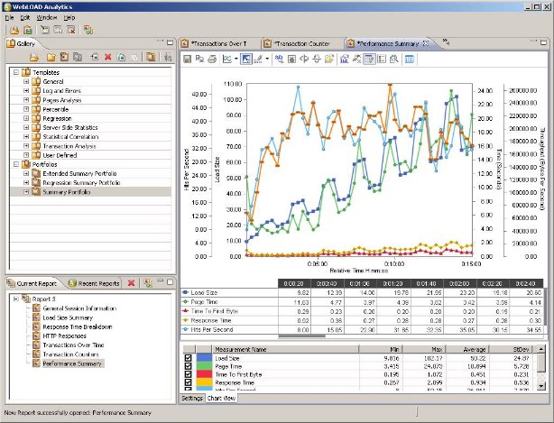
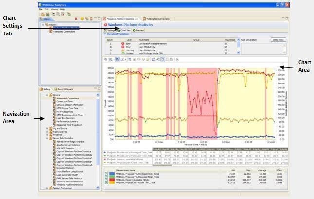

# Getting Started

WebLOAD Analytics provides a user friendly interface for creating your charts and reports, based on Load Session data. This section provides you with the information you need to start working with WebLOAD Analytics. 

## Launching WebLOAD Analytics

You can launch WebLOAD Analytics quickly and easily from WebLOAD Console. 

> **Note:** WebLOAD Analytics is installed as part of the WebLOAD installation. For information about how to install WebLOAD, see the WebLOAD Installation Guide.

**To launch WebLOAD Analytics from WebLOAD Console:** 

1. Select **Tools** > **Open WebLOAD Analytics**,  

   -Or- 

   Click the **WebLOAD Analytics ** icon. 

   WebLOAD Analytics opens. The Session Load you were working on in the WebLOAD Console is automatically loaded into WebLOAD Analytics, and some charts analyzing the Load Session are displayed. 

   

   

## Understanding the User Interface

WebLOAD Analytics is designed to enable you to quickly and easily create, edit, print, publish, and manage charts and reports.  

The user interface consists of the following elements: 

- **Menu Bar** – Enables you to perform WebLOAD Analytics functions through the File, Edit, Window, and Help menus. 
- **Main Toolbar** – This toolbar provides you with shortcuts to the main WebLOAD Analytics functions, including creating new charts, opening existing charts, and saving the reports on which you are working.  
- **Navigation Area** – This area contains the Gallery, Current Report, and Recent Reports tabs. It displays the templates, current reports, and recently used reports available for use, depending on which tab you select.  
- **Gallery Tab** – This tab displays all the templates and portfolios, organized in a hierarchical tree structure. 
- **Current Report Tab** – This tab lists all the open charts in the Charts area. They are all grouped under a Report node.  
- **Recent Reports Tab** – This tab lists all the previously saved Reports, each of which consists of a group of charts. 
- **Charts Area** – This area displays all open charts. Each chart has its own tab, so you can easily switch between the different charts with which you are working. For information about creating, opening, saving, and viewing charts, see[Generating Charts](generating_charts.md) 
- **Chart Tab** – A tab is displayed for each open chart, showing the chart title. When a chart is selected, its settings are displayed in the Settings tab and the generated chart is displayed in the Preview tab and/or Chart View tab. The Preview tab shows the chart in its ready-to-print form. The Chart View tab, available only for interactive charts, enables manipulating the chart display in various ways. 

You can easily resize or move the Charts area and Navigation area by dragging each component. 

## Accessing Help

WebLOAD Analytics provides various help-related functions that enable you to access or display the following: 

- **Help** – WebLOAD provides a comprehensive online help system with step-by-step instructions for common tasks. 

  You can press **F1** from any open window for an explanation of the options, or select **Help** > **Help Contents** to open the online help contents and index.  

- **Version Information** – Information about the version of WebLOAD Analytics that you are using, including copyright and licensing information, plugins, and configuration details. Select **Help** > **About** to access this information. 
- **WebLOAD Community Website** – Select **Help** > **RadView.com** to access the website. 
- **Professional Support** – Enables you to zip log files created by WebLOAD Analytics, for analysis by RadView support.  
  - To create a zip of the WebLOAD Analytics log files, select **Help** > **Create Log Zip**. A confirmation message specifying the location of the zip file appears. 

WebLOAD Analytics creates three types of log files: 

- Analytics log. 
- Import Process Trace File (TRC) log. 
- Eclipse Environment log. 

WebLOAD Analytics provides a fast and easy way to move relevant log files to a zip file. The zip file can then be emailed to RadView Support, when required. 

- To automatically send a zip file of the WebLOAD Analytics log files to RadView support, select **Help** > **Send Logs**. An automatic e-mail message is composed in your default e-mail program, with the zip file attached. 

