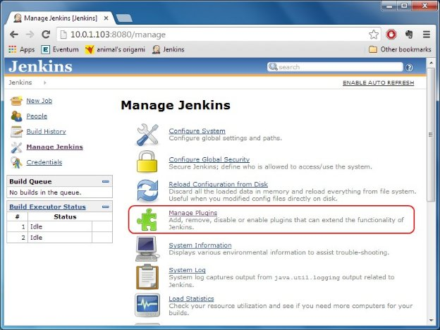
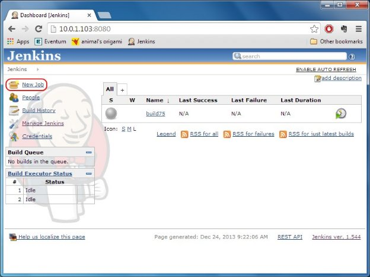
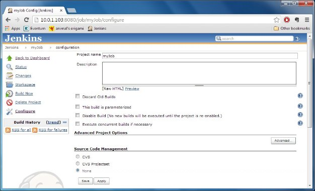
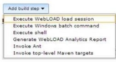
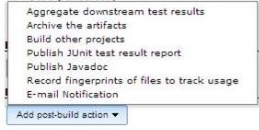
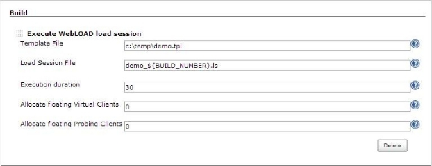
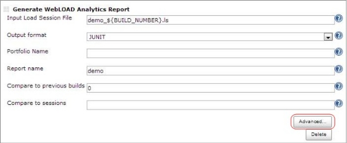
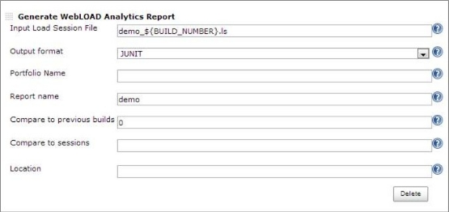

# Running WebLOAD in Jenkins

[Jenkins CI ](http://jenkins-ci.org/)is a Continuous Integration server that is growing in popularity. Agile development teams use Jenkins to run their builds, tests and deployments as well as their performance tests if possible. Jenkins is extendable by means of plugins. As of WebLOAD 10.1, a WebLOAD plugin is available for Jenkins.

**To run WebLOAD jobs in Jenkins, you must:**

1. Install a Jenkins CI server.

   Jenkins needs to be able to control a full WebLOAD installation (in which both the WebOLAD Console and WebOLAD Analytics are installed, and which has an active license). This can be done either by installing the Jenkins Master on the WebLOAD machine, or by setting up a Jenkins Slave (recommended).

   For instructions, refer to the Jenkins documentation at [http://jenkins-ci.org/*.](http://jenkins-ci.org/)

   > **Note:** If Jenkins is running as a Service, make sure that you are using a logged in user, and not the Local System Account.

2. Install the WebLOAD plugin in Jenkins. This is a one-time task. Refer to [*Installing](#_bookmark27)[ the WebLOAD Plugin for Jenkins* ](#_bookmark27)below.

3. Define a WebLOAD job in Jenkins whenever desired. Refer to [*Creating a WebLOAD](#_bookmark28)[ Job in Jenkins* ](#_bookmark28)on page [20](#_bookmark28).

## Installing the WebLOAD Plugin for Jenkins

**To install the WebLOAD Plugin for Jenkins:**

1. In the Jenkins dashboard (homepage), click **Manage Jenkins**.

   

2. In the Manage Jenkins page, click **Manage Plugins**.

   

3. Select the **Available** tab.

   

4. In the Available page:

   1. Select the **WebLOAD Plugin** in the list.
   2. Click **Install without restart**.

You are returned to the Jenkins dashboard.

## Creating a WebLOAD Job in Jenkins

1. In the Jenkins dashboard (homepage), click **New Job**.

   

2. Enter a name for the new job, and define the type of job by selecting from the options displayed under the job name. Typically you might select **Build a free- style software project** or **Copy existing Job**.

   

3. Click **OK**.

   A standard Jenkins New Job page appears.

   

4. Define the project (for help, refer to Jenkins documentation). For example, you might click **Build periodically** to define a project that runs automatically every Thursday at 2 AM.

5. In the **Build** section, click **Add build step** and select a step. The two steps offered by the WebLOAD plugin are **Execute WebLOAD load session** and **Generate WebLOAD Analytics Report**.

   

   The screen refreshes to enable defining the settings of the build step. Refer to:

   0. [*Defining the Execute Load Session Build Step* ](#_bookmark29)on page [23](#_bookmark29)

   1. [*Defining the Generate Analytics Report Build Step* ](#_bookmark31)on page [25](#_bookmark31)

      

6. Repeat the previous step as many times as desired to add as many build actions as desired.

7. Click **Add post-build action** and specify a post-build action or actions. For example, if you specified the JUNIT output format for an Analytics report, you can select **Publish JUnit test result report.**

   

8. Click **Save** or **Apply**.

### Defining the Execute Load Session Build Step
If you select **Execute WebLOAD load session** as a build step, the following appears:

1. Optionally click **Advanced** to further refine your definitions. The following appears:

   

1. Enter information in the fields, as described in [Table 3](#_bookmark30).

|**Parameter**|**Description**|
| :- | :- |
|Template File|The name and path of the \*.tpl (Template file) or \*.ls file (Load Session file) to run. The template defines which agenda to run, on which load generator, and for how long.|
|Load Session File|
The name of the Load Session results file (\*.ls) that will store the load session results. If you do not enter a name, the template file name will be used (and the .tpl suffix will be replaced with .ls)

This file will be saved in the workspace unless you enter a different path.
|
|Execution duration|The length of time (in seconds) that the test is to run. This setting overrides the template definitions.|
|Allocate floating Virtual Clients|The number of Virtual Client licenses to allocate when using WebRM License Server.|
|Allocate floating Probing Clients|The number of Probing Client licenses to allocate when using WebRM License Server.|

### Defining the Generate Analytics Report Build Step
If you select **Generate WebLOAD Analytics Report** as a build step, the following appears:

1. Optionally click **Advanced** to further refine your definitions. The following appears:

   

1. Enter information in the fields, as described in [Table 4](#_bookmark32).

|Parameter|**Description**|
| :- | :- |
|Input Load Session File|The Load Session file name (\*.ls) for which to generate a report. The Load Session file was created by executing a WebLOAD Console load session.|
|Output format|
The output format of the report. Select one of the following:

- **JUNIT** - JUnit XML Report. Can be used in conjunction with the Post Build step **Publish JUnit test result report**. Available from WebLOAD 10.1.

- **HTML** - HTML Report

- **DOC** - Microsoft Word document

- **ODT** - OpenDocument format

- **XLS** - Microsoft Excel spreadsheet

- **XLSX** - Microsoft Excel spreadsheet (2007 and newer)

- **RTF** - Rich Text Format

- **PDF** - Portable Document Format

- **CSV** - Comma Separated Values (text)

- **RAW** - Export the report raw data in CSV (text) format
|
|Portfolio Name|
The templates portfolio to use in order to generate the report. You can specify any portfolio created in the WebLOAD Analytics tool. Note that the predefined portfolios are:

- **Summary Portfolio** – used by default

- **Regression Portfolio** – use when comparing several sessions. Available from WebLOAD 10.1

- **Session Comparison Portfolio** – use when comparing to a single baseline session

- **Extended Summary Portfolio**
|
|Report name|
The name of the generated report.

The name is used both as the report title and as the output filename. If you do not specify a name, the application provides a default name.
|
|Compare to previous builds|Compare to the session results of the defined number of previous builds. For example, if you enter 8, the report will compare the current build with the past eight builds. The previous result files (.ls) are expected to have the same name, in the previous build artifacts.|
|Compare to sessions|Compare to these specified Load Session files. The sessions should be entered as a comma separated list of \*.ls files. Use absolute paths, or paths that are relative to the workspace.|
|Location|The location of the generated report, relative to the workspace.|

## Common Usage Scenarios of an Analytics Build Action

### Generate a summary report of the last build

Used to present the results of the recently-run load session.

1. Input Load Session File: The Load Session from the Execute Console command.
2. Output format: PDF, DOC or HTML
3. Portfolio Name: Summary Portfolio

### Compare last build to X number of previous builds

Used for regression testing against several previous runs of the Jenkins job (builds).

1. Input Load Session File: The Load Session from the Execute Console command.

2. Output format: PDF, DOC or HTML

3. Portfolio Name: Regression Portfolio

4. Compare to previous builds: Number of previous builds to compare with, for example 8.

   

### Compare last build to a known session

Used to compare the results to a base / benchmark load session.

1. Input Load Session File: The Load Session from the Execute Console command.
2. Output format: PDF, DOC or HTML
3. Portfolio Name: Session Comparison Portfolio
4. Compare to sessions: Path to the base session file, for example C:\base\_results.ls

### Generate a report in JUnit format for the last build

Used to export the validation results in JUnit format.

1. Input Load Session File: The Load Session from the Execute Console command.
2. Report Name: Enter a name for the report. For example, entering ‘result’ will create a ‘result.xml’ file.
3. Output format: JUNIT
4. Portfolio Name: Summary Portfolio

> **Notes:** 
>
> - Only templates with Validation Rules are exported.
> - You can optionally instruct Jenkins to display the generated report. To do so, click **Add post-build action**, select **Publish JUnit test result report** and specify the report file name (result.xml in our example).

