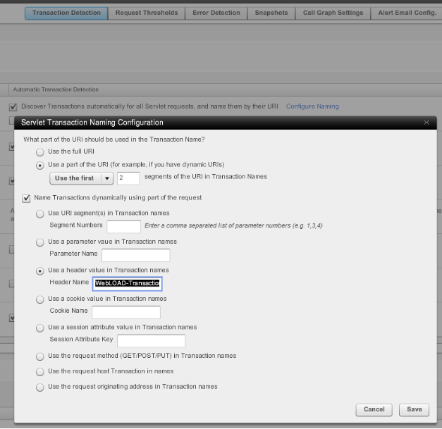
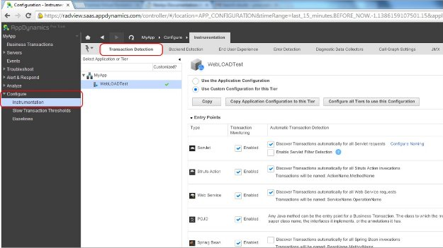
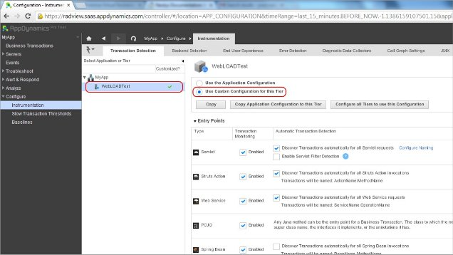
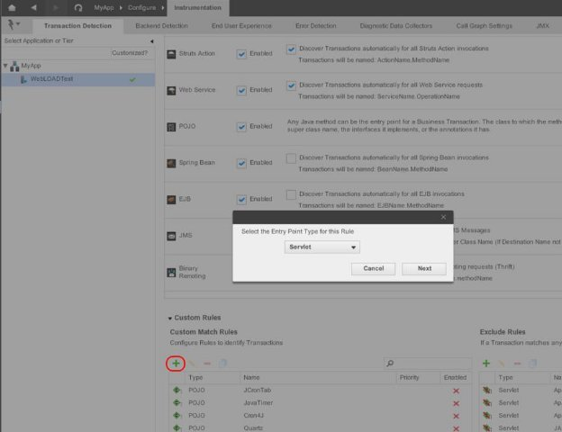
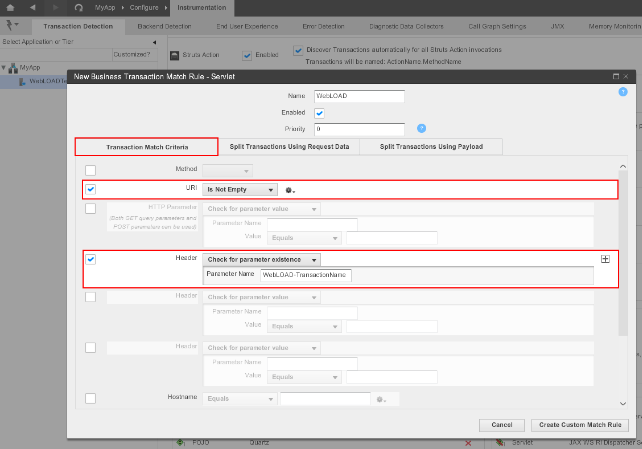
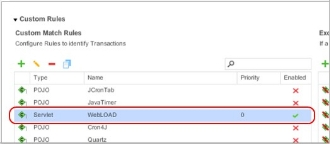
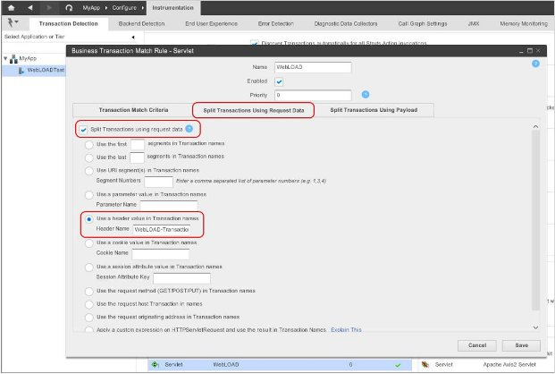
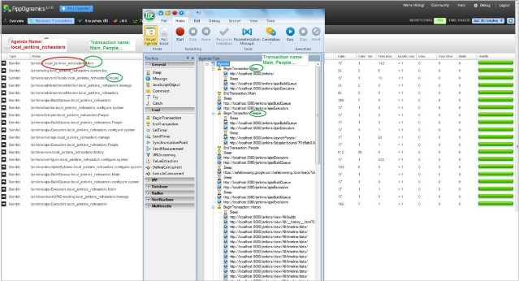

# Integrating with AppDynamics

This section describes how to integrate WebLOAD with AppDynamics.

AppDynamics is an Application Performance Management (APM) solution that monitors, troubleshoots, and diagnoses problems in mission-critical applications.

By integrating WebLOAD scripts with AppDynamics you will be able to identify slow or problematic transactions of scripts run by WebLOAD test sessions. The integration consists of two tasks:

1. In WebLOAD – Specifying that a WebLOAD script should add a line in all transaction headers which will identify them as WebLOAD transactions. Refer to[` `*Configuring WebLOAD Scripts for AppDynamics* ](#configuring-webload-scripts-for-appdynamics).
1. In AppDynamics – Configuring AppDynamics to enable it to read the headers. The additional line enables AppDynamics to identify the corresponding transactions as WebLOAD transactions. Refer to [Configuring AppDynamics to Recognize WebLOAD](#configuring-appdynamics-to-recognize-webload-transactions).

## Configuring WebLOAD Scripts for AppDynamics

To enable WebLOAD for AppDynamics:

1.	Add the line wlGlobals.AddWebLoadHeader=true in the JavaScript code of the script.

This causes WebLOAD to send extra data upon every request of the script. The extra data identifies the request as a WebLOAD request, lists the name of the currently running script, and lists the name of the corresponding transaction.

## Configuring AppDynamics to Recognize WebLOAD Transactions

This section describes how to configure AppDynamics Lite and AppDynamics Pro to read WebLOAD transaction headers.

### Configuring AppDynamics Lite to Recognize WebLOAD Transactions

**To configure AppDynamics Lite to recognize WebLOAD transactions:**

2. In AppDynamics Lite, select **Configure** > **Transaction Detection**.

   

3. In the **Servlet** transaction type:

   1. Check the option **Enabled**.
   2. Check the option **Discover Transactions automatically for all Servlet requests, and name them by their URI**.
   3. Click **Configure Naming** (adjacent to **Discover Transactions automatically for all Servlet requests, and name them by their URI**).

4. The Servlet Transaction Naming Configuration window appears.

5. In the Servlet Transaction Naming Configuration window**,** specify the WebLOAD naming convention by performing the following:
   1. Select **Use the full URI** or **Use a part of the URI**.
   1. Select **Name Transactions dynamically using part of the request**.
   1. Select **Use a header value in Transaction names**.

6. In the **Header Name** field, enter WebLOAD-TransactionName.
7. Click **Save**.

When you run a WebLOAD test, AppDynamics displays the WebLOAD transactions in its Business Transactions list, as described in [*Viewing WebLOAD Performance in AppDynamics](#viewing-webload-performance-in-appdynamics).

### Configuring AppDynamics Pro to Recognize WebLOAD Transactions

In AppDynamics Pro, in addition to configuring AppDynamics to recognize WebLOAD transactions, you can also configure AppDynamics to add a "WebLOAD- TransactionName" prefix to each transaction name.

**To configure AppDynamics Pro to recognize WebLOAD transactions:**

> **Note:** As a prerequisite, you must first create an account in AppDynamics. In the example shown below, the account name is called **WebLOADTest**.

1. In AppDynamics Pro, access the **Applications** menu and select the WebLOAD application.

   

2. Select **Configure** > **Instrumentation** > **Transaction Detection**.

   

3. In the **Transaction Detection** page, select the WebLOAD node (called **WebLOADTest** in our example) and select **Use Custom Configuration for this Tier**.

   

4. In **Custom Rules**, click the green + (plus) icon.

   

5. In the Select the Entry Point Type for this Rule window that appears, select **Servlet** and click **Next**.

   A New Business Transaction Match Rule – Servlet window appears, for defining a new rule.

   

6. Select the **Transaction Match Criteria** tab.
7. In the **Transaction Match Criteria** tab:
   1. In **URI**, select **Is Not Empty**.
   2. In **Header**:
      - Select **Check for parameter existence**.
      - In **Parameter Name**, enter WebLOAD-TransactionName.
   3. Click **Create Custom Match Rule**.

8. Select the new rule in the **Custom Rules** list.

   

9. In the Business Transaction Match Rule window that appears, select the **Split Transactions Using Request Data** tab.

   

10. In the **Split Transactions Using Request Data** tab:
    1. Check the option **Split Transactions using request data**.
    2. Select the option **Use a header value in Transaction names** and enter
    3. WebLOAD-TransactionName as the **Header Name**.

When you run a WebLOAD test, AppDynamics displays the WebLOAD transactions in its Business Transactions list, as described in [Viewing WebLOAD Performance in AppDynamics](#viewing-webload-performance-in-appdynamics).

## Viewing WebLOAD Performance in AppDynamics

After AppDynamics and WebLOAD are configured so AppDynamics can recognize WebLOAD transactions, running a load test in WebLOAD displays the corresponding business transactions in AppDynamics. You can view the WebLOAD transactions in AppDynamics to determine their health.

**To view WebLOAD transactions in AppDynamics:**

- In AppDynamics, click **Business Transactions** to display the full list of top business transactions and their metrics.

The below image shows a load session execution in the WebLOAD Recorder, and the corresponding view in AppDynamics Lite.

Note that in AppDynamics Pro, the name of each WebLOAD application is prefaced with WebLOAD-TransactionName.

The external statistics are imported into the report.

