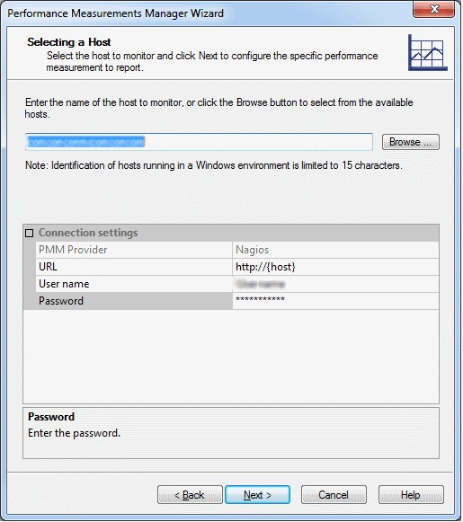
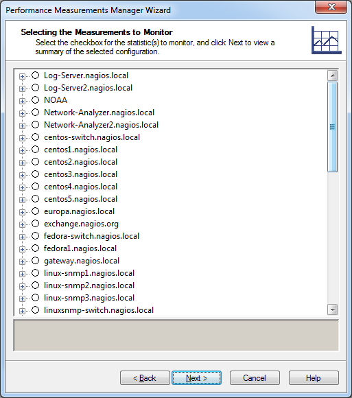
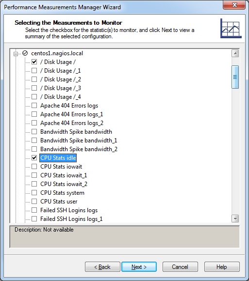
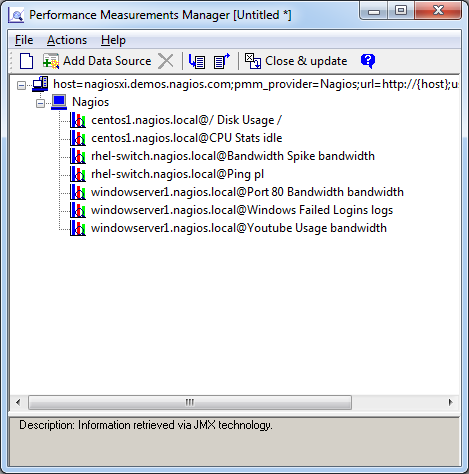
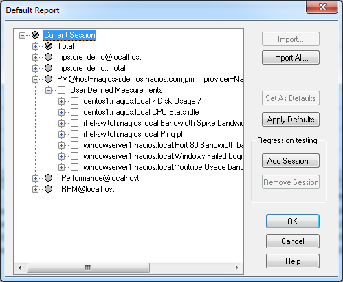
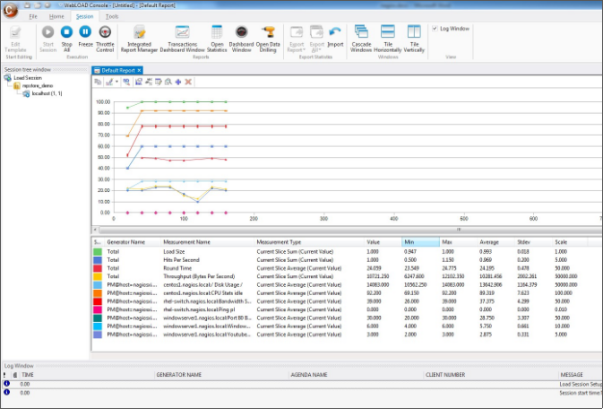

# Integrating with Nagios

This section describes how to integrate WebLOAD with Nagios. After integrating WebLOAD with Nagios, you can utilize data collected by Nagios to be used for WebLOAD monitoring purposes

Nagios is a free and open source computer-software application that monitors systems, networks and infrastructure. Nagios offers monitoring and alerting services for servers, switches, applications and services. It alerts users when things go wrong and alerts them a second time when the problem has been resolved.

The integration assumes you have installed and set up Nagios monitoring in your network.

## Instructing PMM to Collect Data from Nagios

Nagios integration is carried out by adding the Nagios data source in the Performance Measurements Manager (PMM), and instructing the PMM which data, collected by Nagios, to retrieve.

**To instruct PMM to collect data from Nagios:**

1. Run the Performance Measurements Manager wizard, as described in [Opening the Performance Measurements Manager ](performance_measurements_manager.md#opening-the-performance-measurements-manager).
1. In the Selecting a Data Source screen, select **External** > **Nagios**.

3. In the Selecting a Host screen, enter the Nagios host name, username and password.

4. In the Selecting the Measurements to Monitor screen, do the following for each site/OS/host/device you wish to monitor

   1. Expand a site/OS/host/device by clicking the **+ a**djacent to the item.

      

   1. The sub components list all the statistics collected by Nagios for this item. Select the desired statistics.

5. After all the desired items and statistics are selected, click **Next**. The Wizard displays a summary of the host, data source, and measurements configured for monitoring.

6. To accept the PMM configuration, click **Finish**.

   The PMM Wizard closes and the selected configuration is added to the PMM main window.

## Selecting the Nagios Statistics to Display in Reports

After integrating WebLOAD with Nagios, you can specify, while running a session, which Nagios statistics to view in the report view.

1. Open a report as described in [*Opening Reports* ](console_performance_reports.md#opening-reports).
1. In the **PM@<Nagios-host>** node, select the statistics you wish to display in the report.

The following figure shows a report in Report view, displaying the statistics collected by Nagios that were selected to appear in the report.

