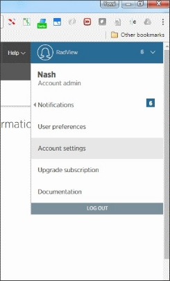
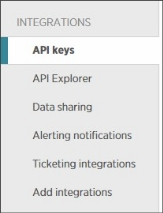
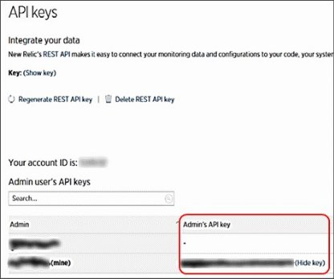
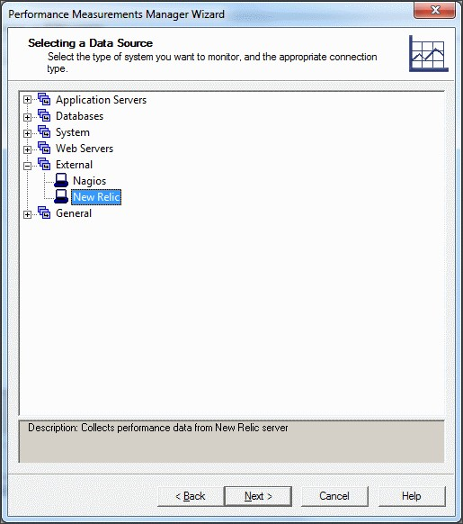
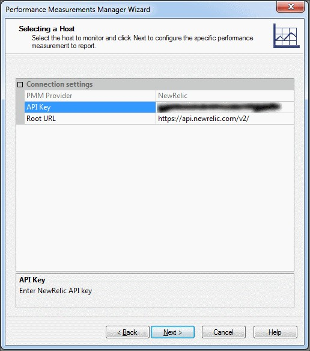
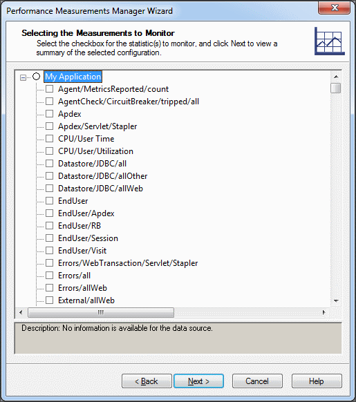
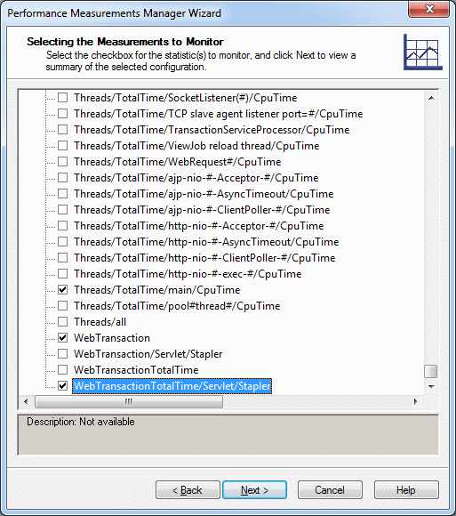
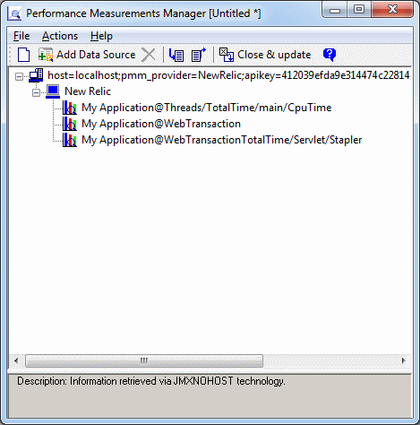
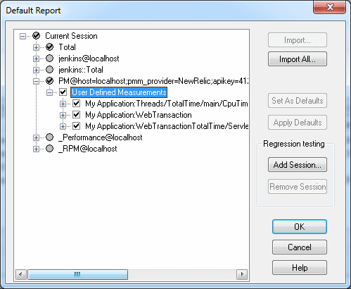
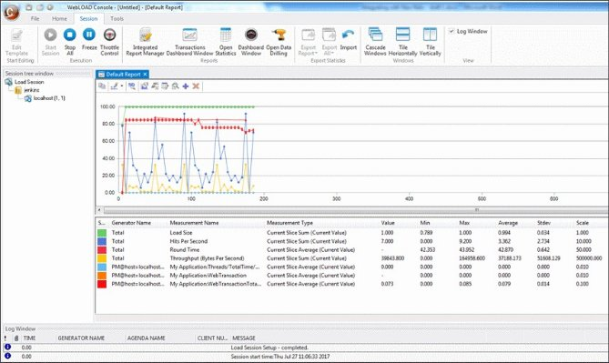

# Integrating with New Relic

This section describes how to integrate WebLOAD with New Relic. After integrating WebLOAD with New Relic, you can utilize data collected by New Relic to be used for WebLOAD monitoring purposes.

New Relic is a cloud-based performance management solution for measuring and monitoring the performance of applications and infrastructure.

## Prerequisites

Prior to integrating New Relic in WebLOAD, make sure you fulfill the following prerequisites:

- You have installed and set up New Relic monitoring in your network.
- You have at least a New Relic PRO license.
- You have a New Relic API key, as described in [*Get or Generate a New Relic API Key*](#_bookmark508).

### Get or Generate a New Relic API Key

**To get or generate a New Relic API key:**

1. Access New Relic as a Pro user.
1. Navigate to **User** > **Account Settings**.

3. Select **Integrations** > **API Keys**.

4. In the **API Keys** page, in the **Admin’s API Key** column, click **(Show key)** in the appropriate line.

5. Record the value of the API key. You will need to enter it in the PMM later on.

## Instructing PMM to Collect Data from New Relic

New Relic integration is carried out by adding the New Relic data source in the Performance Measurements Manager (PMM), and instructing the PMM which data, collected by New Relic, to retrieve.

**To instruct PMM to collect data from New Relic:**

1. Run the Performance Measurements Manager wizard, as described in [Opening the](#_bookmark459)[ Performance Measurements Manager ](#_bookmark459)(on page [364](#_bookmark459)).
1. In the Selecting a Data Source screen, select **External** > **New Relic**.

2. In the Selecting a Host screen, enter the **API Key** you had recorded in [*Get or](#_bookmark508)[ Generate a New Relic API Key* ](#_bookmark508)(on page [433](#_bookmark508)). Note that you can change the New Relic **Root URL** if required; in most cases the default value is the correct one.

3. In the Selecting the Measurements to Monitor screen, do the following for each site/OS/host/device you wish to monitor

   1. Expand a site/OS/host/device by clicking the **+ a**djacent to the item.

      

   2. The sub components list all the statistics collected by New Relic for this item. Select the desired statistics.

5. After all the desired items and statistics are selected, click **Next**. The Wizard displays a summary of the host, data source, and measurements configured for monitoring.

6. To accept the PMM configuration, click **Finish**.

   The PMM Wizard closes and the selected configuration is added to the PMM main window.

## Selecting the New Relic Statistics to Display in Reports

After integrating WebLOAD with New Relic, you can specify, while running a session, which New Relic statistics to view in the report view.

1. Open a report as described in [*Opening Reports* ](#_bookmark342)(on page [298](#_bookmark342)).
1. In the **PM@<New-Relic-host>** node, select the statistics you wish to display in the report.

The following figure shows a report in Report view, displaying the statistics collected by New Relic that were selected to appear in the report.

