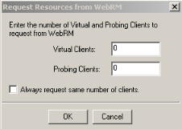

# Connecting to WebRM

WebRM addresses corporate functional and performance testing efforts by managing and directing WebLOAD resources (Virtual Clients, Probing Clients and Consoles) for powerful and efficient sharing of testing resources and achieving load poling capability.

WebRM enables multiple users involved in various stages of application development and testing to share testing resources. By distributing WebLOAD testing resources each developer can run a test session to simulate, validate, and pinpoint where performance problems occur at any stage of the development life cycle, thus eliminating design flaws and ensuring product quality. Using WebRM, WebLOAD resources can be used optimally to fulfill an organizations goals and priorities.

WebRM can run on a separate machine from the other WebLOAD Consoles/Load Machines or can run on a machine that runs WebLOAD Consoles/Load Machines.

WebRM controls the following WebLOAD resources:

- The number of concurrent connected WebLOAD Consoles.
- The number of Virtual Clients controlled by all connected Consoles simultaneously.
- The number of Probing Clients controlled by all connected Consoles simultaneously.

For additional information about WebRM, see the *WebRM User’s Guide*.

## How Does WebRM Work

When you install WebRM, you apply your license file. The license file contains information regarding the total number of Virtual Clients, Probing Clients, and concurrent connected WebLOAD Consoles for which you are licensed.

When installing your WebLOAD Console, select the location where you installed your WebRM server. WebLOAD will communicate with your WebRM server in order to request and grant testing resources for you. If the WebRM server is not running or is not accessible by the WebLOAD Console, the Console will issue an error message and will not open.

When you open your WebLOAD Console you are prompted to request the number of Virtual Clients and Probing Clients you desire. These resources are granted to you as long as your WebLOAD Console is open, allowing you to complete your test session utilizing the allocated number of Virtual and Probing Clients.

WebRM is very straightforward and easy to use. Much of your interaction with WebRM is behind the scenes. Once you have selected the resources you wish to use, you can configure WebRM to automatically grant you these same resources each time you open your WebLOAD Console.

## Requesting Resources from WebRM

Following the configuration of WebLOAD Console to work with WebRM, configure the connection settings by browsing to the machine where the WebRM server resides. (This is described in *WebRM Installation* in the *WebRM User’s Guide*.) When opening your WebLOAD Console, the connection to WebRM occurs automatically. If the Console fails to connect to the WebRM server, the Console will not open.

**To request resources from WebRM:**

1. Open your Console by selecting **Start** >**Programs** > **RadView** > **WebLOAD** > **WebLOAD Console**. The Request Resources dialog appears:

   

2. Enter the number of Virtual Clients and Probing Clients you will need for your test. If you request more than the number of resources allowed for your license, or more than are currently available, you will be prompted with a dialog stating that the resources you requested are unavailable. This dialog will also list what resources are currently available so that you can resubmit your request.

3. If you know that you will require the same number of resources each time you connect to WebRM, check **Always request same number of clients**.

4. Click OK.

## Updating the Number of Requested Resources

You can easily change the number of resources granted to you.

**To change the number of resources granted to you:**

1. In the WebLOAD Console, select **Update Floating License Resources** in the **Home** tab of the ribbon.

   The Request Resources dialog appears, displaying the resources currently granted to you.

1. Edit the Virtual Client and Probing Client settings to reflect the new total number of Virtual and Probing clients you need.

