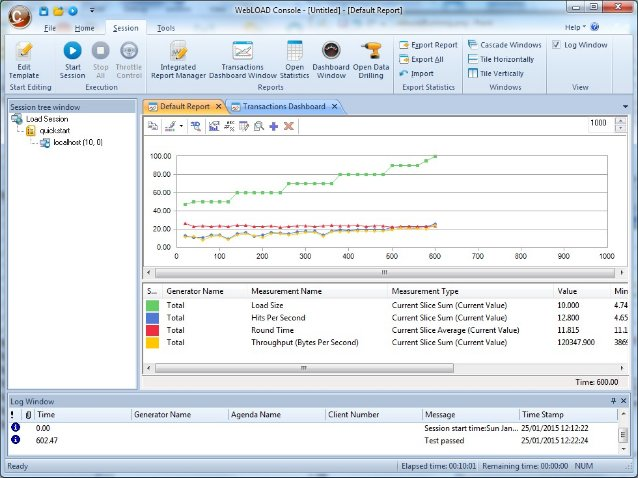
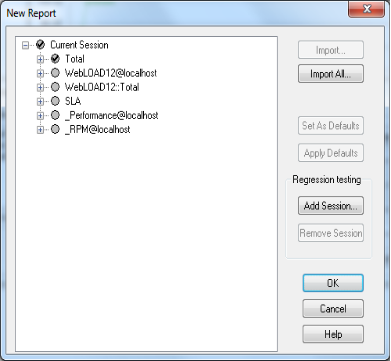
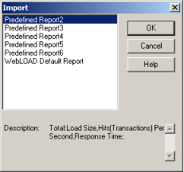
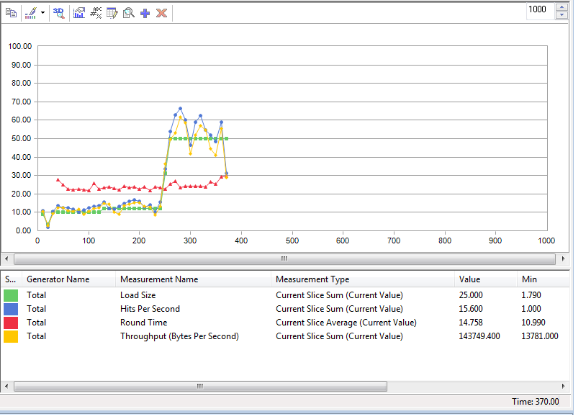
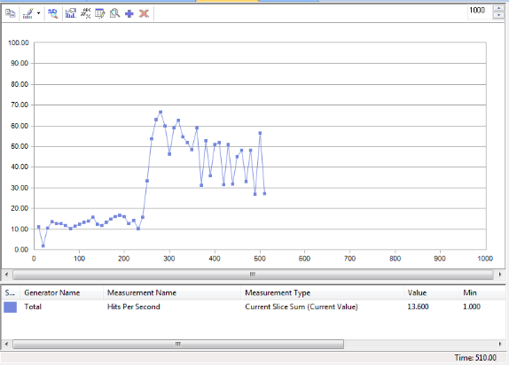
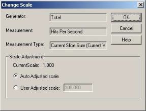



# WebLOAD Console Performance Reports

The WebLOAD Dashboard and WebLOAD Transactions Dashboard display a summary of performance statistics generated during the test session. Integrated Reports enable you to configure a report that combines the following:

- Performance data from the Load Machines and Probing Clients
- Performance data on the SUT, gathered from Performance Monitors
- Existing performance data from a previously saved Load Session with data from the currently running Load Session

Combining several different measurements into a single report gives you a more complete picture of your Web application’s performance.

## Viewing Test Results on the WebLOAD Dashboard

The WebLOAD Dashboard displays real-time statistical information about the test session for the following categories:

|**Category**|**Description**|
| :- | :- |
|Time|The time during the test that the values displayed on the Dashboard were sampled.|
|Running Virtual Clients|The total number of Virtual Clients currently running.|
|Rounds Executed|The total number of times the script has been executed by all Virtual Clients.|
|Failed Rounds|The total number of rounds with errors.|
|Failed Hits|The total number of hits with errors.|
|Hits Per Second|The number of HTTP requests for information (pages, individual images, objects, or frames) made by Virtual Clients to the SUT per second.|
|Calculated Hits Per Day|The number of HTTP request for information made by Virtual Clients to the SUT per day.|
|Pages Per Second|The number of upper level request for information made by a Virtual Client to the system under test (SUT) per second.|
|Calculated Pages Per Day|The number of upper level request for information made by a Virtual Client to the system under test (SUT) per second.|
|Throughput Per Second|The average number of bytes per second transmitted from the SUT to the Virtual Clients running this script.|
|Calculated Throughput Per Day|The average number of bytes per day transmitted from the SUT to the Virtual Clients running this script.|

**To open the Dashboard:**

- Click **Dashboard Window** in the **Session** tab of the ribbon.

## Viewing Test Results on the WebLOAD Transactions Dashboard

The WebLOAD Transactions Dashboard displays real-time statistical information about the transactions in a test session, in a line graph. Separate lines track each transaction. For additional information about graphs, see [*Viewing Integrated Reports* ](#_bookmark361)(on page [310](#_bookmark361)).

|**Category**|**Description**|
| :- | :- |
|Transaction  Name|The name of the transaction|
|Value|The last (current) value of the transaction  response time.|
|Total Min|The lowest value reported for this  transaction’s response time since the beginning of the test.|
|Total Max|The highest value reported for this transaction’s response time since the beginning of the test.|
|Total Average|The average value of the transaction response time.|
|Total Successful Count|The number of successful transactions.|
|Successful TPS|The number of successful transactions per second.|
|Stdev|The average amount this statistic varies from the average number in this script.|
|Scale|The scale of the graph’s Y-Axis. For information about changing the Scale value, see [*Changing the Scale of a Report for a Selected](#_bookmark362) *[Measurement* ](#_bookmark362)*(on page [312](#_bookmark362)).|

**To open the Transactions Dashboard:**

- Click **Transactions Dashboard Window** in the **Session** tab of the ribbon.

## Opening Reports

**To open reports:**

1. Click **Integrated Report Manager** in the **Session** tab of the ribbon. The Integrated Report dialog box appears.

1. Click **New**,

   -Or-

   Select a report and click **Edit**. The Report dialog box appears.

Report data is organized in a tree structure. Report fields are organized into different “report tree branches”, illustrated in the Report Dialog Box figure.

Report tree branches include:

- **Total** ‒ Data collected for the session as a whole, including total load size, total number of rounds, and total number of pages.
- **ScriptName@LoadGenerator** ‒ Data collected for all instances of the named script, running under the named Load Generator. Multiple branches may appear for a single script name, each one linked to a different Load Generator.
- **ScriptName: Total** ‒ Data collected for all instances of the named script, running under all Load Generators participating in this test session.
- **\_Performance@LoadGenerator** – Data collected for assessing Load Generator performance during this test session.
- **SLA** – Data collected for all SLA rules defined in the SLA Manager (see [*The SLA](#_bookmark220)[ Manager* ](#_bookmark220)on page [204](#_bookmark220)).

Using the Report dialog box you can:

- Configure the items displayed in the test report.
- Rename the report.
- Import an existing report configuration.
- Set a default report configuration.

- Apply a default report configuration.
- Configure a report that compares existing performance data from a previously saved Load Session with data from the currently running Load Session.

The following table describes the buttons in the Report dialog box.

|**Button**|**Functionality**|
| :- | :- |
|Import|
Imports a report configuration for the selected component in the configuration tree, from a previously saved Load Template. See [*Importing a Report Configuration for a Selected](#_bookmark356) *[Component* ](#_bookmark356)*(on page [306](#_bookmark354)).

**Note:** Select an upper level component in the configuration tree to enable this button.
|
|Import All|Imports a report configuration from a previously saved Load Template, see [*Importing a Complete Report Configuration* ](#_bookmark355)(on page [306](#_bookmark354)).|
|Set as Defaults|
Sets the current Integrated Report configuration as the default. This overrides the built-in default configuration.

**Note:** Select an upper level component in the configuration tree to enable this button.
|
|Apply Defaults|
Apples the default configuration. The defaults are set using the **Set as Default** option. Selecting this option configures the Integrated Reports to the defaults.

**Note:** Select an upper level component in the configuration tree to enable this button.
|
|*Regression Testing*||
|Add Session|Imports performance data from a previously saved (existing) Load Session, see [*Importing Report Parameters from a Saved](#_bookmark353) *[Load Template* ](#_bookmark353)*(on page [306](#_bookmark354)).|
|Remove Session|
Removes the selected Load Session from the performance data available for display in the report.

**Note:** Select an upper level component in the configuration tree to enable this button.
|
|OK|Confirms the selections made in this dialog box. The selected items are included in the Integrated Report.|
|Cancel|Closes this dialog box without accepting changes.|
|Help|Opens the online-help dialog box.|

## Opening an Existing Report

**To open an existing report:**

1. Click **Integrated Report Manager** in the **Session** tab of the ribbon. The Integrated Reports dialog box appears.

2. Select a report.

   The Open button is enabled and a description of the measurements included in the report appears at the bottom of the dialog box.

3. Click **Open**.

   The Integrated Report displays in the Console Results Window. WebLOAD Console displays the results of your test in a graphical format. Click the **Data Editor ** toolbar button at the top of the Results Window to display your test results in a tabular format.

## Editing a Report

**To edit a report:**

1. Click **Integrated Report Manager** in the **Session** tab of the ribbon. The Integrated Reports dialog box appears.
1. Select a report and click **Edit**. The Report dialog box appears.
1. Make the necessary changes, and click **OK**.

## Renaming a Report

You can assign a meaningful name to a report. The default name for reports is “ReportX” where X is a number that is incremented with each generated report.

**To rename a report:**

1. Click **Integrated Report Manager** in the **Session** tab of the ribbon. The Integrated Reports dialog box appears.
1. Select a report to rename.

   The Rename button is enabled and a description of the measurements included in the report appears at the bottom of the dialog box.

1. Click **Rename**.

   The Rename Report dialog box appears.

4. Type a new name for the report.

5. Click **OK**.

   The selected report is renamed.

## Deleting a Report

**To delete a report:**

1. Click **Integrated Report Manager** in the **Session** tab of the ribbon. The Integrated Reports dialog box appears.
1. Select a report to delete.

   A description of the measurements included in the report appears at the bottom of the dialog box.

1. Click **OK**.

   The selected report is deleted.

## **Configuring an Integrated Report**

You can configure an Integrated Report while the test is running. To view data from the WebLOAD Performance Monitor in your Integrated Report, see [*Performance](#_bookmark456) *[Measurements Manager* ](#_bookmark456)*(on page [363](#_bookmark455)).

**To configure an integrated report:**

1. Click **Integrated Report Manager** in the **Session** tab of the ribbon. The Integrated Reports dialog box appears.

2. Click **New**.

   The New Report dialog box appears.

The full tree of measurements, including all of the items that can be included in the report, are displayed in the Report dialog box. In addition, items configured to be collected in the Performance Measurements Manager are also displayed. Data for all of the items is accumulated during the test run.

Select the parameters to view in the Integrated Report from the tree structure displayed in the Report dialog box. Only the results for the items that are checked are display in the Integrated Report.

### Selecting Measurements for the Integrated Report
The first time the Report dialog box appears, none of the items are selected. If you do not select any of the checkboxes, the Integrated Report is blank.

You can configure the Integrated Report in one of several ways:

- Select the items to be included in the report manually.
- Select the checkbox adjacent to the measurement that you want to include in the Integrated Report. The options display in tree format. You can expand or compress the tree using the **+/-** buttons. If an upper level component is selected, all of the default subcomponents in that tree will be selected.

> **Note**: A gray circle next to a measurement indicates that no default subcomponents are defined (the upper level component cannot be selected). Right-click a measurement to be included in the report to prompt the pop-up menu that enables you to select the item.
>
> - Select a WebLOAD Console default configuration by clicking the **Apply Defaults**
>
>   button. WebLOAD Console selects the set of default measurements.
>
> - Select **Import All** to apply a previously configured Integrated Reports test set, saved as a Load Template to your current test.
>
> The configuration is imported, even if it was designed for testing a different application.

### Changing the Reports Parameters
You can edit the timer options listed in the configuration tree in real time. While a test is running, you can:

- Add a user-defined timer that was not previously configured.
- Change the scale of the report.

Timer information from Probing Clients and Load Machines are added to the configuration tree automatically in runtime, when the Console receives the timer data.

You can define user-defined timers in the script to measure specific activity. For more information on Timers, see the *WebLOAD Scripting Guide.*

#### Adding a User-Defined Timer

**To add a user-defined timer:**

1. Right-click the upper level item in the configuration tree to which you would like to add a timer.

   A drop-down menu appears.

1. Click **Add Timer**.
1. Enter the name of the timer in the text box.
1. Select the timer attributes you would like to include in the report.
1. Click **OK**.

   The new timer is included in the Integrated Report.

### Importing Report Parameters from a Saved Load Template
WebLOAD Console enables you to import a complete report configuration or to import a report configuration for a selected component in the Load Session.

#### Importing a Complete Report Configuration

**To import a complete report configuration:**

1. In the **Reports** dialog box, click **Import All**. The Open dialog box appears.
1. Select the Load Template to import.
1. Click **Open**.

   The Import dialog box displays a list of reports contained in the selected Load Template.

1. Select the report that contains the desired configuration.
1. Click **OK**.

   The report is configured to display the same measurements.

> **Note:** If the imported configuration contains a measurement not configured in the current report, WebLOAD Console ignores the measurement in the Load Template file and does not add it to the report.

This function imports the Integrated Report test configuration from the selected Load Template file. None of the other information in the Load Template file is imported.

#### Importing a Report Configuration for a Selected Component

**To import a report configuration for a selected component:**

1. Select the upper level component in the configuration tree for which you want to import a report configuration.
1. Click **Import**.

   The Open dialog box appears.

1. Select the Load Template to import and click **Open**.

   The Import dialog box displays a list of reports contained in the selected Load Template.

4. Select the report that contains the desired configuration. WebLOAD Console displays the list of components (Load Machines and Probing Clients) included in that report.

5. Select the component that contains the desired configuration.

   The current component is configured to display the same measurements.

> **Note:** If the imported component contains a measurement that is not configured in the current report, WebLOAD Console ignores the measurement in the Load Template file. It does not add it to the report.

This function imports the Integrated Report test configuration from the selected Load Template file. None of the other information in the Load Template file is imported.

## Load Generator Performance Statistics

You can configure a report that displays a summary of Load Generator performance statistics generated during the test session. This is useful for analyzing your Load Generator capacity and gauging the load on the Load Generator itself. The Load Generator performance statistics include:

- Free memory – Free memory of the machine hosting the Load Generator
- Global CPU usage – The total CPU usage of the machine hosting the Load Generator
- Load Generator CPU usage - CPU usage of the Load Generator process
- Server Latency

In addition, if the [*Show Performance Warnings* ](#_bookmark263)option is selected in the **Diagnostics** tab of the **Default/Current Session Options** or **Script Options**, WebLOAD automatically sends warning messages when Load Generators are getting overloaded, so you know how to better utilize the Load Generators in your current and future tests.

**To add Load Generator statistics to an integrated report:**

1. Open a report, as follows:
   1. Click **Integrated Report Manager** in the **Session** tab of the ribbon. The Integrated Reports dialog box appears.
   1. Click **New** to open a new report, or select an existing report and click **Edit**. The Report dialog box appears.
1. Alternatively, click Update ![ref16] in the Integrated Report toolbar, to update the display in the report while a test is in progress.

   The Report dialog box appears.

1. Select items under **\_Performance@LoadGenerator** to indicate the Load Generator measurements you want displayed in the Integrated Report.

## Regression Testing

Regression testing enables you to compare Load Sessions while tests are running, or after the test session is completed. WebLOAD regression testing reports enable you to visualize, verify, and compare results over time to confirm that results only vary in ways that you expect them to.

Regression testing enables you to configure a report that compares:

- Existing performance data from a previously saved or “expected” Load Session with data from the currently running test session.
- Existing performance data from two previously saved Load Sessions.

Combining performance results from several different Load Sessions into a single report enables you to view, verify and compare results over time and ensure that results only vary in ways that you expect them to.

### Configuring an Integrated Report to Include Data from Previously Saved Load Sessions

**To configure an Integrated Report to include data from previously saved Load Sessions:**

1. Click **Integrated Report Manager** in the **Session** tab of the ribbon. The Integrated Report dialog box appears.
1. Click **New**.

   The Reports dialog box appears.

1. In the Reports dialog box, click **Add Session**. The Open dialog box appears.
1. Select the Load Session ( \*.ls) file to add and click **Open**. The Load Session is added to the Report dialog box.
1. Configure the Integrated Report to include the measurements you want to view, see [*Configuring an Integrated Report* ](#_bookmark349)(on page [303](#_bookmark347)). If a measurement is already selected in the current Load Session it is automatically selected in the Load Session selected to be included in the report.
1. Click **OK**.

   The report displays in the Console Results window.

### Removing a Previously Saved Load Session from the Integrated Report Configuration

**To remove a previously saved Load Session from the Integrated Report configuration:**

1. Select the Load Session you want to remove from the Integrated Report configuration in the Reports dialog box.
1. Click **Remove Session**.

   The Load Session is removed from the Report dialog box, and any measurements displayed for that Load Session in the Console Results window are removed.

## Viewing Integrated Reports

In the Integrated Report, WebLOAD Console displays the results of your test in a line graph. Separate lines track each measurement selected in the report configuration.

The report above shows an Integrated Report that includes four measurements. Each is tracked on a different line graph. The line graphs are color-coded to match the measurements on the bottom half of the report.

**Features of this graph:**

- The upper part of the report displays a line graph for each measurement tracked in the report. The X-Axis represents the elapsed time (in seconds) for this test session. The Y-Axis represents the actual value for each measurement, displayed as a percentage relative to the defined maximum Scale Value.
- Hover over a colored line graph to view the exact value for the selected point.
- The scroll bar at the center of the screen provides you with a quick and easy way to access points in the test session currently not in focus.

- The lower part of the report displays a list of the measurements being tracked for each host and each session, the current value of the measurement and, in the last column on the right, the maximum Scale Value set for each measurement.
- The Time Range field in the top right-hand corner displays the time scale for the

  X-Axis. In this graph, the X-Axis displays a window of 200 seconds out of the total time span of the Load Session. Using the arrows on the Time Range field, you can change the number of seconds to achieve the report display you desire.

- If you are tracking more than one measurement, the top graph shows multiple graph lines. To bring up a history focusing on a specific measurement, double-click a single measurement line in the Integrated Report.

### Changing the Scale of a Report for a Selected Measurement

**To change the scale of a report for a selected measurement:**

1. Right-click a specific measurement from the lower part of the report and select

   **Change Scale** from the pop-up menu,

   -Or-

   Double-click a specific measurement from the lower part of the report. The Change Scale dialog box appears.

2. Select one of the following:
   - **Auto Adjusted scale** – This uses an automatic scaling algorithm that determines the best way for the measurements to be displayed in the chart view. The scale adjusts itself according to changes in real time and the value adjusts itself according to the scale value. The Y scale of an integrated report for a number of measurements is 0-100. The points of each chart series (specific measurements) are calculated according to the automatic scaling algorithm: Real value \* 100 / scale value.
   - **User Adjusted scale** – This enables you to manually set the scale value.

3. Enter the new scale value.

4. Click **OK**.

   The scale of the report for that measurement changes in real time. The scale value for a measurement can also be changed after the test has run.

### Viewing the True Value vs. Relative Value of a Measurement

Each measurement displayed in the Integrated Reports has its own expression or value of measurement. For example, Timer results are measured in seconds. CPU is measured in terms of percentage of usage. Throughput is measured in kilobytes per second. All measurements appear as a percentage relative to the defined scale.

To change the scale value of a measurement, see [*Changing the Scale of a Report for a](#_bookmark362) *[Selected Measurement* ](#_bookmark362)*(on page [312](#_bookmark363)). When you change the maximum value, WebLOAD Console displays the relative value of that measurement rather than the true value of a measurement.

**To view a measurement’s value:**

- Select the Data Editor toolbar button to display the relative value of the measurements in the chart.
- Select the Point Label toolbar button to display the real value of the measurements in the chart.

> **Note:** You can display the real value for a single line in the chart by right-clicking the desired line and selecting **Point Label** from the pop-up menu.

### Integrated Report Toolbar

At the top of the Integrated Report, find the Integrated Report toolbar. This toolbar offers a variety of options for customizing the Integrated Report display, tailoring the colors, perspective, and dimension as needed.

The following illustration shows the Integrated Report toolbar and the function of each toolbar button.

|**Icon**|**Toolbar Button**|**Function**|
| :- | :- | :- |
|

|Copy to Clipboard|
Captures a screen shot of the currently displayed chart to the paste buffer. Select one of the following formats:

Ÿ	 As a Bitmap

- As a Metafile

Ÿ	  As Text (data only)
|
|

|Palette Selector|
Changes the color palette of the graph.

1. Click the arrow to display a drop-down of palette bars.

2. Select one of the palette bars. The palette colors are applied to the graph.
|
|

|3D/2D|Toggles between 2D and 3D view.|
|

|Axes Settings|
Modifies the X-Axes and Y-Axes settings of the graph. Perform any of the following:

- Click  **Grid** to toggle the Horizontal Grid on and off.

- Click **Interlaced** to display the Horizontal Grid’s rows with an alternating background color.

- Click  **Grid** to toggle the Vertical Grid on and off.

- Click **Vertical Labels** to toggle the X-Axes elapsed time labels to be displayed horizontally or vertically.

- Click **Staggered** to toggle the X-Axes elapsed time labels to be displayed in a staggered line or all on the same line.

- Click **Show Labels** to toggle the X-Axes elapsed time labeled on or off.

- Click **Options…** to display the Properties dialog box and configure the graph’s advanced settings.
|
||Point Labels|Toggles whether to display labels for every point in the graph. The Point Labels are the true values of the measurements.|
||Data Editor|
Displays the relative values of the test results in a tabular format. The Data Editor’s features are as follows:

- The names of all of the measurements and their attributes tracked in the Integrated Report display in the first column at the far left.

- The data accumulated during the Load Session, scaled into relative values, displays in tabular format in the table fields.

- Hovering over a value in the table highlights the values location in the graph.

- Double-clicking a value in the table enables you to modify the test result value.

**Note:** Right-click anywhere in the Data Editor to display a pop-up menu enabling you to select the Data Editor’s location on the screen and customize the displayed text.
|
|

|Zoom|
Toggles between an enlarged section of the graph and the full graph.

- Click the **Zoom** button and drag your mouse over an area in the graph to enlarge that area.

- Click the **Zoom** button again to display the full graph.
|
||Update|Updates items displayed in the Integrated Report while the test is in progress. Click the **Update** button to open the Report Configuration dialog box. Using this option, you can select the measurement to be displayed in the report.|
|

|Delete|Deletes items from the Integrated Report while the test is in progress. Select the item you want to delete by clicking the Series indicator in the list appearing at the bottom and then click the **Delete** button. The item is immediately deleted from the report.|

