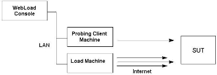
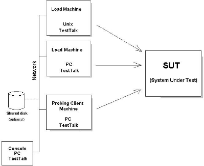
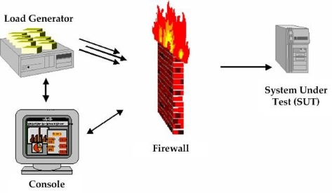
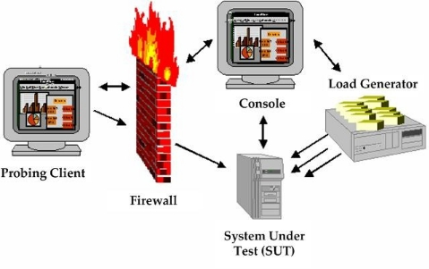
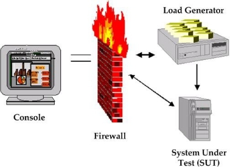
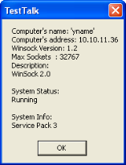

# Getting Started

WebLOAD accurately simulates Internet users’ behavior and models real-life demands on your Web application to predict capacity requirements, report bottlenecks, and report weak links in your application before deployment.

This chapter introduces WebLOAD, the WebLOAD test components and an overview of WebLOAD’s capabilities and features.

## Welcome to WebLOAD

WebLOAD delivers the following for maximum testing performance, ease of use and value:

- Full client-side JavaScript support.
- Document Object Model (DOM) access.
- JavaScript-based test scripting.
- Seamless integration with Web application servers.
- Automated operation.
- Single-point management and real-time graphical and statistical reporting.

WebLOAD verifies the scalability and integrity of Web applications by generating a load composed of Virtual Clients that simulate real-world traffic. Probing Clients let you refine the testing process by acting as a single user that measures the performance of targeted activities, and provides individual performance statistics of the Web application under load.

- **WebLOAD is powerful.** WebLOAD unifies performance, scalability and integrity testing into a single process for accurate and timely verification of your Web application, under load defined conditions. WebLOAD provides you with unmatched flexibility for defining and parameterizing Virtual Clients such as connection speed, browser types, multithreading, and SSL encryption strength, for absolute control while simulating real-world conditions.
- **WebLOAD is easy to use.** Recording a test script is as easy as using a browser, with WebLOAD Recorder recording each step. WebLOAD Recorder requires no programming and is operated using an intuitive, graphical user interface to create visual scripts. These visual scripts can later be enhanced by modifying the automatically generated script. Scripts developed in WebLOAD Recorder can be run in WebLOAD to emulate Virtual Clients for load testing, or can be run in WebLOAD Console to emulate Virtual Clients for load testing.

- **WebLOAD is efficient.** WebLOAD delivers unmatched levels of load generation through its optimized architecture and use of operating systems. You can freely incorporate additional systems for virtually unlimited testing loads.
- **WebLOAD is simple.** WebLOAD automatically finds the performance threshold of your Web application through Goal-Oriented testing. Simply define target performance parameters and WebLOAD generates and increases the number of Virtual Clients accessing the application until performance levels can no longer be sustained.

## How Does WebLOAD Work?

WebLOAD tests Web applications by generating Virtual Clients that simulate real- world loads. Virtual Clients emulate the actions of human users by performing typical actions on your Web application. By increasing the number of Virtual Clients, you increase the load on the system. You create visual JavaScript-based test scripts that define the behavior of the Virtual Clients and WebLOAD executes these test scripts monitoring the application response graphically and statistically, and presenting the test results in real time.

WebLOAD incorporates functional verification into the scalability testing process allowing you to accurately verify the scalability and integrity of your Web applications at the per-client, per-transaction, and per-instance level under defined load conditions. WebLOAD saves the test results, including data from the Load Machines (described in the following paragraphs) and the hosting hardware’s performance monitor. You can view all or part of the data in real time, or after the test session is complete, in tabular format or in graphical format.

The WebLOAD test process includes:

1. Planning the test
1. Creating scripts
1. Creating Load Templates
1. Running the test
1. Analyzing the test results

This guide describes steps 1, 3, 4, and 5 in the test creation process in detail. Information on performing step 2, Creating scripts is available in the *WebLOAD Recorder User’s Guide*.

### WebLOAD Architecture
The following diagram illustrates the configuration for a typical WebLOAD test.

The *Console* sets up, runs and controls a test session. At the Console, you can:

- Define the hosts participating in the load test
- Specify the test scripts that the load test executes
- Schedule tests
- View performance reports

*Load Machines* are hosts, which run Load Generator software simulating multiple *Virtual Clients* simultaneously accessing your System Under Test (SUT). One Load Machine can run multiple Load Generators.

Load Generators execute tests that “bombard” the System Under Test with a large load, to enable complete scalability and stress testing.

The tests consist of multiple simultaneous requests made by Virtual Clients (which emulate Web browsers) to Web servers. Load Machines can run multiple threads.

The *System Under Test* (SUT) is where the Web system under test resides. The SUT does *not* require that WebLOAD software be installed on it.

The *Probing Client Machines* are also hosts. They run Probing Client software, which simulates a single Virtual Client accessing the SUT and runs at the same time as Load Machines, to further measure the performance of the SUT under load. WebLOAD returns exact values for Probing Client performance, in contrast to Load Machines, which return average values of Virtual Client performance*.*

Additional WebLOAD components are:

- **WebLOAD Recorder** – A tool for recording, creating, and authoring protocol test scripts for the WebLOAD environment. For more information, see the *WebLOAD Recorder User’s Guide*.
- **TestTalk** – A network agent that facilitates communication between the Console and hosts, either Load Machines or Probing Client Machines. TestTalk *must* be installed on both the Console and the hosts. TestTalk runs in the background and does not interfere with any other program running on your system.
- **WebLOAD Analytics** – enables you to generate a variety of reports based on performance data and statistics gathered by WebLOAD. Use WebLOAD Analytics to select a Load Session and generate predefined or custom reports displaying the results of the test.
- **WebRM –** distributes and circulates WebLOAD testing resources (Virtual Clients and Probing Clients) amongst users on a “need to use” basis. WebRM is packaged with a maximum number of Virtual Clients, Probing Clients and WebLOAD Console seats, as defined by the WebLOAD license.

### What is the Product of Your WebLOAD Testing?

WebLOAD continuously samples the activity while a Load Session is in progress, and saves a wide variety of measurement data. You can view all or part of the data in real time or after the Load Session is complete. Data can be displayed in tabular format or in graphical format. At the conclusion of a Load Session, data can automatically be exported to a spreadsheet program, HTML or as a tab-delimited file to a database application. Reports can also be created using WebLOAD Analytics.

### HTTP Client
Using the HTTP client testing mode, testers can simulate the user scenario at the protocol level. Each Virtual Client sends HTTP methods (and/or other protocol calls) to the server based on the recorded script. This is a low-level, “nuts-and-bolts” approach that focuses on specific internal implementation commands, such as HTTP transactions.

Scripts created for HTTP Client mode focus on HTTP transactions. HTTP Client scripts are created through the WebLOAD Recorder. The WebLOAD Recorder is an easy-to- use tool that facilitates the writing of test scripts for HTTP Client mode. The WebLOAD Recorder records your actions as you navigate through a Web application, automatically generating a script that reflects your actions in JavaScript, writing the GET and POST HTTP protocol commands that correspond to your browser activities. You can then use these scripts to test the performance of your Web application during WebLOAD test sessions.

Working in HTTP Client mode provides users with the most efficient, portable, powerful work mode. HTTP Client mode is *portable to many operating systems*, including all different flavors of *Windows*, *Linux*, *Solaris*, and so on. HTTP Client mode runs so *efficiently* that users can achieve large benchmarks by simulating extremely heavy test loads of *thousands* of clients. HTTP Client mode also provides the most *comprehensive, detailed statistical analysis and test reports*.

Working in HTTP Client mode does require a certain level of programming sophistication, since it can require hands-on programming of the JavaScript scripts with HTTP protocol code, as described in the *WebLOAD JavaScript Reference Guide*. HTTP Client mode scripts are designed to be run only on WebLOAD.

#### HTTP Client Feature Summary

The following table summarizes the features of the HTTP Client mode:

|**Feature**|**HTTP Client**|
| :- | :- |
|
Average Load per Machine\*

\*single CPU, 1GB memory
|Up to 1000|
|JavaScript scripts|YES|
|Complex Objects (Flash, ActiveX, etc.)|YES, if using HTTP|
|Single Script for WebLOAD Recorder|YES|
|Authoring Tool|YES|
|Portable to UNIX, etc.|YES|
|Detailed Statistics|YES|
|HTTP Manipulations|YES|
|Backward Compatibility (V5.0)|YES|

### WebLOAD Features

Using WebLOAD, you have access to all the features described in this section, including multiple functionality, protocols, and supported environments.

*Table 4: WebLOAD Features*

|**Feature**|**Benefit(s)**|
| :- | :- |
|***Supported Protocols***||
|HTTP 1.0 and 1.1 Support|Comprehensive support for HTTP 1.0 and 1.1 including cookies, proxies, SSL, client certificates, authentications, persistent connections, and chunked transfer coding.|
|SSL Updates|Support for the new SSL standard (TLS 1.0).|
|SSL Bit Limit|Enables you to set a limit on the maximum number of bits available to Virtual Client for SSL encryption.|
|Custom HTTP Headers|Define, edit, and manipulate HTTP headers.|
|Custom User-Agents|Various hand-sets can be emulated by defining custom user-agents.|
|AJAX Support|Supports automatic recording of AJAX calls into the test script, enabling debugging and full access to all request data (headers and body), both in the script and during run time. WebLOAD supports various formats: XML, JSON, other text-based formats, and binary data. In your script, you can define AJAX requests to be executed concurrently, better simulating the way they are executed by a web browser.|
|SOAP/Web Services Support|Built-in support for recording Web service calls into the script, providing you with access to both the SOAP envelope and payload for debugging and parameterization.|
|Authentication Methods|Native support for NTLM and Kerberos.|
|Comprehensive Support for Dynamic Content|WebLOAD delivers comprehensive support for dynamic applications, including Web 2.0 technologies such as AJAX.|
|Internet Protocol Support|Native support for FTP, SMTP, POP3, IMAP, NNTP, LDAP, TCP, UDP, and Telnet provides support for non-HTTP protocols.|
|ODBC Support|Native support from WebLOAD Java Script for ODBC commands to be integrated in a script. Specific support for Oracle, MS SQL and MySQL databases.|
|Multimedia protocols support|WebLOAD Multimedia Add-on, supporting RTSP/RTP streaming protocol, for generating scripts for testing multimedia websites.|
|Radius protocol support|Supports adding Radius capabilities to WebLOAD scripts, for a complete simulation of a user-scenario that includes authentication for a Radius server.|
|Adobe Flex support|The WebLOAD Adobe Flex Add-on supports recording and executing an Adobe Flex script with AMF 0 / 3 protocol.|
|***Supported Programming Interfaces***||
|XML Document Object Model support|WebLOAD provides full support for using the XML Document Object Model. Using XML DOM objects, WebLOAD Scripts are able to both access XML site information and generate new XML data to send back to the server for processing, taking advantage of all the additional benefits that XML provides.|
|COM Support|WebLOAD Java Script provides direct object access to any component that has a COM wrapping and an Idispatch interface.|
|Java from JavaScript|WebLOAD supports full Java access from your JavaScript scripts. Full Java support means that your WebLOAD Scripts not only test access time to an HTML page, they can also invoke and run Java classes used by the Java applications embedded within an HTML page.|
|***Script Authoring***||
|Automatic Script Recording|Automatically generate the script by recording protocol level traffic using a proxy-based recorder. Automatic proxy settings available for leading browsers, such as Microsoft Internet Explorer and Mozilla Firefox. The script is generated during recording. Additional information on the recorded pages can be viewed in the Browser View, HTTP Headers View, HTML View, and DOM View.|
|Sleep Recording|Enables you to automatically record “think” time in the script to provide a more realistic simulation of users accessing your Web application.|
|JavaScript Script Definition (as part of WebLOAD Recorder)|Delivers the familiarity and scripting power of a full programming language for maximum flexibility, including writing, editing and extending.|
|Script Authoring (as part of WebLOAD Recorder)|Automatically generates test scripts in JavaScript from a standard Web browser.|
|Advanced Script Debugging|A fully functional debugger that enables the execution of scripts. The debugger supports break-points, step-by-step debugging, watch, and variable windows. In addition, there are the following views for execution output: Browser View, HTTP Headers View, HTML View, DOM View and Log View.|
|Data Driven Load Testing|Use real data to emulate realistic scenarios where many different users are accessing your Web application simultaneously. For example, you can use different user-names and passwords for different Virtual Clients.|
|Include Files|Provides modularity by enabling you to reference JavaScript source code in multiple scripts using the IncludeFile command.|
|Copy Files|Enables you to copy files from the Console to a Load Machine. The CopyFile command is important if your test uses a script that references auxiliary files such as input files, output files, or other files, while the script and its auxiliary files reside on the Console.|
|Output Files|Enables you to save script output for later study and analysis. The wlOutputFile object lets you write script output messages to an output file.|
|Input Files|Enables you to parameterize your script to create variance in the business process that is simulated by Virtual Clients. Use the GlobalInputFile Building Block and the wlInputFile object to read values from external files and use them as input to your application.|
|Correlation Engine|A rule-based correlation engine, which automatically correlates dynamic parameters – such as session ID – in your script immediately after recording.|
|Global User Variables|Global User Variables enable you to share data between Load Generators and Load Machines.|
|***Load Test Definition***||
|Easy User Interface Settings for Runtime Options for each Script|Enables you to customize the runtime options through the Console User Interface.|
|Save Test Scenarios|Saves test scenarios for accurate before/after comparisons and for re- executing test sessions.|
|Comprehensive Performance Measurements|Over 25 performance metrics for maximum testing flexibility and accuracy.|
|First Byte Statistic|First Byte is the time it takes a Virtual Client to receive the first byte of data.|
|User-defined Timers|Measure specific activities for identifying performance bottlenecks.|
|Automatic Transactions|All transactions in the script are automatically turned into Named Transactions, eliminating the need to manually create timers for all transactions.|
|Automatic named transaction enhancements - Object level and HTTP level|WebLOAD automatically creates a sub transaction for all content and automatically breaks down every HTTP command into s elements (open, send, wait, receive).|
|User-Defined Transactions|Defines specific user-activities in the application as transactions and measures their performance.|
|Performance Threshold|Transactions can be defined as failed, according to the amount of time the transaction takes.|
|Real-Time Server Side Statistics|Using WebLOAD you can monitor a variety of server-side applications, databases, systems, and Web-server statistics. You can configure the WebLOAD Performance Measurement Monitor (PMM) to display real-time performance statistics for services available from the server including the percentage of CPU usage, memory usage, etc.|
|Supported Server Side Statistics for Open Interoperability|Server side statistics can be collected over generic protocols and interfaces such as SNMP, JMX, Perfmon (Windows) and a Generic Unix performance collector. Specific pre-configured collectors exist for the following servers, using the generic protocols: BEA WebLogic, IBM WebSphere 5, Microsoft Active Server Pages, Microsoft ASP .NET, Oracle, Microsoft SQL Server, MySQL, Windows NT/2000/XP, Unix platforms, Windows .NET Framework, Microsoft IIS, Apache, Sun One (former iplanet 6), and Microsoft Media Server.|
|Enhanced Statistic Setting|ESS provides additional statistical information on the WebLOAD metrics.|
|Sleep Time Control Settings|Easily controls sleep behavior on the fly to save script development time.|
|Pass/Fail Definitions|Set rules to define the success or failure of test sessions.|
|Script Level Options|Unique options can now be set for each script in the test session.|
|Load Profiler|Create schedules based on pre-defined visual templates for easier and faster scheduling.|
|Global Functional Verification|Global Functional Verification enables you to select verification tests to run on all pages returned from the server from a list of predefined tests.|
|Browser Cache|Imitates the Web browser cache activity to provide a realistic simulation of Web activity.|
|Variable Connection Speed|Enables you to define a load as coming from different connection speeds (i.e., 14400, 28800…).|
|File Locations|
Supplies a default directory for files used and generated by WebLOAD, including:

- Sessions

- Templates

- IncludeFiles

- CopyFiles

- Scripts
|
|***Load Test Execution***||
|Single-Point Management|Console for managing WebLOAD setup, testing, monitoring and reporting.|
|Throttle Control|Vary the number of Virtual Clients on the fly to create “what-if” scenarios as you change the load conditions.|
|Probing Client|Simulates a single user-scenario and gets user-level measurements and statistics for better analysis of your system’s performance.|
|Goal-Oriented testing|The Goal-Oriented Test enables the user to specify performance thresholds and then automatically raise the user load settings until the application reaches the desired performance goals.|
|Unlimited Load Generation|Optimized, distributed architecture for unlimited load generation with minimal resources, using multiple Load Machines.|
|Efficient Load Generation|Optimized architecture, keeping Virtual Client memory footprint and CPU utilization to the minimum, and facilitating maximal number of Virtual Clients per Load Machine.|
|Support for Keep-Alive|Supports persistent connections with Web applications for accurate simulation of Web browser behaviors.|
|Supports Multithreading|Provides accurate real-world simulation of Web browser behavior.|
|Synchronization Point|Enables you to ensure that all Virtual Clients execute a given command simultaneously.|
|Diagnostics Options|The Diagnostic options can be enabled when developing a script or for tracking problems in existing scripts.|
|Command Line Activation|Allows you to initiate testing through a command line interface. You can enter the WebLOAD launch command into either a batch job or an external script. WebLOAD runs directly, without user intervention, using the parameters specified.|
|Remote PMM|Enables collecting performance statistics from SUT machines that are behind a firewall.|
|Integration with defect tracking systems|Allows opening bugs from WebLOAD and posting them into an external defect tracking tool.|
|SLA Manager|Supports sending error messages and optionally also notifications (via email) when pre-defined conditions occur during the execution of the load test.|
|**Load Test Analysis & Reports**||
|Real-time Dashboard|View test execution statistics in real-time for a quick and automated overview of test performance.|
|Real-Time Analysis|Graphical and statistical analysis of test sessions while the test session is running.|
|Real-Time Reports and Graphs|WebLOAD’s Integrated Reports let you see the results of your test in real-time. Test results can be viewed on the test, script, page and object level. Reports include over 75 metrics including response time, hit per seconds, pages per second etc.|
|Data Drilling|When testing the integrity of your Web application, it is important to verify whether a given transaction succeeded or failed, as well as to determine the reasons for the failure. Data Drilling enables you to display a detailed description of all user-defined and named transactions to the instance level.|
|Real-Time Transactions Dashboard|Graphical analysis of transaction statistics in real-time.|
|Error Path Zoom In/Out and Coloring|The path of the failed transaction is colored and expanded in the Data Drilling reports to emphasize the failed transaction. A zoom in/out feature offers the ability to expand or collapse the Data Drilling tree according to the error path.|
|Regression Testing|Regression testing enables you to compare Load Sessions while tests are running, or after the Load Session is complete.|
|Microsoft Excel Integration|Automatically exports all test session data to Microsoft Excel for easy storage and reference.|
|Export Load Session data|Additional support for exporting all test session data to HTML and tabbed file formats.|
|WebLOAD Analytics|WebLOAD Analytics provides comprehensive reports including failure rates. It automates the process of manually creating reports from WebLOAD performance data. Easily and quickly view these pre- configured reports to gain better insight to performance and scalability issues of your Web applications.|
|Comprehensive Test Session Reports|Save and compare graphical and statistical test reports for measuring the performance of an application over time.|
|HTML reports|Export WebLOAD’s reports to HTML format.|
|Predefined Default Reports|WebLOAD supplies six predefined reports to provide you with a fast and easy way to view the information of interest to you in real time without having to spend time configuring the measurements to appear in the reports.|
|***Extensibility***||
|WebLOAD SDK|
WebLOAD SDK enables external developers and users to add functionality to WebLOAD in the following areas:

- Protocol driver extension

- PMM extension

- Toolbox (Building Block) extension

- User-agent extension

- Report Template extension

- Object (Java) connector extension

- JavaScript language extension
|
|***Various Productivity Features***||
|Enterprise WebLOAD resource pooling and sharing (using WebRM)|
Addresses corporate functional and performance testing efforts by organizing, managing and directing WebLOAD resources (Virtual Clients, Probing Clients and WebLOAD Consoles).

WebRM enables multiple users involved in various stages of application development and testing to share testing resources. By distributing WebLOAD testing resources each developer can run a test session to simulate, validate, and pinpoint where performance problems occur at any stage of the development life cycle, thus eliminating design flaws and ensuring product quality.
|

## How are Tests Defined?

WebLOAD tests are configured by creating Load Templates, which define the events to occur in the test session. Using the WebLOAD Wizard, you can quickly and easily define basic Load Templates that include:

- The scripts (test scripts) to run
- The machines on which to run the test
- The number of Virtual Clients to run
- The test schedule

After creating a basic Load Template with the WebLOAD Wizard you can modify the template to include advanced features, such as connection speed, browser type, and pass/fail definitions, through the WebLOAD Console ribbon.

## Configuring WebLOAD

A Load Session includes the following components:

|**Component**|**Description**|
| :- | :- |
|Console|
The Console controls set up, manages a Load Session, and displays the Load Session results.

It is recommended that the Console reside on its own separate system and not be installed on systems running Load Generators or Probing Clients.
|
|
SUT

(System Under Test)
|The Web application to be tested. WebLOAD can test any Web application that can be accessed through a Web browser, on the Internet or intranet. The SUT requires no special software.|
|Load Machine|The host(s) that runs Load Generators. The Load Generators bombard the SUT with user-defined transactions for testing scalability and integrity of the SUT.|
|Probing Client Machine (optional)|The host(s) that run Probing Clients. A Probing Client runs at the same time as load testing. WebLOAD generates exact values for the Probing Client performance as opposed to averages for Load Generator performance.|
|WebRM|WebRM distributes and circulates WebLOAD testing resources (Virtual Clients, Probing Clients, and WebLOAD Consoles) amongst users on a “need to use” basis.|

The following diagram shows a simple WebLOAD test configuration. The Load Machine and the Probing Client Machine both access the SUT. The Console controls the test from a separate system. All three computers are networked.

### Required Software for each Load Session Component

|**Test Session Component**|**Required Software for Running Test Session Component**|
| :- | :- |
|Console|
- TestTalk

- Console
|
|SUT (System Under Test)|None|
|Load Generator|TestTalk|
|Probing Client (optional)|TestTalk|
|Shared disk (optional)|None|

### Example of a Test Configuration

The following diagram illustrates a typical WebLOAD test configuration.

This test session has three participating host computers. Two hosts act as *Load Machines*, and one host is a *Probing Client Machine*. In this configuration, the Console is run on a separate system. All systems are on a network with a shared disk that contains the script.

#### **The Console**

In the diagram above, the Console is a node on the network along with the host computers in the test session, and the shared disk. The Console communicates with the hosts that are testing the SUT through the TestTalk network agent. The Console controls the test setup, management and reporting.

> **Note:** Running a Load Machine on the same system running the Console software is not recommended.

#### **The Load Machine**

Web application tests can be run from either one Load Machine, or from several hosts simultaneously. The test load can be greater if the load is divided between multiple systems. For example, if one host can simulate 100 simultaneous Virtual Clients, a second host with the same capacity can simulate an equal number of Virtual Clients. When the two hosts run simultaneously, they can simulate double that number.

#### **Probing Client**

The Probing Client resides on the network with the other hosts in the test session. The Probing Client tests the performance of the SUT while it is being bombarded by the Load Machines. In this test session there is one Probing Client, however WebLOAD can support multiple Probing Clients in a test session. WebLOAD generates exact values for the Probing Client performance as opposed to averages for Load Machine performance.

### Sharing a script
You can increase the size of the test load by distributing the load generation tasks over multiple Load Machines. You may want all of these Load Machines to test the SUT using the same script. There are several ways to share a script over multiple systems.

#### Shared Disk

You can configure a shared disk that can be accessed by all the systems on the network, as shown in the previous diagram. The script can then reside on the shared disk, and can be used by all systems for testing. Thus there is only one copy of the script, and all the relevant hosts run it from the shared disk.

In this configuration, you must make sure that in the script configuration all hosts refer to the shared disk and are mapped to the same logical name. On one host the logical name of the shared disk may be “K” while on another host the logical name may be “L”. Each host must configure the script using the correct logical name.

#### Copying the Test Program to Each Host

Copy the script to each host participating in the test. Verify that the most updated copy of the script resides on each system.

## Working with a Firewall

If your machine configuration is similar to the one illustrated below, no special WebLOAD configuration is necessary.

In some cases you may want to use machine resources in the test session that reside on different sides of a firewall. In this case, you must change your initial settings to enable WebLOAD to accommodate this unique configuration.

The following diagrams illustrate situations where the Load Machine and the Console are on opposite sides of the firewall.

The following configuration is required to enable data transfer through the firewall. Generally, the rules that need to be added to the firewall are:

- Allow outgoing TCP from the Console all ports to Probing Client port 9000.
- Allow incoming TCP from Probing Client port 9000 to Console all ports (options=ackonly).

## Managing the Communication Between the Systems in your Load Session
The WebLOAD Console must be able to communicate with all of the hosts in your test session, those that run WebLOAD modules and those that run components of the SUT. All of the hosts must be on a common Local Area Network (LAN) or Wide Area Network (WAN). In addition to the physical network, all of the hosts running a WebLOAD module must be running TestTalk, the WebLOAD network agent, which is installed with WebLOAD.

### Working with TestTalk

TestTalk enables communication between the hosts in your Load Session. Each of the hosts participating in the test session must be running TestTalk in the background for the test to execute successfully.

TestTalk is automatically run when you start the Console. While TestTalk is running, the TestTalk icon is displayed in the Status bar.

> **Caution:** Do not close TestTalk in the middle of a test session. This can cause unexpected behavior. When shutting down the system, be sure to shut down the Console first and only then shut down TestTalk.

#### Viewing the Network Configuration

**To view the network configuration:**

- Right-click the TestTalk icon in the tray and select Net Configuration.

The following TestTalk message box appears.

The information displayed in the TestTalk message box includes:

|**Item**|**Description**|
| :- | :- |
|Computer’s name|The name of your computer. You must know the name of each of the hosts to configure your test session. If you are not familiar with the name of your host, open TestTalk at that host and view the name in this message box.|
|Computer’s address|The IP address. You need this information to ping a host if you want to verify that it is connected to the network.|

#### Required Connections

WebLOAD can only run a test when the hosts participating in the test session are properly connected. Each participating host must have two types of connections. If either of these connections is not complete, you may experience problems running WebLOAD.

- Physical connection

  The hosts in the test session must all be physically connected to the network. They must be turned on and the connection must be live.

- Connected by network agent

  All of the hosts in the test session must be running TestTalk as a background process. Only the host controlling the tests must be running the Console.

#### Testing Your Connection

**To test your connection:**

1. Ping the host to test its physical connection to the network. This is described in [*Managing the Communication Between the Systems in your Load Session* ](#_bookmark22)(on page [24](#_bookmark22)). If the host is not connected properly to the network, connect it and rerun WebLOAD.
1. If the ping is acknowledged, verify that TestTalk is running on the host. This is done by checking the actual host to verify that the TestTalk program is functioning. If TestTalk is not running, open TestTalk by selecting **Start** > **Programs** > **RadView** **WebLOAD** > **TestTalk** and retry the program.

   TestTalk runs in the background. Error messages are displayed on the program window. Check this window for any error messages that may explain the problem.

1. If there is still a problem with the host, you may be experiencing problems not related to TestTalk. Restart the system and rerun WebLOAD.

## Pinging a Host

You can test a host’s physical connection to the Console by pinging the remote host. The response that the Console receives from the ping indicates the status of the connection to the remote computer.

#### **To ping a host:**

- From the operating system, type **ping systemname**. Example:

  `c:> ping systemname`
  
  

#### Acknowledgments from a Ping

You can receive several types of acknowledgments from a ping:

- Ping systemname with 32 bytes of data.

  `reply from 192.114.35.1: bytes = 32 time = 1ms TTL = 255` 

  `reply from 192.114.35.1: bytes = 32 time = 1ms TTL = 255` 
  
  `reply from 192.114.35.1: bytes = 32 time = 1ms TTL = 255` 
  
  `reply from 192.114.35.1: bytes = 32 time = 10ms TTL = 255`
  
  This acknowledgment indicates that the host is connected properly. If you receive this response, and WebLOAD continues to return an error, test the TestTalk network agent.

- Bad IP address systemname.

  Indicates that the remote host is not connected properly. The host must be physically connected to the network, and configured properly.

- Request timed out.

  Indicates that the IP address is known to the Console, however the host is not currently working. The host must be turned on and tested again.

## Troubleshooting Communications

On occasion, you may have trouble with a WebLOAD host. Refer to the following table for possible solutions.

|**Problem**|**Solution**|
| :- | :- |
|
At the beginning of a test session, the host prompts:

All hosts are stopped.

This indicates that none of the hosts are accessible and the Domain Name Server (DNS) cannot recognize a host name.
|
Test your connection, as described in

[*Testing Your Connection* ](#_bookmark24)(on page [26](#_bookmark24)).
|
|
At the beginning of a test session, a host prompts:

Load Session Setup –timed out, not completed.

This indicates that at least one host is not accessible and the Domain Name Service (DNS) cannot recognize a host name.
|
Test your connection, as described in

[*Testing Your Connection* ](#_bookmark24)(on page [26](#_bookmark24)).
|
|Your system starts, but the test session times out during operation.|
Test your connection, as described in

[*Testing Your Connection* ](#_bookmark24)(on page [26](#_bookmark24)).

Check the names of the computers in the TestTalk Help menu, under Net Configuration. Verify that there is complete consistency between the names of the computers and the names used in WebLOAD.
|
|WebLOAD reports unexpected results from a test.|Access the System Under Test (SUT). If you have a good connection, the test results are accurate.|
|
The system issues the message:

Error loading script…
|The Console must specify the complete path of the script that is used by the remote host. For example, if the script is on a shared disk, the name of the disk in the path specified by the Console, must be the same name used by the remote host.|

