# Performance Measurements Manager

WebLOAD Console provides the Performance Measurements Manager (PMM) for monitoring the performance of various server-side applications, databases, stream technology, system, and Web server measurements in real-time while your test is running.

## Using the Performance Measurements Manager

Using the PMM, you configure WebLOAD Console to collect data for the hosts and services available from the server, to provide a complete picture of application performance while you are testing your Web application. Thus, in addition to the data accumulated from load testing, you receive data on the performance of your server.

Using the PMM, you can monitor:

- Application Server Resources
- Database Resources
- Stream Technology Resources
- System Resources
- Web Server Resources

## About the Performance Measurements Manager

Using the PMM you can monitor a wide range or performance objects such as application data, database, Web server, stream technology, and system performance statistics in real-time during your test sessions. Each performance object, or data source, provides measurements that represent detailed data on specific aspects of the system or service.

Use the performance data collected to:

- Understand the effect of the load on your system’s resources.
- Observe changes in resource usage so you can plan for future upgrades.

- Test application changes by monitoring the results.
- Diagnose problems and target components or processes for optimization.

You set up the data sources to monitor in the PMM, including the hosts and measurements. You can maintain multiple configurations of servers, hosts and measurements to monitor.

Each configuration includes:

- Data sources
- Hosts
- Selected measurements from each data source on each host

To activate the monitors, you must configure the list of data sources, hosts and measurements to monitor before running your load test. While running your test, you can create Integrated Reports to display performance statistics for any monitors configured in the PMM. Use the PMM Wizard to add data sources to the PMM main window and create configuration files.

The PMM can be run from within WebLOAD Console or as a standalone tool. Run the PMM from within WebLOAD Console to create and define the performance objects to monitor and assign the configuration to a WebLOAD template, or run the standalone tool to create a library of configuration files for use in future WebLOAD tests.

## Opening the Performance Measurements Manager

The PMM can be opened as a standalone tool for configuring the data to monitor before you even define your test or from within WebLOAD Console to assign PMM configurations to your test template.

- To open the PMM from within WebLOAD Console, click **Performance Measurements Manager** in the **Session** tab of the ribbon.
- To open the PMM as a standalone tool select **Start** > **Programs** > **RadView** >**WebLOAD** > **Utilities** > **Performance Measurements Manager**.

The PMM opens with no configured data sources listed.

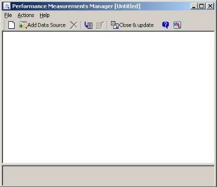

### The Performance Measurements Manager Main Window

The PMM main window is where you set up the configuration file of data sources, hosts, and performance measurements to monitor. The main window displays the data sources configured to be monitored together with the hosts and the performance measurements being monitored on each host.

The main window consists of the following:

- Menu bar
- Toolbar
- Configuration window
- Description pane

#### Menu Bar
The PMM menu bar is located at the top of the window.

This section discusses each of the PMM menus, their options, and their related toolbar buttons.

##### File Menu

The File menu includes the following functions for PMM configuration file management.

> **Note:** Menu entries vary depending if PMM is run from within WebLOAD Console or as a standalone tool.

|**Menu Entry**|**Icon**|**Description**|
| :- | :- | :- |
|New Configuration / New|

![\\Jordan\d$\work\RadView\Designs\11. [New]_16_Color_Icons\PMM-icons\png\File_New.png]
|Clears the configuration in the PMM main window.|
|Open (available only in the PMM standalone tool)|

|Opens the Open dialog box, enabling you to select the PMM file to open.|
|Import PMM|

![\\Jordan\d$\work\RadView\Designs\11. [New]_16_Color_Icons\PMM-icons\png\ImportPMM.png]
|
Opens an existing PMM configuration.

If a configuration is already defined in the Configuration pane, PMM prompts you to Append the selected file to the existing configuration, or replace the existing configuration.
|
|Export PMM|

![\\Jordan\d$\work\RadView\Designs\11. [New]_16_Color_Icons\PMM-icons\png\ExportPMM.png]
|
Saves the current configuration to a \*.pmm file. The following information is saved:

- Data sources

- Hosts

- Selected measurements from each data source on each host

**Note:** Exporting a configuration from the PMM within WebLOAD Console does not assign the configuration to the current template. To update the template with the configuration displayed, click **Close and update Template**.
|
|Save / Save As (available only in the PMM standalone tool)|

![\\Jordan\d$\work\RadView\Designs\11. [New]_16_Color_Icons\PMM-icons\png\File _Save.png]
|Saves the current configuration to a \*.pmm file.|
|p>Close and Update Template (available only in the PMM initiated through the WebLOAD

Console)
|

![\\Jordan\d$\work\RadView\Designs\11. [New]_16_Color_Icons\PMM-icons\png\CloseUpdateTemplate.png]
|
Closes PMM and updates the current WebLOAD template with the current PMM configuration.

**Note:** The PMM configuration is not saved outside of the template.
|
|Exit|none|Closes PMM.|

##### Action Menu

The Actions menu includes the following functions for creating a PMM configuration file and controlling the Configuration pane.

|**Menu Entry**|**Icon**|**Description**|
| :- | :- | :- |
|Add Data Source|

![*]
|Opens the PMM Wizard for configuring new data sources, hosts and measurements to monitor.|
|Delete|

![\\Jordan\d$\work\RadView\Designs\11. [New]_16_Color_Icons\PMM-icons\png\delete.png](../images/console_users_guide_2116.png)
|Deletes the currently selected item and all sub-items from the configuration.|
|Clear All (available only in the PMM standalone tool)|

|Removes all elements from the current configuration.|
|Expand Tree|

|Expands the configuration tree.|
|Collapse Tree|

|Collapses the configuration tree.|

##### Help Menu

Use the PMM Help menu to access online help, the WebLOAD Community, as well as copyright and version information about PMM.

#### Configuration Pane

The Configuration pane displays the performance objects that are configured for monitoring, including hosts, data sources and measurements.

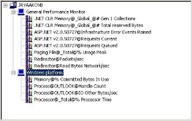

#### Description Pane

The Description pane displays information about the item selected in the Configuration window. As you click different items in the Configuration window, the information displayed in the description pane changes appropriately.

### The PMM Configuration Tree Structure

The PMM Configuration tree gives you a complete graphical overview of the performance objects configured for monitoring, including hosts, data sources and measurements. The icons adjacent to the tree items enable you to view your current configuration at a glance.

The following figure shows the PMM configuration tree, configured to collect data from two hosts, each with one data source and multiple measurements.

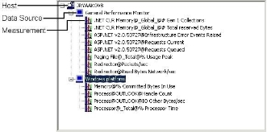

#### Configuration Tree Structure

The first level branches display the hosts for which the data sources and measurements are defined. The second level branches display the data sources configured on each host and the third level branches display the measurements configured for each data source on each host.

#### Configuration Tree Icons

PMM displays icons on each line of the Configuration Tree, making it easy to view the performance objects configured for collection during your test session.

The Configuration Tree icons are described in the following table:

|**Icon**|**Performance Object**|
| :- | :- |
|

![\\Jordan\d$\work\RadView\Designs\11. [New]_16_Color_Icons\PMM-icons\png\hostSelection.png](../images/console_users_guide_2122.png)
|Host|
|

|Data Source|
|

|Measurement|

The following options can be accessed through the right mouse button:

<table><tr><th colspan="1" valign="top"><b>Tree Item</b></th><th colspan="1" valign="top"><b>Right-Mouse Option</b></th><th colspan="1" valign="top"><b>Description</b></th></tr>
<tr><td colspan="1" rowspan="2" valign="top">Host</td><td colspan="1" valign="top">Add data source</td><td colspan="1" valign="top">Opens the PMM Wizard, enabling you to select additional data sources to monitor on the selected host.</td></tr>
<tr><td colspan="1" valign="top">Delete</td><td colspan="1" valign="top">Removes the selected host from the configuration.</td></tr>
<tr><td colspan="1" rowspan="2" valign="top">Data Source</td><td colspan="1" valign="top">Add measurements</td><td colspan="1" valign="top">Opens the PMM Wizard to enabling you to select additional measurement to monitor on the selected data source.</td></tr>
<tr><td colspan="1" valign="top">Delete</td><td colspan="1" valign="top">Removes the selected data source from the configuration.</td></tr>
<tr><td colspan="1" valign="top">Measurement</td><td colspan="1" valign="top">Delete</td><td colspan="1" valign="top">Removes the selected measurement from the configuration.</td></tr>
</table>

### Navigating the PMM Configuration Tree

You can move through a PMM configuration tree by expanding and collapsing nodes as needed with the plus and minus keys, or by clicking and double-clicking with the mouse.

The following table lists the mouse actions you can use to move through a PMM configuration tree.

|**Action**|**Result**|
| :- | :- |
|Click|Selects an item and displays a description for the selected item.|
|Double-click|Displays or hides items contained by the selected item.|
|Right-click|Displays the Actions shortcut menu for the selected item.|

The following table lists the keystrokes you can use to move in the PMM main window.

|**Key**|**Result**|
| :- | :- |
|UP ARROW|Moves the selection up one item in the configuration tree.|
|DOWN ARROW|Moves the selection down one item in the configuration tree.|
|RIGHT ARROW|Expands the selected item. If the selected item does not contain hidden items, behaves like down arrow.|
|LEFT ARROW|Collapses the selected item. If the selected item does not contain exposed items, behaves like up arrow.|
|PAGE UP / HOME|Moves the selection to the first item in the configuration tree.|
|PAGE DOWN|Moves the selection to the bottom item visible in the window.|
|END|Moves the selection to the last item in the configuration tree.|
|Plus sign “+” on the numeric keypad|Expands the selected node.|
|Minus sign “-” on the numeric keypad|Collapses the selected node.|
|Asterisk “\*” on the numeric keypad|Expands the entire tree below the selected node.|

## Using PMM Configuration Files

PMM configuration files can be created and attached to WebLOAD Console templates for monitoring performance in a test session, or configured and saved for use in future WebLOAD Console sessions.

### Creating a New Configuration File

When PMM is first opened the main configuration window is empty, enabling you to create a new configuration file. For directions on how to define the components to monitor, see [*Specifying the Data Sources, Hosts, and Measurements to Monitor* ](#specifying-the-data-sources-hosts-and-measurements-to-monitor).

If the PMM currently displays a configuration file, creating a new configuration file requires clearing the current configuration information from the display window.

**To clear an existing configuration from the configuration window in order to define a new configuration file:**

1. Click the **New  ![\\Jordan\d$\work\RadView\Designs\11. [New]_16_Color_Icons\PMM-icons\png\File_New.png]** toolbar button.

   A dialog box appears asking for confirmation.

1. Click **Yes**.

   The PMM configuration window is cleared.

### Opening / Importing Saved PMM Configuration Files

PMM configurations can either be opened alone, or they can also be added to any existing configuration in the PMM configuration window, letting you reuse existing configuration files within a new test configuration.

**To open an existing configuration file:**

1. #### **File** > **Import PMM**,
   -Or-

   Click the **Import  ![\\Jordan\d$\work\RadView\Designs\11. [New]_16_Color_Icons\PMM-icons\png\ImportPMM.png]** toolbar button.

   The Open dialog box opens for selecting an existing PMM configuration file.

1. Browse to the location of the PMM configuration files, select a file, and click **Open**.

   If a configuration is already defined and displayed within the PMM configuration window, a message box displays:

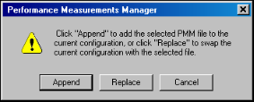

The message box has the following options:

- **Append** ‒ Add the selected PMM configuration to the current configuration in the PMM configuration window.
- **Replace** ‒ Remove the current configuration in the PMM configuration window, and replace it with the selected configuration.
- **Cancel** ‒ Aborts the PMM configuration file opening/importing process. The selected configuration is added to the PMM configuration window.

### Assigning a PMM Configuration to a WebLOAD Console Template

PMM configurations can only be attached to WebLOAD Console templates when working with the PMM from within WebLOAD Console.

**To assign a PMM configuration to a template:**

1. Ensure that the template to which you want to assign the PMM configuration is open in WebLOAD Console.
1. Open / define the PMM configuration you want to attach to the template. For information on defining PMM configurations, see [*Specifying the Data Sources, Hosts, and Measurements to Monitor* ](#specifying-the-data-sources-hosts-and-measurements-to-monitor).
1. Select **File** > **Close and update Template**,

   -Or-

   Click the ![\\Jordan\d$\work\RadView\Designs\11. [New]_16_Color_Icons\PMM-icons\png\CloseUpdateTemplate.png] **Close & update** toolbar button.

   PMM closes and the configuration file is assigned to the current template.

### Saving and Exporting PMM Configurations

After configuring the data sources, hosts and measurements to monitor you can save the configuration for use in WebLOAD Console tests. PMM lets you save multiple configurations to save you the time of reconfiguring the measurements to monitor each test. PMM configuration files are saved with the extension \*.pmm.

PMM configuration files include the following information to monitor:

- Data sources
- Hosts
- Measurements

#### Exporting PMM Configuration Files

When working with PMM from within WebLOAD Console you create configurations for use with the current WebLOAD Console template. To save the configuration, you must export it to a PMM file.

**To export PMM files:**

1. From the PMM activated in WebLOAD Console, select **File** > **Export PMM**,

   -Or-

   Click the **Export ![\\Jordan\d$\work\RadView\Designs\11. [New]_16_Color_Icons\PMM-icons\png\ExportPMM.png]** toolbar button. The Save As dialog box opens.

1. Browse to the location you want to save your PMM file, enter a name for the file in the File Name field, and click **Save**.

#### Saving PMM Configuration Files

When working with PMM as a standalone tool, you can save configurations for use in WebLOAD Console tests. The configuration is not attached to any WebLOAD Console template.

**To save PMM files:**

1. From the PMM standalone tool, select **File** > **Save**,

   -Or-
   
   Click the **Save** toolbar button. The Save As dialog box opens.

2. Browse to the location you want to save your PMM file, enter a name for the file in the File Name field, and click **Save**.

## Specifying the Data Sources, Hosts, and Measurements to Monitor

PMM can be used for adding new data sources to the PMM configuration or updating an existing configuration. You select the type of data source to monitor and the measurements to monitor on each host. When you connect to a host server using Perfmon (Windows), you must have administrator privileges on that server in order to successfully monitor it. For more information about configuring administrator privileges on a host server using Perfmon (Windows), see [*Configuring Administrator Privileges for Perfmon (Windows)* ](#configuring-administrator-privileges-for-perfmon-windows).

Some data sources require initial configuration to enable monitoring by the PMM. For more information, refer to [*Enabling Data Sources Monitoring* ](#enabling-data-sources-monitoring)

### Adding Data Sources

Data sources are the performance objects you want to monitor.

#### Starting the Performance Measurements Manager Wizard

**To add new data sources:**

1. Click the  **Add data source** toolbar button.

   The Performance Measurements Manager Wizard opens.

   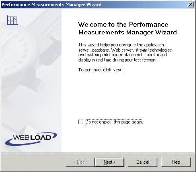

2. Check or clear **Do not display this page again**.

3. Click **Next**.

   The Data Source screen appears.

#### Selecting the Data Source

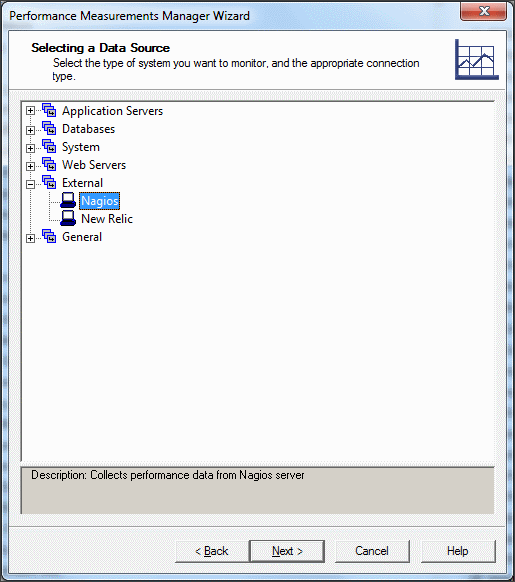

**To select a data source:**

1. Expand the tree to view all available data sources. PMM supports the following types of data sources:

   **Application Servers:**

   - Adobe LiveCycle ES using JMX

   - GlassFish AS using JMX

   - IBM WebSphere 5 using WAS

   - JBoss 4.x-5.x GA using JMX

   - JOnAS using JMX
   - Microsoft Active Server Pages
   - Microsoft ASP .Net
   - Oracle WebLogic 10.0 using JMX
   - Oracle WebLogic using SNMP
   - SAP NetWeaver using JMX
   - Tomcat 6.x using JMX
   - WebSphere 6.1 using JMX
   - WebSphere 7.0 using JMX

   **Databases:**

   - Microsoft SQL Server
   - Microsoft SQL Server using SNMP (does not support SQL 2005 or 2008)
   - MySQL database using SNMP
   - Oracle

   **System:**

   - UNIX/Linux platforms Network data using SNMP
   - UNIX/Linux platforms using RSTATD
   - UNIX/Linux UC-Davis
   - Windows .Net Framework
   - Windows platform
   - **Web Servers:**
   - Apache 2 web server using SNMP
   - Apache web server using SNMP
   - Microsoft Internet Information Server (IIS)
   - Sun One (former iPlanet 6)

   **General:**

   - General JMX – General JMX can be used to connect to any server that supports both JMX (JSR-3) and JMX Remoting (JSR-160).General Performance 
   - Monitor – General Performance Monitor can be used just like the System > Windows Platform. The difference is that it gives access to all Performance Monitor counters.
   - General SNMP – General SNMP can be used similarly to other SNMP-based PMs. The difference is that is gives access to all MIBs served by the SNMP agent on that machine.
   - General UNIX – General UNIX can be used similarly to the System > UNIX platform using RSTATD. The difference is that is gives access to all RSTATD counters.

   **External**

   - Nagios – Collects performance data from an installed Nagios server
   - New Relic– Collects performance data from an installed New Relic server

2. Select a server or system as a data source, and click **Next**. The Host Selection screen appears.

#### Selecting a Host

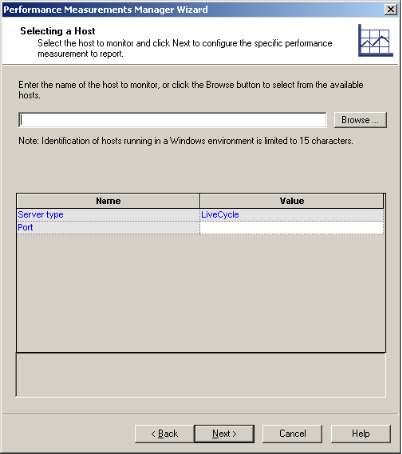

**To select a host:**

1. Click **Browse** to select a host to monitor.

   The Host Selection dialog box opens.

   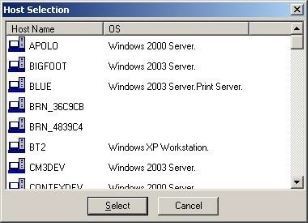

2. Select the host to monitor from the list and click **Select**. The host is added to the Selecting a Host screen.

3. Some application server data sources require that you enter the application server’s port value. Contact your system administrator for the information.

4. Following are port numbers commonly used by some application server data sources:

   - Tomcat – 8080.

   - JBoss – 1099.

   - WebSphere – 9080.

   - WebLogic – 7001.

5. Click **Next**.

   PMM attempts to connect to the host. If you are accessing this host for the first time within this Load Template, PMM prompts you for your username and password on the host.

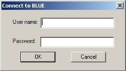

Enter your username and password.

If a connection is successfully made, the Wizard progresses to the Measurements to Monitor screen.

If a connection cannot be established, the Wizard returns to the Host Selection screen, enabling you to select an alternate host.

#### Selecting the Measurements to Monitor

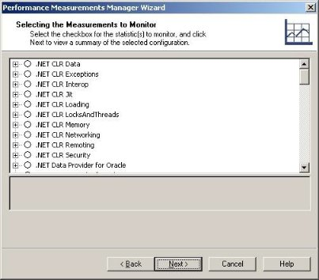

**To select the measurements to monitor:**

1. Select one or more measurements to monitor by clicking the checkbox adjacent to the item. PMM only collects the data for measurements that are selected. All other data is not collected.

   Explanations of each measurement are available by clicking the measurement name. The explanation appears at the bottom of the window.

   The list of available measurements varies depending upon the type of data source. Each data source is supplied with a default set of measurements to monitor.
   
   > **Notes:**
   >
   > An empty circle  next to a measurement indicates that the measurement contains sub- components and that no default sub-components are defined (the upper level component cannot be selected). To select sub-components, click the **+** to expand the tree.
   >
   > A circle with a checkmark  next to a measurement indicates that the measurement contains sub-components and that default sub-components are defined. To view and configure the configured subcomponents, click the **+** to expand the tree.

2. Click **Next**.

   The Wizard displays a summary of the host, data source, and measurements configured for monitoring.

   

#### Finishing the Configurations

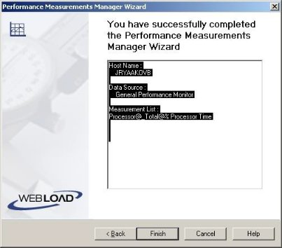

**To finish the configurations:**

1. To accept the configuration, click **Finish**.

   The PMM Wizard closes and the selected configuration is added to the PMM main window.
   
   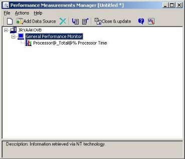

2. To add additional data sources, hosts, and measurements to monitor, click the **Add data source** toolbar button and repeat the process.

### Adding Measurements to a Configured Data Source

Measurements can be added quickly and easily to a data source configured in the PMM window.

**To add measurements to a data source already configured in the PMM:**

1. Right-click the data source to which you want to add measurements and click **Add measurements** from the pop-up menu.

   The Measurements to Monitor screen for the selected data source appears.

1. Select all of the measurements you want to monitor for the data source by selecting the checkbox adjacent to the measurement names.

   Explanations for each measurement are available by clicking the measurement name. The explanation appears at the bottom of the window.

1. Click **Next**.

   A summary of the current configuration appears.

1. To accept the configuration, click **Finish**.

   The PMM Wizard closes and the configuration is updated in the PMM main window.

### **Adding Data Sources to a Configured Host**

Data sources can be added quickly and easily to a host configured in the PMM window.

**To add data sources to a host already configured in the PMM:**

1. Right-click the host in the PMM main window to which you want to add a data source, and click **Add data source** from the pop-up menu.

   The Select a Data Source Wizard screen appears.

1. Select the data-source to add to the configuration and click **Next**.

   The PMM Wizard progresses to the Measurements to Monitor screen.

1. Select all of the measurements you want to monitor for the data source.

   Explanations of each measurement are available by clicking the measurement name. The explanation appears at the bottom of the window.

1. Click **Next**.

   A summary of the current configuration appears.

1. To accept the configuration, click **Finish**.

   The PMM Wizard closes and the configuration is updated in the PMM main window.

### Deleting a Data Source

**To delete a data source from PMM configuration:**

1. Right-click the data source you wish to delete in the PMM main window.
1. Select **Delete** from the pop-up menu.

   A message box appears asking for confirmation.

1. Click **Yes**.

   The data source is removed from the configuration and is no longer monitored.

### Deleting a Monitored Host

**To delete a host from the PMM configuration:**

1. Right-click the host you wish to delete in the PMM main window.
1. Select **Delete** from the pop-up menu.

   A message box appears asking for confirmation.

3. Click **Yes**.

The host, and all data sources and measurements configured for the host are removed from the configuration and are no longer monitored.

### **Deleting a Measurement**

**To delete a measurement from the PMM configuration:**

1. Right-click the measurement you wish to delete in the PMM main window.
1. Select **Delete** from the pop-up menu.

   A message box appears asking for confirmation.

1. Click **Yes**.

   The measurement is removed from the configuration and no longer monitored.

### Configuring Administrator Privileges for Perfmon (Windows)

In order to successfully monitor a host server using Perfmon (Windows), you must have administrator privileges on that server. There are three methods for configuring Administrator privileges:

- [*Configuring Administrator Privileges on a Server* ](#configuring-administrator-privileges-on-a-server)
- [*Configuring Administrator Privileges on all Servers Simultaneously* ](#configuring-administrator-privileges-on-all-servers-simultaneously)
- [*Configuring Administrator Privileges on non-Server* PCs ](#configuring-administrator-privileges-on-non-server-pcs)

#### Configuring Administrator Privileges on a Server

**To configure Administrator privileges on a server:**

1. Log into the server to be tested.
1. Right-click **My Computer** and click **Manage.** The Computer Management screen appears.
1. In the Local Users and Groups area, add your WebLOAD Console username to the following groups:

   - Performance Log Users
   - Performance Monitor Users

#### Configuring Administrator Privileges on all Servers Simultaneously

#### **To configure Administrator privileges on all servers simultaneously:**

1. Log into the Active Directory computer in the domain to be tested.
1. Navigate to **Administrative Tools > Active Directory Users and Computers**.
1. Select your WebLOAD Console username and click **Properties**.
1. Click the Member of tab and add the user to the following groups:

   - Performance Log Users
   - Performance Monitor Users

#### Configuring Administrator Privileges on non-Server PCs

The following method must be used for non-server PCs, but can also be used for server PCs.

**To configure Administrator privileges on a non-server PC:**

1. Grant at least Read permission to the following files:

   - `<Windows directory>\system32\perfcxxx.dat`
   
   - `<Windows directory>\system32\perfhxxx.dat`
   
     where xxx represents the system language (e.g., 009 for English).

2. Open regedit32 and find the following keys:
   - `HKEY\_LOCAL\_MACHINE\SYSTEM\CurrentControlSet\Control\ SecurePipeServers\Winreg`
   - `HKEY\_LOCAL\_MACHINE\SOFTWARE\Microsoft\Windows\NT\ CurrentVersion\Perflib`

3. Grant your user at least Read permission to these keys and their sub-keys and close regedit32.

   Your user has access to monitor the performance of the host server using Perfmon (Windows).

For more information about configuring administrator privileges on a host server using Perfmon (Windows), see *Controlling remote Performance Monitor access to Windows NT servers*, located at [http://support.microsoft.com/default.aspx?scid=kb;en-us;164018.](http://support.microsoft.com/default.aspx?scid=kb%3Ben-us%3B164018)

## Enabling Data Sources Monitoring

PMM enables you to monitor various data sources during runtime to view performance data in real time. However, some data sources require preliminary configuration of the data source and/or of WebLOAD. The following sections describe the various data sources and, where applicable, the necessary preliminary configuration.

### Enabling Application Server Monitoring

PMM enables you to monitor application servers during runtime to view performance data from the application server in real-time. Before running your test session, you may need to perform some configuration tasks, as described below.

> **Note:** No configuration is necessary if you are using the following servers: GlassFish AS using JMX, JOnAS using JMX, Microsoft Active Server Pages, Microsoft ASP.NET.

#### Adobe Life Cycle Enterprise Server using JMX – Configuration Tasks

Adobe Life Cycle Data Services Enterprise Server JMX configuration depends on the type of server being used: JRun or Tomcat.

##### Configuring a JRun Server

The JRun configuration file is \lcds\jrun4\bin\jvm.config.

In order to enable JMX, set the following in the configuration file:

`java.args=-Xms32m -Xmx384m`

`-Dsun.io.useCanonCaches=false`

`-Dcom.sun.management.jmxremote`

`-Dcom.sun.management.jmxremote.port=<port>`

`-Dcom.sun.management.jmxremote.ssl=false`

`-Dcom.sun.management.jmxremote.authenticate=false`

##### Configuring a Tomcat Server

The Tomcat configuration file is \lcds\tomcat\bin\catalina.bat. In order to enable JMX, set the following in the configuration file:

`set CATALINA\_OPTS=%CATALINA\_OPTS% -Dcom.sun.management.jmxremote`

`-Dcom.sun.management.jmxremote.port=<port>`

`-Dcom.sun.management.jmxremote.ssl=false`

`-Dcom.sun.management.jmxremote.authenticate=false`

`-Djava.rmi.server.hostname=<hostname>`

#### IBM WebSphere 5 Using WAS – Configuration Tasks

To monitor the IBM WebSphere 5 application server in the Performance Measurements Manager Wizard, you need to install the supported IBM WebSphere 5 software and configure the IBM WebSphere 5 server.

##### WebLOAD Configuration

To enable the PMM to monitor the IBM WebSphere 5 application server, you need to install the IBM WebSphere Application Server WAS, Version 5 Application Client software.

For information about obtaining and installing the WebSphere 5 Application Client software, refer to the WebSphere info center at [http://www.ibm.com/software/webservers/appserv/infocenter.html ](http://www.ibm.com/software/webservers/appserv/infocenter.html)or contact IBM.

When this software package is not installed or has not been installed properly, the ability to monitor WebSphere 5 using WAS is not available and WebLOAD might show one of the following error messages:

- The IBM J2EE Client version x (required for probing WebSphere) is not installed. Please install the IBM J2EE Client.
- The IBM J2EE Client version x (required for probing WebSphere) is not installed properly. Please reinstall the IBM J2EE Client.
- The Java program associated with the IBM J2EE Client (required for probing WebSphere) is not found. Please reinstall the IBM J2EE Client.
- The IBM J2EE Client version x (required for probing WebSphere) is not installed. Before continuing, please install the IBM J2EE Client.
- The file [name], essential for probing WebSphere, could not be found in the J2EE directory. Before continuing, please install the IBM J2EE Client version x.

##### Server Side Configuration

- Enable data collection as described in:[ http://www.ibm.com/software/webservers/appserv/doc/v35/ae/](http://www.ibm.com/software/webservers/appserv/doc/v35/ae/%0binfocenter/was/atsepmcf.html)[ infocenter/was/atsepmcf.html](http://www.ibm.com/software/webservers/appserv/doc/v35/ae/%0binfocenter/was/atsepmcf.html).

- Turn off the security settings on the application server, as follows:

  1. Log in to the server by typing the following command line directly on the server:

     `wsadmin.bat -user <user name> -password <user password>`

  2. Type the following command to disable the security settings:

     `$AdminTask setGlobalSecurity {-interactive}”`

  3. Type $AdminConfig save to save the new configuration.

  4. Restart the application server.

     
#### JBoss 4.x – 5.x using JMX – Configuration Tasks

To enable the PMM to monitor the JBoss 4.x – 5.x using JMX, you need to configure the JBoss 4.x – 5.x application server to use JMX, and configure WebLOAD to use JBoss 4.x and 5.x.

##### **Server Side Configuration:**

**To configure JBoss to use JMX:**

1. Edit the server execution file (for example, /usr/local/jboss/bin/run.sh) by adding the following flags:

   `JAVA\_OPTS=$JAVA\_OPTS -Dcom.sun.management.jmxremote=true JAVA\_OPTS=$JAVA\_OPTS -`

   `Dcom.sun.management.jmxremote.port=6789`

   `JAVA\_OPTS=$JAVA\_OPTS -`

   `Dcom.sun.management.jmxremote.authenticate=false`

   `JAVA\_OPTS=$JAVA\_OPTS -`

   `Dcom.sun.management.jmxremote.ssl=false`

   where jmxremote.port is some arbitrary free TCP port.

1. Run JBoss with -b0.0.0.0. This instructs the server not to bind exclusively to localhost.

> **Note:** By default, the JBoss Naming Service (JNDI) is listening on TCP port 1099. This port is the default port, retrieved from the Service Binding Manager. You can change the default port by changing the following configuration file:
>
> `/usr/local/jboss/server/all/conf/jboss-service.xml.`

##### WebLOAD Configuration

**To configure WebLOAD to use JBoss 4.x.x:**

1. Put the jars jboss-management.jar and jbossall-client.jar into <WebLoad- ProgramData-Dir>\extensions\Java.
1. Try to connect to port 1099 (JNDI) with the default installation.

**To configure WebLOAD to use JBoss 5.x.x:**

1. Put the following jars into <WebLoad-ProgramData-Dir>\extensions\Java:

   0. lib/jboss-common-core.jar
   0. client/jmx-invoker-adaptor-client.jar
   0. client/jbossjmx-ant.jar
   0. client/jboss-logging-spi.jar
   0. client/jboss-client.jar
   0. common/lib/jboss-serialization.jar
   0. common/lib/jboss-remoting.jar
   0. common/lib/jboss-security-spi.jar
   0. common/lib/jboss-integration.jar
   0. common/lib/jboss-javaee.jar
   0. common/lib/jboss-management.jar
1. Try to connect to port 1099 (JNDI) with the default installation.

#### Oracle WebLogic 10.0 Using JMX – Configuration Tasks

To enable the PMM to monitor Oracle WebLogic 10.0 Using JMX, you need to configure the Oracle WebLogic server.

##### Server Side Configuration

**To configure the Oracle WebLogic server:**

In the server's start-up script (for example, startWebLogic.cmd), add the following rows:

`set JAVA\_OPTIONS=%JAVA\_OPTIONS% -`

`Dcom.sun.management.jmxremote=true`

`set JAVA\_OPTIONS=%JAVA\_OPTIONS% -`

`Dcom.sun.management.jmxremote.port=6790`

`set JAVA\_OPTIONS=%JAVA\_OPTIONS% -`

`Dcom.sun.management.jmxremote.authenticate=false`

`set JAVA\_OPTIONS=%JAVA\_OPTIONS% -`

`Dcom.sun.management.jmxremote.ssl=false`

#### Oracle WebLogic Using SNMP – Configuration Tasks

To enable the PMM to monitor Oracle WebLogic using SNMP, you need to configure the Oracle WebLogic to set up a server side SNMP agent and configure the PMM to use Oracle WebLogic.

##### Server-side Configuration

**To set up a server-side SNMP agent:**

1. Log into the WebLogic Administration Console.
1. In the Domain Structure tree, expand the **Diagnostics** node and click the **SNMP**

   node.

1. Perform the following in the **Server SNMP Agents** table:
   1. Click **New** to add and configure a new SNMP Server agent.
   1. Specify a name.
   1. Click **OK** to continue.

      The new SNMP Server Agent is added with the following settings: Enabled = false, UDP Port = 161.

   1. Click the name of the new SNMP Server Agent to configure its settings.
   
   1. Check the **Enabled** option.
   
   1. Change the SNMP UDP port number. You can set it to be any free UDP port, such as 3161.
   
   1. Change the Trap Version to V2.
   
   1. Click **Save** to continue.

4. Set the target server for monitoring, as follows:
   1. Click the **Targets** tab.
   1. Select the relevant servers from the list. Select only one server per agent.
   1. Click **Save** to continue.

The basic configuration of an SNMP Server agent is complete. No restart is needed.

##### WebLOAD Configuration:

In the PMM wizard, enter the following parameters:

1. In the Selecting a Host window, it is preferred to specify the IP address of the active network interface.
1. System Entry Point – for Oracle WebLogic the default system entry point is **.1.3.6.1.4** (**iso.org.dod.internet.private.enterprises**) or **.1.3.6.1.4. 140.625.105.1.1.16.**

#### SAP NetWeaver Using JMX – Configuration Tasks

To enable the PMM to monitor SAP NetWeaver Using JMX, you need to configure the PMM to use SAP NetWeaver.

##### WebLOAD Configuration:

1. Copy the following jars for SAP NetWeaver installation to

   `C:\Program Files\RadView\WebLOAD\extensions\java:`

   - `com\_sap\_pj\_jmx.jar – the SAP-JMX library.`
   - `client.jar – the SAP AS Java client API (includes the JMX Adapter).`
   - `exception.jar – the SAP exception framework.`
   - `logging.jar – the SAP Logging API.`
1. In the PMM wizard, perform the following:

   1. In the Selecting a Host window, specify the RMI-P4 port.
   1. When you are prompted for your username and password on the host, enter the credentials of a user with a default administrator role.

#### Tomcat 6.0 Using JMX – Configuration Tasks

To enable the PMM to monitor Tomcat 6.0 Using JMX, you need to configure the Tomcat 6.0 application server.

**Server-side configuration**

In the server's execution script (for example, \bin\catalina.bat), add the following rows:

`set CATALINA\_OPTS=%CATALINA\_OPTS% -Dcom.sun.management.jmxremote`

`-Dcom.sun.management.jmxremote.port=<port> - Dcom.sun.management.jmxremote.ssl=false`

`-Dcom.sun.management.jmxremote.authenticate=false - Djava.rmi.server.hostname=<hostname>`

#### WebSphere 6.1 Using JMX – Configuration Tasks

To enable the PMM to monitor WebSphere 6.1 using JMX, you need to configure the WebSphere 6.1 application server and configure WebLOAD to support WebSphere 6.1.

##### **Server-side configuration**

1. Add -Djavax.management.builder.initial= - Dcom.sun.management.jmxremote to the Generic JVM Argument, as follows:
   1. Launch the WebSphere Application Server.
   1. Connect to the Administration Console.
   1. Select **Servers** > **Server Types** > **WebSphere application servers**, and specify which server to manage (default: server1).
   1. In the Configuration tab, select **Server Infrastructure** > **Java and Process Management** > **Process Definition**.
   1. #### Select **Additional Properties** > **Java Virtual Machine**.
   1. Set the Generic JVM arguments to -Djavax.management.builder.initial=

      -Dcom.sun.management.jmxremote.

1. Add the following lines to `/opt/IBM/WebSphere/AppServer/java/jre/lib/management/management.properties:`

   `com.sun.management.jmxremote.port=9999` 

   `com.sun.management.jmxremote.authenticate=false` 
   
   `com.sun.management.jmxremote.ssl=false`

##### WebLOAD Configuration:

Copy the following libraries from the application server’s installation directory to the

<WebLOAD\_DIR>\ extensions\java\ directory:

- `com.ibm.ws.admin.client\_6.1.0.jar`
- `com.ibm.ws.runtime\_6.1.0.jar`
- `ibmorb.jar`

#### WebSphere 7.0 Using JMX – Configuration Tasks

To enable the PMM to monitor WebSphere 6.1 Using JMX, you need to configure the WebSphere 6.1 application server and configure WebLOAD to support WebSphere 6.1.

##### Server-side configuration

1. Add -Djavax.management.builder.initial= - Dcom.sun.management.jmxremote to the Generic JVM Argument, as follows:
   1. Launch the WebSphere Application Server.
   1. Connect to the Administration Console.
   1. Select **Servers** > **Server Types** > **WebSphere application servers**, and specify which server to manage (default: server1).
   1. In the Configuration tab, select **Server Infrastructure** > **Java and Process Management** > **Process Definition**.
   1. #### Select **Additional Properties** > **Java Virtual Machine**.
   1. Set the Generic JVM arguments to `-Djavax.management.builder.initial=`

      `-Dcom.sun.management.jmxremote`.

1. Add the following lines to

   `/opt/IBM/WebSphere/AppServer/java/jre/lib/management/management.properties:`

   `com.sun.management.jmxremote.port=9999` 
   
   `com.sun.management.jmxremote.authenticate=false` 
   
   `com.sun.management.jmxremote.ssl=false`

##### WebLOAD Configuration:

Copy the following libraries from the application server’s installation directory to the

<WebLOAD\_DIR>\ extensions\java\ directory:

- `[WebSphere]/AppServer/runtimes/com.ibm.ws.admin.client\_7.0.0. jar`
- `[WebSphere]/AppServer/plugins/com.ibm.ws.runtime.jar`

- `[WebSphere]/AppServer/runtimes/com.ibm.ws.webservices.thincli ent\_7.0.0.jar`
- `[WebSphere]/AppServer/java/jre/lib/ibmorb.jar`
- `[WebSphere]/AppServer/java/jre/lib/ibmjgssprovider.jar`
- `[WebSphere]/AppServer/deploytool/itp/plugins/com.ibm.webspher e.v7\_7.0.0.v20080817/wasJars/ibmjsseprovider2.jar`

Where `[WebSphere]` is the application server’s installation directory.

### Enabling Database Monitoring

PMM enables you to monitor database servers during runtime. This allows you to view performance data from the database in real-time. Before running your test session, you may need to perform some configuration tasks, as described below.

> **Note:** No configuration is necessary if you are using the following database: Microsoft SQL server.

#### Oracle Monitor – Configuration Tasks on Windows

The PMM Oracle database monitor uses SNMP to retrieve statistics.

**To use this monitor on Windows you must:**

1. Install SNMP support for Windows.
1. Install SNMP support for Oracle using the Oracle Database installation.
1. Specify the port where the Oracle master agent is listening.

   The required port is specified in the TRANSPORT section of the MASTER.CFG file located in the \ADMIN directory.

   For example, add the following section to the MASTER.CFG file:

   TRANSPORT ordinary SNMP OVER UDP SOCKET

   AT PORT 161

   Use port 161 for the Oracle Peer SNMP master agent.

1. Specify the authentication in the COMMUNITY section of the MASTER.CFG file. For example:

   `COMMUNITY public` 
   
   `ALLOW ALL OPERATIONS` 
   
   `USE NO ENCRYPTION`

5. Specify an unused port where the encapsulated agent, such as Microsoft SNMP service, should listen. Microsoft SNMP service typically uses port 1161. The port is specified in the SERVICES file located in the NT\_HOME|\SYSTEM32\DRIVERS\ETC directory.

   For example, modify the nt\_home\system32\drivers\etc\services file from:

   …

   snmp 161/udp

   …

   To:

   snmp 1161/udp

6. Specify which non-PEER master agents are to be encapsulated by editing the encapsulator configuration file, ENCAPS.CFG, located in the \ADMIN directory. You must add the AGENT entry, including MIB-subtrees manageable by NMS, for the encapsulated master agent.

   For example, modify the encaps.cfg file as follows: AGENT AT PORT 1161 WITH COMMUNITY public SUBTREES 1.3.6.1.2.1.1,

   `1\.3.6.1.2.1.2,`

   `1\.3.6.1.2.1.3,`

   `1\.3.6.1.2.1.4,`

   `1\.3.6.1.2.1.5,`

   `1\.3.6.1.2.1.6,`

   `1\.3.6.1.2.1.7,`

   `1\.3.6.1.2.1.8,`

   `1\.3.6.1.4.1.77`

   `FORWARD ALL TRAPS;`

   > **Note:** The port (1161) must match the unused port specified in step 5.

7. Make the “OracleSNMPPeerEncapsulator” service automatic and start it.
8. Reboot your computer.

#### Oracle Monitor – Configuration Tasks on UNIX

The PMM Oracle database monitor uses an SNMP Master Agent to communicate with the Oracle Intelligent Agent. The SNMP Master Agent and the Oracle Intelligent Agent must be configured correctly before the Oracle Intelligent Agent can communicate over SNMP to the Master Agent on a UNIX platform. For detailed information on configuring the Intelligent Agent, see the *Oracle Enterprise Manager Configuration Guide*.

**To use this monitor on UNIX you must:**

1. Configure the SNMP Master Agent.
1. Start the SNMP Agents.

##### **Configuring the SNMP Master Agent**

The necessary SNMP files are installed automatically when you install the Oracle Intelligent Agent. After installing the Oracle Intelligent Agent, you will have to edit the following files as described below:

- $ORACLE\_HOME/network/snmp/peer/CONFIG.master
- $ORACLE\_HOME/network/snmp/peer/CONFIG.encap
- $ORACLE\_HOME/network/snmp/peer/start\_peer
- /etc/snmpd.config

###### CONFIG.Master (Peer Master Agent file)

**To edit the CONFIG.master file:**

- Find the line beginning with MANAGER and change the IP address coded in this line to match the IP address of the machine where the SNMP traps will be sent.

###### CONFIG.encap (Peer Encapsulator file

**To edit the CONFIG.encap file:**

- Find the line AGENT AT PORT. It normally reads AGENT AT PORT 1161 WITH COMMUNITY public.

If you modify the port number from 1161, you must also modify the start\_peer

script.

###### start\_peer Script

**To edit the start\_peer script:**

1. Find the line NEW\_SNMPD\_PORT= and verify that it is using the same port number listed above in the CONFIG.encap file.
1. Find the line NEW\_TRAPD\_PORT= and verify the port number is different from

   NEW\_SNMPD\_PORT=.
   
   

###### snmpd.config File

**To edit the snmpd.config file:**

1. Add the following line to the file:

   trap <hostname or ipaddress>

1. Replace the information in angle brackets with the actual hostname or IP address of the local host where the file is located.

##### **Starting the SNMP Agents**

**To start the SNMP agents:**

1. Make sure no SNMP components are running. The three main components are the master\_peer, encap\_peer, and snmpd. If any of these processes are running, use the ps command to find them, and the kill command to terminate the processes.

   For example:

   ps -ef | grep snmp

   This command checks to see if the SNMP Master Agent is running.

1. Start the PEER Master Agent, PEER encapsulator, and native Digital UNIX SNMP Agent:

   cd $ORACLE\_HOME/network/snmp/peer su root

   ./start\_peer -a

   This command starts all three processes.

1. Now use the ps command to verify that all three processes were started:

   ps -aux |grep peer ps -aux |grep snmpd ps -ef | grep snmp

#### MySQL database using SNMP – Configuration Tasks

The PMM for MySQL enable monitoring various components of MySQL using the SNMP Micro Agent for MySQL provided by AdventNet (commercial product).

For more information on the AdventNet SNMP Micro Agent for MySQL, see <http://www.adventnet.com/products/mysql_agent/index.html>.

#### Microsoft SQL Server Using SNMP – Configuration Tasks

For the Microsoft **SQL Server 2000**, enable SNMP monitoring by selecting the **Enable SNMP** check box in the SQL Server Network Utility dialog box.

Microsoft **SQL Server 2005** and **SQL Server 2008** do not support SNMP. Use the Windows Performance Monitor instead.

### Enabling Systems Monitoring

PMM enables you to monitor operating systems during runtime. This allows you to view performance data from the systems in real-time. Before running your test session, you may need to perform some configuration tasks, as described below.

> **Note:** No configuration is necessary if you are using the following systems: Windows .Net Framework, Windows platform.

### Enabling Web Servers Monitoring

PMM enables you to monitor Web servers during runtime to view performance data from the server in real-time. Before running your test session, you may need to perform some configuration tasks, as described below.

> **Note:** No configuration is necessary if you are using the following Web server: Microsoft Internet Information Server (IIS).

#### Apache Web Server Using SNMP – Configuration Tasks

The PMM uses SNMP to monitor different status values of the Apache Web server.

The Apache SNMP monitoring is based on Mod-Apache-Snmp. For download and installation instructions, refer to [http://mod-apache-](http://mod-apache-snmp.sourceforge.net/english/index.htm) [snmp.sourceforge.net/english/index.htm.](http://mod-apache-snmp.sourceforge.net/english/index.htm)

#### Apache 2 Web Server Using SNMP – Configuration Tasks

The PMM uses SNMP to monitor different status values of the Apache 2 Web server.

The Apache 2 SNMP monitoring is based on **Mod-Apache-Snmp**. For download and installation instructions, refer to [http://mod-apache-](http://mod-apache-snmp.sourceforge.net/english/index.htm) [snmp.sourceforge.net/english/index.htm.](http://mod-apache-snmp.sourceforge.net/english/index.htm)

#### Sun One (iPlanet) – Configuration Tasks

The PMM Sun One monitor uses SNMP to retrieve server statistics.

**To use this monitor you must:**

1. Install SNMP support for Windows.
1. Ensure that the iPlanet SNMP agent is installed and activated on the iPlanet server host.

   Configure the Sun One server to be a proxy for the SNMP agent.

1. Configure the Sun One server host to use port 1161 as the SNMP message port.
1. Enable **SNMP Statistics Collection** on the SNMP Subagent Configuration page of the Server Manager.

##### **Setting up the SNMP Agent and Configuring the Sun One Server as a Proxy for the SNMP Agent**

To enable PMM to monitor performance data from the Sun One application server you must first set up the Sun One SNMP agent. The Administration Interface will not start the OS master agent on ports other than 161. The workaround is to use the Sun One SNMP master agent, modify the native master agent to use a different port, and enable the Sun One SNMP subagent to gather information about the server.

**To set up the Sun One SNMP agent on Solaris:**

1. Check whether an SNMP daemon (snmpd) is running on port 161. If an SNMP daemon is running:
   1. Make sure you know how to restart it and which MIB it supports.
   1. Kill its process.
1. Edit the CONFIG file located in the plugins/snmp/magt server root directory from:

   …

   snmp 161/udp

   …

   To:

   …
   
   snmp 1161/udp
   
   …

3. Manually activate the Sun One master agent and subagent.

   1. At the command prompt, enter the commands:

      `cd <iws\_install>/Servers/plugins/snmp cd maget`

      `./magt CONFIG INIT& cd ../sagt`

      `./sagt -c CONFIG &`

   2. Restart the Sun One Server and the subagent from the Web server Administration.

## Enabling Monitoring of Application Servers that use Generic Monitoring Protocols

PMM enables you to monitor application servers that use generic monitoring protocols. You can monitor the application servers during runtime to view performance data in real-time. Before running your test session, you may need to perform some configuration tasks, as described below.

### General JMX – Configuration Tasks

The Java Management Extensions (JMX) technology provides the tools for building distributed, Web-based, modular and dynamic solutions for managing and monitoring devices, applications, and service-driven networks.

General JMX can connect to any device that supports JMX (JSR-003) and JMX Remote API (JSR-160). Refer to your application server’s documentation to see how to configure JMX for your server.

### General Performance Monitor – Configuration Tasks

General Performance Monitor can be used to connect and collect statistics using Windows Performance Monitor protocol (Perfmon).

When you connect to a host server using Perfmon (Windows), you must have administrator privileges on that server in order to successfully monitor it. For more information about configuring administrator privileges on a host server using Perfmon (Windows), see [*Configuring Administrator Privileges for Perfmon (Windows)* ](#configuring-administrator-privileges-for-perfmon-windows).

### General SNMP – Configuration Tasks

General SNMP can be used to connect to all servers supporting SNMP monitoring.

Refer to your server documentation for instructions on how to enable SNMP on your server.

### General UNIX – Configuration Tasks

RSTAT monitors enable you to monitor the **rpc.rstatd** daemon counters. This daemon is already installed and running on most Solaris and Linux machines. If not, you can obtain it at [http://rstatd.sourceforge.net/.](http://rstatd.sourceforge.net/)

This protocol uses RPC calls on port 111. You may need to open this port in the firewall to allow PMM to access the rstatd daemon.

## Monitoring Generic SNMP Data Sources

WebLOAD Console currently supports a variety of SNMP monitors by default, including basic SNMP for Windows, Solaris, and UNIX/Linux, along with WebLogic, and Oracle servers. WebLOAD Console’s SNMP monitoring support can be easily extended by updating WebLOAD Console’s UserMibFilter.ini file. For more information about extending SNMP monitoring support, see *PMM Extension* in the *WebLOAD Extensibility SDK*.

## Remote Performance Measurement Manager

This feature enables you to collect statistics on remote machines using TestTalk. With other methods of testing a remote machine, security and firewall issues may block communication between the WebLOAD Console and the remote machine. Using TestTalk to measure performance on remote machines avoids this problem.

To enable the Remote Performance Measurement Manager, you must add a special protocol extension to the Load Generator, called the Remote Machine Load Generator. This extension monitors the Windows Perfmon and sends the information back as Load Generator statistics.

Once the Remote Machine Load Generator is installed, you can add a Remote Performance Measurement Manager script to your template. When you run the template, statistics from the remote machine are gathered through the Remote Machine Load Generator and the script you configure.

## Setting the Remote Machine Load Generator

In order to collect statistics from a remote machine using the Remote Performance Measurement Manager, you must first add the Remote Machine Load Generator extension to your Load Generator. The following sections explain how to install the Remote Machine Load Generator extension.

#### Installing the Remote Machine Load Generator Extension

Install WebLOAD on any Windows machine that can access the server you want to probe. For more information, see the *WebLOAD Installation Guide.*

#### Setting INI Properties

Set the following parameters in webload.ini of the Load Generator installation

(<Install Dir>\bin):

PROTOCOLS=“pmprobeprotocol.dll;JSCOMObject.dll” PROTOCOLS\_NAMES=“Performance Monitor Probe;COM Object”

##### Setting the Probed Measurements

You can run the Remote Performance Measurement Manager utility to select the servers you want to probe and the statistics you want to collect. For instructions on how to use the Performance Measurements Manager utility to select a server and statistics, see [*Specifying the Data Sources, Hosts, and Measurements to Monitor* ](#specifying-the-data-sources-hosts-and-measurements-to-monitor).

> **Note:** To use the Remote PMM , you must obtain a valid license file for the remote machine. To do so, open the Update License utility after performing a full WebLOAD installation, and send the HostID to [license@radview.com ](mailto:license@radview.com)with a request for a license for setting up a Remote PMM only.

**To select a server and statistics:**

1. From the Start menu, select **Start** > **Programs** > **<WebLOAD Installation>** > **Utilities** > **Performance Measurements Manager**, to select the servers you want to probe and the measurements that should be received.
1. Save the selected definitions in any file you choose, for example: myload.pmm.
1. Modify the C:\Program Files\RadView\WebLOAD\bin\webload.ini file, as follows:
   1. Locate the LOAD\_PMM\_FILE\_PATH=““ parameter.
   1. Insert the path and name of your selected definitions file. For example:

      LOAD\_PMM\_FILE\_PATH=“C:\\temp\\myload.pmm”

> **Note:** Currently, only the “Perfmon” measurements for probing Windows are supported when using the Remote PMM feature.

#### Firewall Settings

**To configure the firewall settings:**

- Open port 9000 in the firewall.

> **Note:** Port 9000 is the default port for TestTalk, WebLOAD Console’s network agent. You can change the port number through TestTalk’s configuration file.

**To change the default port:**

1. Open the C:\Program Files\RadView\WebLOAD\bin\webload.ini file.
1. Modify the following parameter value from “9000” to a different port number, for example: “9011:”

   TESTTALK\_NETWORK\_PORT=“9011”.

1. Save and close the file.
1. Exit TestTalk.
1. Restart WebLOAD Console.

### Setting the Console

Once you have installed and configured the Remote Machine Load Generator, you can add a Remote Performance Measurement Manager script to your template. This script is run by the Remote Machine Load Generator when you run your template.

**To add a Remote PMM script to the template:**

1. Click **Add Remote PMM** in the **Home** tab of the Console ribbon. The Add PMM Probing Client dialog box is displayed.

   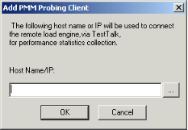

2. Enter the remote host’s name or IP address,

   -Or-

   Select a host from a list of available hosts by clicking . The Host Selection dialog box is displayed.

   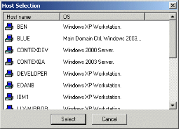

   1. Select a host.
   2. Click **Select**. The selected host name is displayed in the Host Name/IP field of the Add PMM Probing Client dialog box.

3. Click **OK**. A new script called RemotePMMScript is automatically added to the template.

> **Note:** You can rename the new script by right-clicking on the new script and typing in a new name.

## Importing External Statistics

WebLOAD Console enables you to import statistical data from an external comma- delimited values file (.csv) into your report, while running a Load Session or upon test completion. Imported counters are added to the integrated reports tree, under Import::<File name>, where <File name> is the name of the file containing the external statistics. For more information about integrated reports, see [*WebLOAD Console Performance* Reports ](console_performance_reports.md). All imported data is integrated with the

Load Session’s database and the WebLOAD Console statistics are also calculated for this information. For more information about WebLOAD Console statistics, see [*WebLOAD Statistics Reports* ](statistics_reports.md).

> Note: Imported data is also available for use with WebLOAD Analytics.

#### **To import external statistics:**

1. Select **Import External Statistics** from the **Session** tab of the ribbon. The Import External Statistics dialog box appears.

   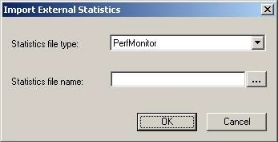

2. In the Statistics File Type drop–down list, select one of the following types of statistics files:

   - **Anue System**

   - **PerfMonitor**

3. In the Statistics File Name field, browse for or enter the name of the external statistics file. The file has a \*.csv extension.

4. Click **OK**.

   The external statistics are imported into the report.

