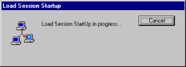
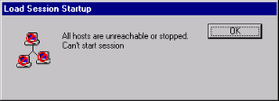
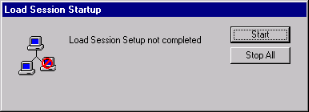
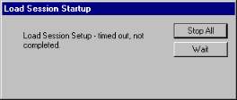
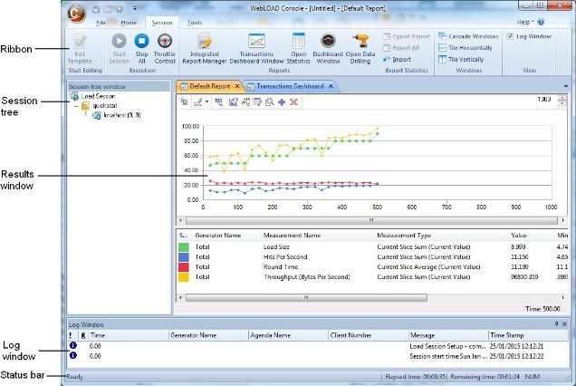
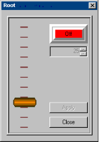

# Running a Load Session

After configuring a Load Session, you can run your Load Session. This chapter describes the procedure for running your Load Session, and the way WebLOAD Console behaves while a Load Session is in progress.

WebLOAD Console collects a complete set of test data while a Load Session is running. You can configure reports that include only the data needed. Reports can be configured during or after a test.

WebLOAD Console run commands can start, pause, and stop your Load Session while it is in progress. These commands are detailed in this chapter.

## Starting a Load Session

You can start a Load Session in one of the following ways:

- Click the **Start Session** icon in the Quick Access toolbar.
- Click **Start Session** in the **Session** tab of the ribbon.
- From the WebLOAD Wizard - Finish dialog box, select the checkbox to run the Load Session immediately and click **Finish**.
- From the Goal-Oriented Test - Finish dialog box, select the checkbox to run the Load Session immediately and click **Finish**.

### Running a Load Session from the System Memory

You can run a test from the configuration parameters in your system memory, without saving the Load Session. If you start running a Load Session without saving the Load Session configuration, you are prompted to save the Load Template.

The following message box appears.

#### Saving the Current Load Template

**To save the current Load Template:**

- Click **Yes**.

  The test session definition is saved to a Load Template (\*.tpl) file.

### Launching WebLOAD Console through the Command Line Interface

You can perform load testing through a command line interface. You can enter the WebLOAD Console launch command into a batch file or into an external script and WebLOAD Console will run directly, without user intervention, using the parameters specified.

> **Note:** You can also perform unattended WebLOAD Console testing at prescribed times by running WebLOAD in Jenkins . [Jenkins CI ](http://jenkins-ci.org/)is a Continuous Integration server that is used by Agile development teams to run their builds, tests and deployments as well as their performance tests if possible. Jenkins is extendable by means of plugins. As of WebLOAD 10.1, a WebLOAD plugin is available for Jenkins. For more information, refer to the *WebLOAD Automation User Guide*

**To run WebLOAD Console through the command line interface:**

Enter the WebLOAD.exe command together with a series of optional parameters (described below) into your external script to automatically launch a WebLOAD test. When your script runs, the executable file will invoke WebLOAD Console and run the specified test according to the specified parameters.

> **Note:** Verify that the script used with the template specified, and any included files, are accessible to the Load Template or Load Session file that will be run.

#### Syntax

Use the following syntax to define the parameters for running a WebLOAD test through a command line interface:

`WebLOAD.exe [<file name to open>][] [<flags>][][/ag <script name>]`

#### Parameters

When running a test invoked by the executable, you can specify the following parameters:

|**Parameter**|**Description**|**Comments**|
| :- | :- | :- |
|File name to open|The name of the \*.tpl or \*.ls file (Load Template or Load Session file) to run.|Optional parameter|
|File name to save|The name of the \*.ls file containing the test data. This file will be saved in the current directory unless otherwise specified.|Optional parameter|
|Flags|
- /ar – Automatically run the WebLOAD test without waiting for user input. If this flag is not specified, the Console is called up with the specified Load Template/Load Session but the test is not automatically run. The system waits for user input.

- /ar *time* – Automatically run the test for the length of time specified in *time/*

- /vc – The number of Virtual Client licenses to allocate when using WebRM License Server.

- /pc – The number of Probing Client licenses to allocate when using WebRM License Server.

- /rc *`<results_file_name>`* – Place the results in the specified file (an XML file).
|Optional parameter|
|/ag `<script name>`|The name of an existing script (\*.wlp) to open.|Optional parameter|

The parameters are all optional. If no parameters are entered, the executable launches the Console and does not run a test. If the autorun flag </ar> flag is not set, the <file name to save> and the <time> parameters are ignored.

> **Note:** If there is a conflict between the time defined in this command and the time defined in the WebLOAD Scheduler, the load test runs for the shorter of the two periods defined.

#### Examples

**Example 1:**

`WebLOAD.exe test1.tpl`

This command opens the Console and the test1.tpl template. The Console waits for user input.

**Example 2:**

`WebLOAD.exe test1.tpl march9.ls /ar 30`

This command opens the Console and automatically runs a test using the test1.tpl template file. The test results are saved in the Load Session file march9.ls, which includes all of the test data and results. This file is saved in the current directory, unless otherwise specified. The autorun flag is set, meaning that the test runs without user intervention. The test will run for 30 seconds.

**Example 3:**

`WebLOAD.exe /ag c:\scripts\MyScript.wlp`

This command opens the Console and the WebLOAD Wizard to the script/Mix Selection dialog box. The MyScript.wlp script is automatically selected and the WebLOAD Wizard waits for user input. For more information about the script/Mix Selection dialog box.

**Example 4:**

`WebLOAD.exe test1.tpl march9.ls /ar 30 /rc result1.xml`

This command performs all the actions described in Example 2 above, and in addition the execution return code is saved in result1.xml.

**Example 5:**

`WebLOAD.exe test1.tpl march9.ls /ar 30 /vc 100 /pc 3`

This command performs all the actions described in Example 2 above, and in addition it allocates 100 virtual clients and 3 probing clients from the WebRM server.

## Establishing Communication

WebLOAD Console begins executing a test by verifying the test parameters and attempting to communicate with the hosts participating in the test session.

While WebLOAD Console is preparing to run the test, the following message appears:

### Errors in Communication

The following errors may occur during Load Session startup:

- All hosts are unreachable or stopped
- Load Session setup not completed
- Load Session setup timed out

#### Correcting the All Hosts are Unreachable or Stopped Error

When the All hosts are unreachable or stopped error occurs and the session cannot be started, the following error message appears:

**To correct the all hosts are unreachable or stopped error:**

1. Click **OK**.
1. Test your connection. Verify that the host systems participating in the test are all up and running. If hosts are still unreachable, inform your system administrator.

#### Correcting the Load Session Setup Not Completed Error

When only some of the requested hosts are active, the “Load Session Setup not completed” error message appears as follows:

**To correct the Load Session Setup not completed error:**

- Click **Start** to begin testing with Hosts that have been reached,

  -Or-

  Click **Stop All** to stop testing.

#### Correcting the Load Session Setup Timed Out Error

When the Load Session setup has timed out, the following error message appears:

**To correct the Load Session Setup timed out error:**

- Click **Stop All** to stop testing,

  -Or-

  Click **Wait** to give WebLOAD Console more time to connect to the unreachable hosts. WebLOAD Console allows another interval of time equal to the timeout interval, for the systems to connect.

WebLOAD Console has a built-in start session timeout value, which is the length of time WebLOAD Console waits while TestTalk attempts to make contact with the hosts. You can change the timeout values through the **Global Options** > **General** tab.

## The Console Screen in Session Mode

When you start running your Load Session, the Results window appears.

The following table describes the segments of the Console in Session Mode:

|**Segment**|**Function**|
| :- | :- |
|Session Tree|Presents a graphic display of your test session. See [*Viewing the Session Tree in Session Mode* ](#viewing-the-session-tree-in-session-mode) for a complete discussion of the Session Tree.|
|Results Window|Displays all of the reports opened during a test session. Use the tabs located at the top and the bottom of the window to view different reports.|
|Log Window|Displays all of the error messages recorded during a test session. You can toggle the Log Window display on/off through the **Session** tab of the Console ribbon.|
|Status Bar|Indicates the program status, including continually updated information about the Elapsed time since the session started running, and the Remaining time till session end (if known).|

### Viewing the Session Tree in Session Mode

The Session Tree displays the complete configuration of the current Load Session. Status icons reflect the current status of your Load Session.

Through the Session Tree you can see:

- The scripts running
- The hosts running each script
- The current operating status of each host and script

Icons display on each line of the tree, making it easy to view your test activity.

While the Load Session is running, status icons reflect the current status for each script. The status icons are described in the above table.

To the right of each script two numbers are displayed in parentheses, for example Script1[45, 75]. These display the maximum Load Size (number of Virtual Clients) that script is scheduled to generate, followed by the Load Size currently being generated. The current Load Size number changes according to the Load Size schedule that is defined in the Load Generator Schedule dialog box. When a test session has not yet begun, the ‘current’ Load Size being generated is 0. In most modes of operation, the current Load Size never exceeds the maximum Load Size scheduled for that script listed to the left of the current value.

> **Note:** Using Throttle Control, you can increase the current Load Size to exceed the maximum Load Size ‒ but only if you are not using the Goal-Oriented Test.

## **WebLOAD Console Operating Commands**

WebLOAD Console offers five commands for controlling a test session:

- Start
- Pause
- Resume
- Stop
- Stop All

You access them through the **Session** tab of the Console ribbon, or the Session Tree pop-up menus.

### Starting a Test Session

**To start a test session:**

- Click the **Start Session ** button in the Quick Access toolbar,

  -Or-

  Select **Start Session** in the **Session** tab of the ribbon.

### Pausing a Test Session

**To pause a test session:**

- Right-click a component in the test session Tree and select **Pause** from the pop-up menu.

When you pause a script it temporarily stops the execution of that script. The remainder of the components in the current test session (other scripts running simultaneously) will continue running as scheduled. If the root is selected, all components are paused.

When a paused script is continued (using the Go or Resume command), the script skips any actions scheduled for the duration of the pause. Script execution continues with whatever load was scheduled for the current time.

Pausing a Host that is generating a heavy load causes an immediate jump in system response time because the system load drops immediately.

### Resuming a Test Session
Resuming resumes execution of a paused Load Session component. Keep in mind that pausing and continuing does not automatically reschedule Load Session Scripts.

Scheduling continues in relation to the start of the session.

**To resume a test session:**

- Right-click a component in the test session Tree and select **Resume**.

Resuming a Host that is generating a heavy load causes an immediate drop in system response time.

### Stopping a Load Session Component

**To stop a Load Session component:**

- Right-click a component in the test session Tree and select **Stop**,

The selected component will stop. Once an individual component is stopped, it cannot be restarted unless the whole Load Session is restarted.

You may stop some of the Load Session components without affecting the remaining ones.

Stopping a Load Session component affects system performance by causing a sudden drop in system load, which leads to a corresponding jump in system performance.

### Stopping a Test Session

**To stop a test session:**

- Select **Stop All** in the **Session** tab of the ribbon,

  -Or-

  Right-click a component in the Load Session Tree and select **Stop All**.

Stopping a complete Load Session affects system performance because the system load immediately drops to zero.

### Manually Shutting Down Cloud Machines
You can manually shut-down Amazon Cloud Machines still running. This is relevant if WebLOAD is configured to leave Cloud Machines running, or if you chose to leave them running at the end of a Load Session.

![ref7]**Note:** The data residing on an Amazon Cloud Machine is not accessible once the machine is shut down.

For more information about working with Cloud Machines, refer to [*Selecting Host Computers* ](config_load_template.md#selecting-hosts)

For information about changing the shut-down policy of Cloud Machines, refer to [*Creating WebLOAD Cloud Accounts* ](#correcting-the-all-hosts-are-unreachable-or-stopped-error)

**To shut down Cloud Machines:**

- Click **Terminate Cloud Machines** in the **Tools** tab of the ribbon. The Cloud Machines are shut down.

> **Note**: After manually shutting down Cloud Machines, verify on the Amazon Management Console that no machines are left running.

## Throttle Control – Changing the Load Size Dynamically During Runtime

Using Throttle Control utility, you can override the test schedule and dynamically control the Load Size during runtime. You can select a component (from the Session Tree) and modify Load Size ‒ the number of Virtual Clients participating in the test.

The selected component can be:

- The root of the Session Tree
- A Load Machine

When using Throttle Control consider the following:

- You *cannot* modify a script using Throttle Control.
- You *cannot* use Throttle Control with the Goal-Oriented Test.
- You *cannot* use Throttle Control to create a load of more than 20 users in Standalone Workstation mode.
- If you select the root from the Session Tree and you are testing with more than one Load Machine, WebLOAD Console distributes the load among the Load Machines. During this process, the original schedule is “suspended” for the duration of Throttle Control.

### Opening Throttle Control

**To open Throttle Control:**

- Select **Throttle Control** from the **Session** tab of the ribbon,

  -Or-

  Right-click a Session component and select **Throttle Control** from the pop-up menu.

The Throttle Control dialog box appears.

The Throttle Control dialog box displays:

- The current Load Size.
- The currently selected component. (In the figure above, the selected component is the Root of the Session Tree.)

### Activating Throttle Control

**To activate Throttle Control:**

1. Toggle the **Off** button to **On**.
1. Adjust the Throttle by moving the lever up or down and set the desired Load Size.
1. Click **Apply**.

   The Load Size changes dynamically while the test is running.

### Deactivating Throttle Control

**To deactivate Throttle Control:**

1. Toggle the **On** button to **Off**.
1. Click **Close**.

   The Throttle Control dialog box is closed. Once Throttle Control is turned off, the Load Session resumes the manual schedule and continues running from the point at which Throttle Control was deactivated.

