# Setting Global Options

Global Options enable you to modify WebLOAD Console defaults to your specifications. All WebLOAD Console tests use these defaults.

## How to Set Global Options

This section guides you through the process of setting WebLOAD Console global

options and introduces you to some of WebLOAD Console’s more advanced features. Global options can be modified at any time from the WebLOAD Console.

**To set global options:**

1. Click **Global Options** in the **Tools** tab of the ribbon,

   -Or-

   Select **Global Options** from the Console System button.
   
   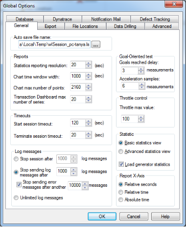
   
   The Global Options dialog box opens.
   
   The Global Options dialog box contains the following tabs:
   
   - General
   
   - Export
   
   - File Locations
   
   - Data Drilling
   
   - Advanced
   
   - Database
   
   - Notification Mail
   
   - Dynatrace
   
   - Defect Tracking

2. Select the desired tab, and modify as many of the options as you need.
3. Select another tab and modify its options, if necessary.
4. Click **OK** to accept the modifications, or **Cancel** to reject them, and exit the Global Options dialog box.

### The General Tab

The General tab lists a number of options that you can modify to facilitate your work in test sessions.

**To access the General tab options:**

1. Click **Global Options** in the **Tools** tab of the ribbon,

   -Or-

   Select **Global Options** from the Console System button.

1. Select the **General** (default) tab.

   

#### Setting the Autosave File Name Default Location

WebLOAD Console performs fast saves while running a test. This option enables you to specify the filename and location of the autosave (backup) file. It is recommended to save files to a central location where they are available to all users.

**To set the Autosave file name default location:**

1. Click **Global Options** in the **Tools** tab of the ribbon,

   -Or-

   Select **Global Options** from the Console System button.

1. Select the **General** (default) tab.
1. Type or select the desired file name and location in the Auto Save File Name field.
1. Click **OK**.

#### Setting the Reports Options

The Reports options enable you to define the:

- Interval between each reported sample (referred to as the Statistics reporting resolution).
- Default time range to be displayed as the x-axis of the Integrated Report chart (out of the total time span of the Load Session).
- The maximum number of points in a chart. This is intended for improving charts performance during execution. By default, the maximum number is limited, but you can change it to unlimited. Note that even when the number is limited, all statistics are saved in the WebLOAD statistics data base; following execution, you can change the maximum number of points to unlimited, and re-open the chart to display all points.

**To set the Reports options:**

1. Click **Global Options** in the **Tools** tab of the ribbon,

   -Or-

   Select **Global Options** from the Console System button.

1. Select the **General** (default) tab.

1. In the **Statistics reporting resolution** field, type or select the desired statistics reporting resolution (in increments of 10 seconds). The minimum allowed value is one second.

   > **Note:** The default reporting interval is 20 seconds. When running long test sessions, it is a good idea to increase this interval. Reducing this interval to lower than 10 seconds might result in high consumption of your machine’s resources.

4. In the **chart time window width** field, type or select the desired time width of the chart window. The default time width is 1000 seconds.
5. In the chart max number of points field, type or select the maximum number of points displayed in a chart during execution. To specify an unlimited number, enter the value 0. The default number of points is 2160.
6. In the **Transaction Dashboard max number of series** field, type or select the maximum number of series in the Transactions Dashboard report. The default number of series is 20.

#### Setting Goal-Oriented Test Options

The Goal-Oriented Test increases the load generation until your Web application performance falls below the profile you have defined.

The performance parameters that you can define are:

- **Goals reached delay** ‒ the number of samples required to declare the Goal- Oriented Test goals as achieved. The Goal-Oriented Test declares the defined goals reached only after receiving the desired goal results in several samples.
- **Acceleration samples** ‒ the number of sample measurements to read before automatically accelerating the load if the Goal-Oriented Test goal has not been reached by then.

**To set Goal-Oriented Test options:**

1. Click **Global Options** in the **Tools** tab of the ribbon,

   -Or-

   Select **Global Options** from the Console System button.

1. Select the **General** (default) tab.

   In the Goals reached delay field, type or select the number of samples to read before proclaiming goals reached.

1. In the Acceleration point measurements field, type or select the number of samples to read before accelerating the load.

#### Setting WebLOAD Console Timeout Values

**To set WebLOAD Console Timeout values:**

1. Click **Global Options** in the **Tools** tab of the ribbon,

   -Or-

   Select **Global Options** from the Console System button.

1. Select the **General** (default) tab.
1. In the Start Session Timeout field, type or select the amount of time the Console should attempt to contact a host at the start of a test session (default: 30 seconds).
1. In the Terminate Session Timeout field, type or select the amount of time the Console should attempt to contact a host at the close of a test session (default: 20 seconds).

#### Setting the Throttle Control Max Value

The throttle control utility enables you to dynamically modify the number of Virtual Clients participating in a test during runtime.

**To set the Throttle Control max value:**

1. Click **Global Options** in the **Tools** tab of the ribbon,

   -Or-

   Select **Global Options** from the Console System button.

1. Select the **General** (default) tab.
1. In the Throttle max value field, type or select the maximum number of Virtual Clients that can participate in the test.

#### Setting the Log Message Options

Log messages generated by the Console, the JavaScript compiler, and any user messages programmed in the script and detected by WebLOAD Console during runtime are displayed in the Log Window. For further information on Log Messages, see [*Viewing the Log Window* ](viewing_log_window.md).

**To set the log message options:**

- In the Stop Session after 	log messages field, type or select the maximum number of log messages to read before stopping WebLOAD Console,

  -Or-

  In the Stop sending log messages after 	log messages field, type or select the maximum number of log messages to record. WebLOAD Console will continue the Load Session but stop recording log messages. The maximum number of log messages is 32767.

  Note that log messages can be of type Info, Error, or Warning. Even if you restrict the number of total log messages, you may still wish to see Error messages.

  Therefore you can separately set the maximum number of error messages to record by typing or selecting a number in the Stop sending error messages after another

  ` 	`messages field. When that number is reached, WebLOAD Console will continue the Load Session but stop recording error messages.

  -Or-

  Set WebLOAD Console to send an unlimited number of log messages.

#### Setting the Statistic View Settings

**To set the Statistic View settings:**

1. Click **Global Options** in the **Tools** tab of the ribbon,

   -Or-

   Select **Global Options** from the Console System button.

1. Select the **General** (default) tab.
1. Select **Basic Statistics** view to:

   0. Access only the Current Value for each Current Slice measurement in the Integrated Report.
   0. Display the Min, Max, Average, and Count values for in the Test Summary. The Basic Statistics view is the default setting.

      -Or-

      Select **Advanced Statistics view** to display all values available for the current slice and test summary in the WebLOAD Integrated Reports. These values are: Min, Max, Average, Count, Sum, and STDev.

1. Check the **Load generator statistics** checkbox (checked by default) to display the statistics for each Load Generator separately in Integrated Reports.

### The Export Tab

WebLOAD reports can be exported to other programs as Tab files (tab-delimited text files). Export options, such as the default Tab file viewer, can be set through the Export dialog box.

**To access the Export tab options:**

1. Click **Global Options** in the **Tools** tab of the ribbon,

   -Or-

   Select **Global Options** from the Console System button.

1. Select the **Export** tab.

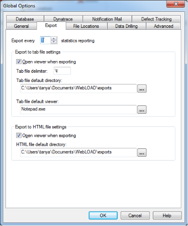

#### Setting the Statistics Resolution to Export

The statistics exporting resolution is the frequency of the number of samples to export when exporting WebLOAD reports. For example, if 1 is entered for this value, WebLOAD Console exports every sample. If 2 is entered for this value, WebLOAD Console exports every second sample.

**To set the Statistics resolution to export:**

1. Click **Global Options** in the **Tools** tab of the ribbon,

   -Or-

   Select **Global Options** from the Console System button.

1. Select the **Export** tab.
1. Type or select the desired exporting resolution in the Export every statistics reporting field.

When deciding the value for this option you must consider the setting selected for the sampling. If, for example, the Statistics reporting resolution (set through **Global Options** † **General**) is set to 20 seconds and Export every statistics reporting is set to 2, the measurements exported reflect a sampling every 40 seconds. They are the

measurements gathered at the intervals 20, 60, 100, 140…

This option is useful in cases where a large amount of data results from a long test session.

#### Setting the Export to Tab File Settings

WebLOAD reports can be exported as Tab files (tab-delimited text files).

- **Open Viewer When Exporting Tab Files:** When the Open viewer when exporting option is enabled (default), WebLOAD Console launches the program which serves as the default viewer (e.g., Notepad, Excel) for an exported Tab file. The default viewer is defined in the Tab File default viewer field (see below).
- **Tab File Export Settings:** These options define the Tab file that can be exported to other programs.

**To define the Tab File for export:**

1. Click **Global Options** in the **Tools** tab of the ribbon,

   -Or-

   Select **Global Options** from the Console System button.

1. Select the **Export** tab.

1. In the Tab File delimiter field, enter the delimiter to be used in the Tab files that contain the WebLOAD Console statistical data for export.

   Any string can be used as a delimiter.

   0. To use a tab character as a delimiter, enter \t.
   0. To use a new line as a delimiter, enter \r or \n.
   0. To use a space as a delimiter, enter \s.

1. In the Tab File default directory field, set the default directory where the Tab files should be saved.

1. In the Tab file default viewer field, specify which program should serve as the default viewer (e.g., Notepad, Excel) for an exported Tab file.

   

##### Export to HTML Settings

WebLOAD reports can be exported as HTML files.

- **Open Viewer When Exporting HTML Files**: When the Open viewer when exporting option is enabled (default), WebLOAD Console launches the program, which serves as the default viewer.
- **HTML Export Settings**: These options define the HTML files that can be exported to other programs.

**To define the HTML files for export:**

1. Click **Global Options** in the **Tools** tab of the ribbon,

   -Or-

   Select **Global Options** from the Console System button.

1. Select the **Export** tab.
1. In the HTML File default directory field, set the default directory where the HTML files should be saved.

### The File Locations Tab

This dialog box lists the default locations of various WebLOAD Console files, such as script files. You can modify these locations if you wish.

**To access and configure the File Location tab options:**

1. Click **Global Options** in the **Tools** tab of the ribbon,

   -Or-

   Select **Global Options** from the Console System button.

1. Select the **File Locations** tab.

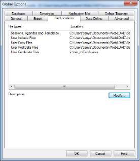

WebLOAD Console’s various file types are described in the following table:

|**File Type**|**Description**|
| :- | :- |
|**Session**, **Scripts** and **Templates**|Session, Script, and Template files created by WebLOAD Console. These files have the following extensions: .wls, .wlp, and .tlp.|
|**User Include Files**|
External text files included in the script by using the

IncludeFile function.
|
|**User Copy files**|
Copied files loaded into the script by using the CopyFile function. These files can be all file types. The most commonly used files are .txt files used with the GetLine function and .dat files used with the wlHttp.Post and Get commands. The CopyFile function searches in various system directories in addition to the location specified in the tab.

The load engine first looks for the file to be copied in the default User Copy Files directory. If the file is not there, the file request is handed over to WebLOAD Console, which searches for the file using the following search path order:

1. If a full path name has been hardcoded into the CopyFile command, the system searches the specified location. If the file is not found in an explicitly coded directory, the system returns an error code of File Not Found and will not search in any other locations.

**Note:** It is not recommended to hardcode a full path name, since the Sscript will then not be portable between different systems. This is especially important for networks that use both UNIX and Windows systems.

2. Assuming no hardcoded full path name in the script code, the system looks for the file in the current working directory, the directory from which WebLOAD Console was originally executed.

3. Finally, if the file is still not found, the system searches for the file sequentially through all the directories listed in the File Locations tab.
|
|**User PostData Files**|Data files created when the PostData recording options specify to record the data in a data file. The system first searches for the data files in the directory in which the script is located, then, if not found, in the current working directory, and lastly, in the folder defined in the default User PostData Files directory specified in this dialog box.|
|**User Certificate Files**|Certificate files include files used to emulate a server certificate for the user client application and list the trusted certificate authorities. By default this is the certificate supplied with the WebLOAD Console installation. The file extension is .pem.|

3. Select the item whose default location you want to change, and click **Modify**. The Modify Location dialog box opens.

4. Select a new default location and click **OK**.

   The dialog box closes and the new location is listed.

### The Data Drilling Tab
Data Drilling enables you to display a detailed description of all user-defined and named transactions to the instance level. An instance is a single occurrence of a user- defined transaction in a given round. Data Drilling is only enabled if the Collect instances checkbox is selected.

**To access and configure the Data Drilling tab options:**

1. Click **Global Options** in the **Tools** tab of the ribbon,

   -Or-

   Select **Global Options** from the Console System button.

1. Select the **Data Drilling** tab.

   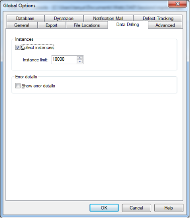

3. Set the Data Drilling options:

   1. Click the **Collect instances** checkbox (default) to enable Data Drilling.

   2. Specify the limit of collected instances in the Instance limit field. The default limit is 1000.

      **Note:** If you disable the **Collect instances** checkbox, the Data Drilling options of the Functional Testing tab are also disabled.

4. Click the **Show error details** checkbox to enable viewing full details of HTTP errors. For more information, see [*Full View of HTTP Errors* ](#full-view-of-http-errors).

#### Full View of HTTP Errors

This feature enables viewing the full details of HTTP errors that occurred. The feature is enabled by selecting the **Show error details** checkbox in the **Data Drilling** tab of the **Global Options** window.

When the feature is enabled, you can view full details of HTTP errors as follows.

1. In the Log Window, double click an error message. The error is displayed in page view.

   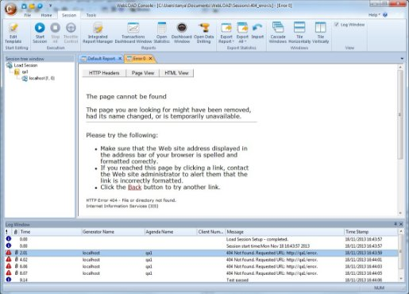

2. To view the HTTP Headers (Request and Response) relating to the error, click **HTTP Headers**.

   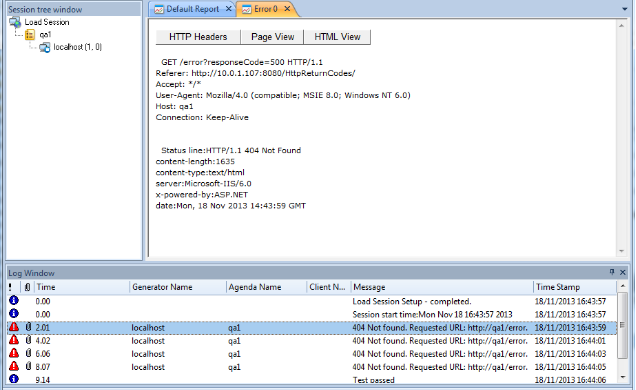

3. To view the HTML source of the error message, click **HTTP View**.

   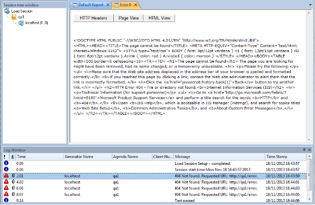

### The Advanced Tab
Load Generator spawning sets the number of threads at which WebLOAD Console should automatically spawn Load Generators. Spawning Load Generators improves performance.

**To access and configure the Advanced tab options:**

1. Click **Global Options** in the **Tools** tab of the ribbon,

   -Or-

   Select **Global Options** from the Console System button.

1. Select the **Advanced** tab.

   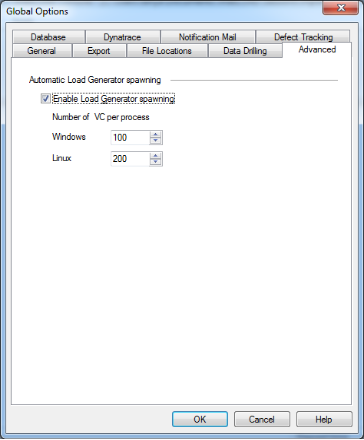

3. Under Automatic Load Generator Spawning, click **Enable Load Generator Spawning** (default).
4. Type or select the number of threads at which WebLOAD Console should automatically spawn Load Generators for the appropriate operating systems.
5. Click **OK**.

> **Notes:**
>
> Only client threads running within a single spawned process, on the same Load Generator, are able to share global variables. So if, for example, you have spawning set to 100 and you are running a total of 300 threads, you are actually running three spawned processes on three separate Load Generators.
>
> Only client threads running within a single spawned process, on the same Load Generator, can be synchronized.

### The Database Tab
The Database option enables you to instruct the Console to write all session data to a database during session execution. This is useful if you want to be able to view and analyze the session in the Web Dashboard (refer to the *WebLOAD™ Web Dashboard User Guide*).

**To access and configure the Database tab options:**

1. Click **Global Options** in the **Tools** tab of the ribbon,

   -Or-

   Select **Global Options** from the Console System button.

1. Select the **Database** tab.

   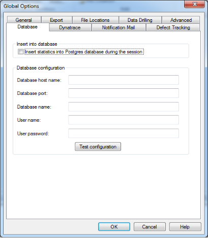

1. To instruct the Console to write to the database all session data during session execution:

   1. Check the **Insert statistics into Postgres database during the session** checkbox.
   1. In the **Database host name** field, enter the name of the server hosting the PostgreSQL database.
   1. In the **Database port** field, enter the port number through which to connect to the server.
   1. In the **Database name** field, enter the name of the database.
   1. In the **User name** and **User password** fields, enter the credentials for accessing the database

4. Click **Test configuration** to test whether the Console can connect to the database based on the information you entered. A message is returned, indicating whether the connection attempt succeeded.
5. Click **OK**.

### The Notification Mail Tab

The Notification Mail options enable you to configure the settings by which SLA notification emails are sent. An SLA notification email is optionally sent when a certain condition is met that requires special attention. For more information on defining SLA notification email conditions, see [*The SLA Manager* ](#the-sla-manager).

**To access and configure the Notification Mail tab options:**

1. Click **Global Options** in the **Tools** tab of the ribbon,

   -Or-

   Select **Global Options** from the Console System button.

1. Select the **Notification Mail** tab.

   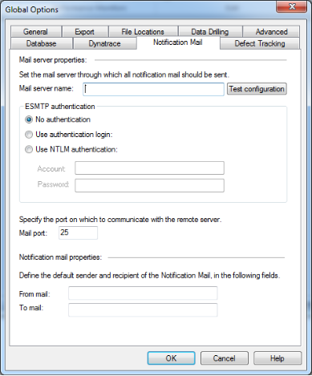

3. Under Mail Server Properties, enter a value in the Mail Server Name field.

   You can click **Test configuration** to test whether the Console can connect to the mail server based on the information you entered.

4. Under ESMTP Authentication, select **No Authentication, Use Authentication Login** or **Use NTLM authentication**. If you select **Use Authentication Login** or **Use NTLM authentication**, enter an Account and Password.
5. Under Notification Mail Properties, enter a value for the From Mail and To Mail fields.
6. Click **OK**.

### The Dynatrace Tab
The Dynatrace options enable you to integrate WebLOAD with Dynatrace. For information on using Dynatrace in conjunction with WebLOAD, refer to the

[*Integrating with Dynatrace* ](appendix_b.md)appendix.

**To access and configure the Dynatrace tab options:**

1. Click **Global Options** in the **Tools** tab of the ribbon,

   -Or-

   Select **Global Options** from the Console System button.

1. Select the **Dynatrace** tab.

   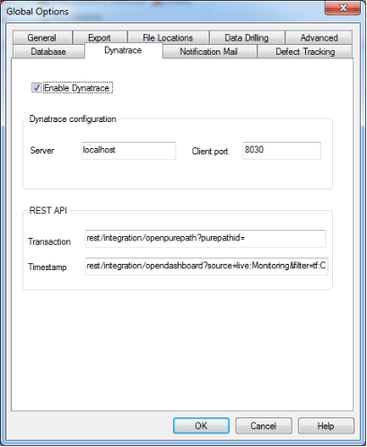

3. Select the **Enable Dynatrace** checkbox if you wish to integrate WebLOAD with Dynatrace.
4. If you wish to change the default system profile in which to view points of interest in Dynatrace, refer to [*Specifying the Dynatrace System Profile* ](appendix_b.md#specifying-the-dynatrace-system-profile).

### The Defect Tracking Tab
The Defect Tracking options enable you to set the tracking system to use for tracking defaults.

**To access and configure the Defect Tracking tab options:**

1. Click **Global Options** in the **Tools** tab of the ribbon,

   -Or-

   Select **Global Options** from the Console System button.

1. Select the **Defect Tracking** tab.

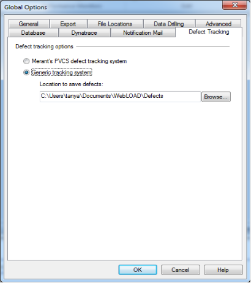

3. Select the tracking system to use. If you select a generic tracking system, enter the location to save the defects.

### Tracking Defects
After selecting the system to use when tracking defects, you can add an Issue that records problems that need to be tracked in the database. When you submit an Issue, you can add notes or files to it.

#### Accessing the Report Defect Dialog Box

**To access the Report Defect dialog box:**

1. Right click inside the Log Window, and select **Report Defect**.

2. If **Merant’s PVCS defect tracking system** was selected in the **Defect Tracking** tab, the PVCS Tracker Project Login dialog box is displayed.

   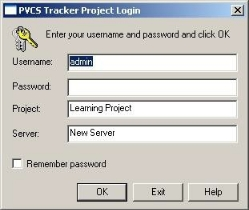

3. Enter your username and password.
4. Click **OK**.

The Report Defect dialog box opens with three tabs:

- General tab
- Notes tab
- Attached Files tab

#### Entering a New Record

Use the General tab to enter a new record into the defect tracking project database.

**To enter a new record into the defect tracking project:**

1. Select the **General** tab. The General tab is displayed.

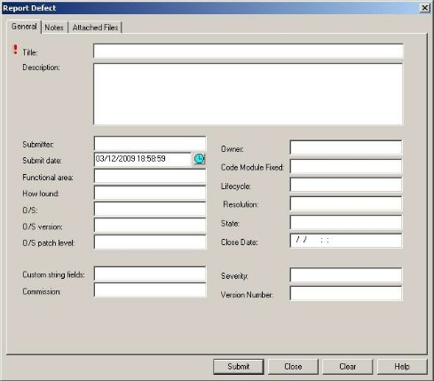

2. Enter a title for the record in the Title field and a description of the record in the Description field.

   > **Note:** The Title field is required; all other fields are optional.

3. Enter the information in the remaining fields.
4. If you want to clear the form and reset the form fields to their default values, click **Clear**.

#### Adding, Modifying, and Deleting a Note

You can add, modify, or delete a note that indicates the status of a record.

**To add, modify, or delete a note:**

- Select the **Notes** tab. The Notes tab is displayed.

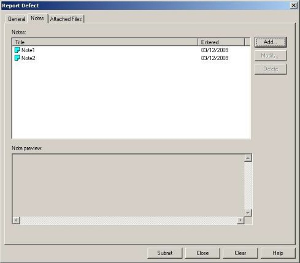

**To add a note:**

1. Click **Add**. The Add Note dialog box is displayed.
1. Enter a Note Title and Note Text.
1. Click **OK**. The note title is added to the list in the Title field of the Notes tab.

**To modify a note:**

1. Select the note in the Notes section of the Notes tab.
1. Click **Modify**. The Modify dialog box is displayed.
1. Make the desire changes and click **OK**. **To delete a note:**
1. Select the note in the Notes section of the Notes tab.
1. Click **Delete**. A confirmation dialog box is displayed.
1. Click **OK**. The note title is removed from the list in the Title field of the Notes tab.

   Use the Add, Modify, and Delete buttons to add, edit, or delete Note entries, as illustrated in the preceding figure.

#### Attaching Files

You can attach files relevant to the record.

**To attach or delete files:**

1. Select the **Attached Files** tab. The Attached Files tab is displayed.

   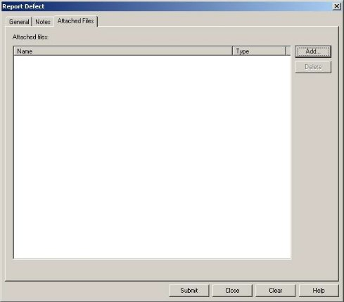

   Attach a file:

   1. Click **Add**. The Add Attached Files dialog box is displayed.
   2. Select the desired file.
   3. Click **Open**. The selected file is displayed on the Attached Files tab.

   Delete a file:

   1. On the Attached Files tab, select the file you want to delete.
   2. Click **Delete**. A confirmation dialog box is displayed.
   3. Click **OK**. The selected file is removed from the Attached Files tab.
   4. Click **Submit** to submit the record.

## The SLA Manager

The Service Level Agreement (SLA) Manager allows you to define conditions (SLA breaches) under which error messages should appear in the WebLOAD Console, and optionally an email notification sent as well. Conditions include cases where a specified Measurement value exceeds, equals, or drops down to less than a specified threshold value. For more information about configuring the email settings by which notification mail is sent, see [*The Notification Mail Tab* ](#the-notification-mail-tab).

### Accessing the SLA Manager

**To access the SLA Manager:**

- Select **SLA Manager** from the **Home** tab of the ribbon.

  The SLA Manager dialog box appears. The currently defined SLA rules are listed in the dialog box. If no SLA rules are defined, the list is empty.

### Configuring the SLA Manager Rules and Actions

**To configure the SLA Manager options:**

1. In the SLA Manager dialog box, click **New** to define a new SLA rule, or select an existing SLA rule and click **Edit** to modify the existing rule.

   The Rules and Actions dialog box appears for defining the SLA rule.
   
   An SLA rule consists of one or more conditions, logically ANDed or ORed, as well as the actions to be taken (= error message and notifications to be sent) when the rule conditions are met.
   
   Each line in the Rule Definition table defines one rule condition.

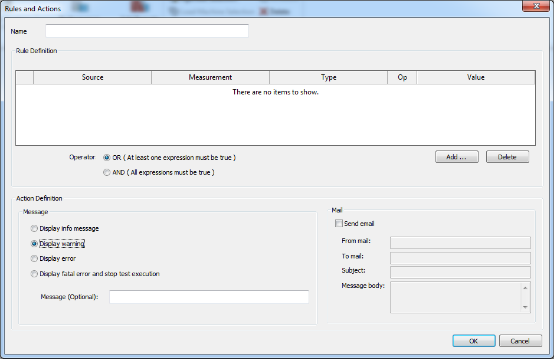

2. If you are creating a new SLA rule, enter the rule name in the **Name** field.

3. To add a rule condition, click **Add** in the Add Notification Rules and Actions dialog box. The Goal Definition dialog box appears, listing all the WebLOAD Console built-in measurements in a tree structure. The measurements are the building blocks of SLA rule conditions.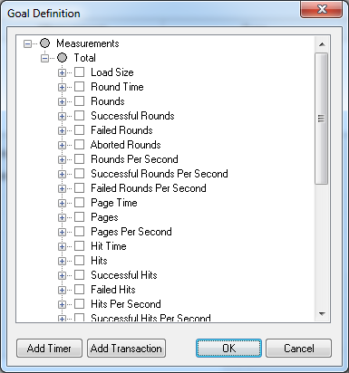

   1. Optionally add a previously-defined custom measurement of type Timer to the tree, as follows:

      - Click **Add Timer**. A new node appears in the Goal Definition dialog box, with an empty name field.
      - Enter the timer’s name in the name field.

   2. Optionally add to the tree, measurements based on a previously-defined transaction (which you created when editing the script in the WebLOAD Recorder), as follows:

      - Click **Add Transaction**.

      - In the Add Transaction dialog box that appears, enter the transaction name.

        Seven measurements, based on the specified transaction, are automatically added to the tree. For example, if you add the previously-defined “Login” transaction, the following seven measurements are added.

        

   3. To create rule conditions, select the checkboxes adjacent to each of the measurements you wish to include in the SLA rule. 

      For example, to define an SLA rule condition that response time not exceed 5 seconds, select the checkbox adjacent to Response Time. 

      **Note**: A gray circle next to a measurement indicates that no default subcomponents are defined (the upper level component cannot be selected). To select subcomponents, click the + to expand the tree.

   4. Click **OK**.

      WebLOAD Console closes the Goal Definition dialog box, and in the Rule and Actions dialog box opens a “condition” row for each of the selected measurements.

      

4. For each condition, click in the **Op** field and select an operator from the drop-down list.
5. For each condition, click in the **Value** field and type a threshold value for the condition.
6. When more than one condition is defined, you can the logical connection between the conditions:
   - Select **OR** to require only one condition to be true for the rule to be met.
   - Select **AND** to require all conditions to be true for the rule to be met.

7. In the **Message** section under the **Action Definition** section of the Rules and Actions dialog box, define the log message to be displayed in the log if the SLA rule conditions are met:

   - Specify the type of log message to display: info, warning, error or fatal error. Note that a fatal error also causes test execution to stop.

   - Optionally specify the message text.

     If you specify the message text, the log will display the specified text.

     If you do not specify the message text, the log message will display the default SLA message format which begins with “SLA `<SLA rule name>` failed”.

     Note that a log message will appear in the log every time the SLA rule conditions are met, even if they are met multiple times in the course of load test execution.

8. In the **Mail** section under the **Action Definition** section of the Rules and Actions dialog box, optionally define the email notification to be sent out if the SLA rule conditions are met:

   - Check the **Send email** checkbox if you want an email notification to be sent.

   - Specify the email sender in the **From Mail** field.

   - Specify the email recipient in the **To Mail** field.

   - Specify the email subject line in the **Subject** field.

   - Specify the message text body in the **Message Body** field.

     Note that an email notification is sent only once if the SLA rule conditions are met, even if they are met multiple times in the course of load test execution.

9. Click **OK** to save your settings and return to the main SLA Manager dialog box.

