# Setting Script Options

This chapter guides you through the process of setting WebLOAD Console default script options, individual script options, and Session script options, using some of WebLOAD Console’s more advanced features. Script Options enable you to modify scripts to your specifications, and define the way WebLOAD Console behaves during runtime. Setting script options allows you to emulate different types of user activity. For example, you can set WebLOAD Console to emulate users connecting to your application at different modem speeds.

> **Notes:**
>
> Script options, set through the Console, are not uploaded when editing the script in WebLOAD Recorder. Debugger options are available (in WebLOAD Recorder) for debugging the script in WebLOAD Recorder.
>
> Changes you make to the script through the Console override the settings for the script created through WebLOAD Recorder.
>

## About Script Options

Script options allow you to configure WebLOAD Console behavior to emulate different types of user activity and ensure that the Virtual Clients running the test accurately emulate real users accessing your Web application.

There are three modes for modifying script settings. Most of the Options tabs described in this section can be edited in any of these three modes. Option tabs that are only available through a specific mode are noted in the tab description.

> **Note:** To modify script options, you must be in Edit mode (click **Edit Template** in the **Session** tab of the ribbon or select **Edit Template** from the Console System button).

The three option modification modes are:

- **Default Options** ‒ When building a new template or session, or editing an existing one, each new single script or script participating in a Mix is automatically assigned these defaults.
  
  **To activate the Default Options from the WebLOAD Console:**

  - Click **Default Options** in the **Tools** tab of the ribbon,

    -Or-

    Right-click the **root node** (Load Session node) and select **Default Options**,

    -Or-

    Select **Default Options** from the Console System button.
  
- **Current Session Options** – You can modify script options for all scripts participating in a specific Load Session or part of a specific Load Template without changing the default settings for all Sessions.
  
  **To activate this mode:**

  - Click **Current Session Options** in the **Tools** tab of the ribbon,

    -Or-

    Right-click the **root node** (Load Session node ) and select **Current Session Options**,

    -Or-

    Select **Current Session Options** from the Console System button.

    Modify the defaults as desired. All participating scripts currently listed in the Session Tree are automatically assigned the modified default values.
  
- **Script Options** ‒ You can modify script options for an individual script within a new or existing Load Session or Load Template.
  
  **To activate this mode:**

  - Click **Script Options** in the **Tools** tab of the ribbon,

    -Or-

    Right-click the desired script in the Session Tree and select **Script Options**,

    -Or-

    Select **Script Options** from the Console System button.
  
    The modifications you make here only affect that specific script.

## Modifying Script Options

The Options dialog boxes are identical for all three modes, although they are activated differently, as described in [*About Script Options* ](#about-script-options).

The Options dialog boxes include the following tabs:

- SSL tab (see [*Setting the SSL Options* ](#setting-the-ssl-options)
- Sleep Time Control tab (see [*Setting Sleep Time Playback Settings* ](#setting-sleep-time-playback-settings)
- Terminate Round (see [*Configuring Round Termination Settings* ](#configuring-round-termination-settings)
- Browser Cache tab (see [*Setting the Browser Cache* ](#setting-the-browser-cache)
- Browser Parameters tab (see [*Configuring Browser Parameter Settings* ](#configuring-browser-parameter-settings)
- HTTP Parameters tab (see [*Setting the HTTP Parameters* ](#setting-the-http-parameters)
- Authentication tab (see [*Setting Authentication* ](#setting-authentication)
- Connection tab (see [*Connection Speed Settings* ](#setting-the-browser-type-and-version)
- Diagnostic tab (see [*Diagnostic Settings* ](#diagnostic-settings)
- Functional Testing tab (see [*Functional Testing Options* ](#functional-testing-options)
- Pass / Fail Definition tab (see [*Pass / Fail Definition Settings* ](#about-script-options) (only edited through the Default and Current Session Options dialog boxes)
- Reset Mechanism tab (see [*Configuring Reset Mechanism Settings* ](#configuring-reset-mechanism-settings) (only edited through the Default and Current Session Options dialog boxes)
- Java Options tab (see [*Configuring the Java Options* ](#configuring-the-java-options) (only edited through the Default and Current Session Options dialog boxes)

**To modify script or session configuration options:**

1. Select the desired tab.
1. Modify the options as needed.
1. Select another tab to modify additional options.
1. Click **OK** to accept the modifications, or **Cancel** to reject them, and exit the Default/ Current Session Options dialog box.

## Setting the SSL Options

**To access and configure the SSL tab options:**

1. Click **Default/Current Session Options** or **Script Options** in the **Tools** tab of the ribbon,

   -Or-
   
   Select **Default/Current Session Options** or **Script Options** from the Console System button.

2. Select the **SSL** tab.

   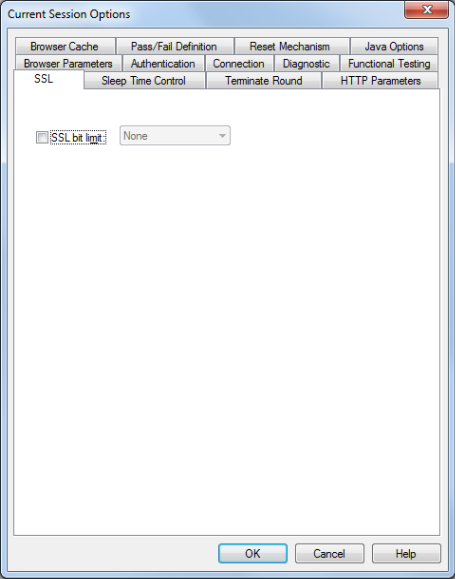

3. Check **SSL Bit Limit** and select the highest SSL Bit Limit available between the Virtual Clients and the server.

4. Click **OK** to accept the modifications, or **Cancel** to reject them, and exit the Default/Current Session Options dialog box.

   

## Setting Sleep Time Playback Settings

Sleep time is a pause to simulate the intermittent activity of real users. WebLOAD Console enables you to set a script to execute with the sleep times recorded in the script, random sleep times or no sleep times at all.

**To set sleep time playback settings:**

1. Click **Default/Current Session Options** or **Script Options** in the **Tools** tab of the ribbon,

   -Or-

   Select **Default/Current Session Options** or **Script Options** from the Console System button.

1. Select the **Sleep Time Control** tab.

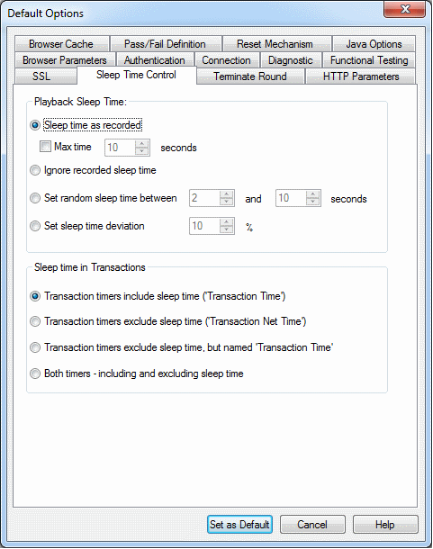

3. In **Playback Sleep Time**, specify the type of sleep to use when playing back the script:

   - Select **Sleep time as recorded** (default) to run the script with the delays corresponding to the natural pauses that occurred when recording the script. **Max time** provides an option of restricting playback of length sleep times, to no more than a specified number of seconds.

   - Select **Ignore recorded sleep time** to eliminate any pauses when running the script and run a worst-case stress test.

   - Select **Set random sleep time** and set the range (minimum and maximum) of delays to represent a range of users.

   - Select **Set sleep time deviation** and set which percentage of the recorded sleep time to use when running the script.

4. In **Sleep Time in Transactions**, specify how to calculate and display transaction timers:

   - **Transaction timers include sleep time (‘Transaction Time’)** – If you select this option, then if a transaction includes sleep commands, by default the sleep times will be included in the transaction time. The transaction time measurement will be called “Transaction *`<transaction name>`* Time”.

   - **Transaction timers exclude sleep time (‘Transaction Net Time’)** – If you select this option, then if a transaction includes a sleep command, by default the sleep time will be excluded from the transaction time. The transaction time measurement will be called “Transaction *`<transaction name>`* Net Time”.

   - **Transaction timers exclude sleep time, but named ‘Transaction Time’** – If you select this option, then if a transaction includes a sleep command, by default the sleep time will be excluded from the transaction time. However, the transaction time measurement will be called “Transaction *`<transaction name>`* Time” (without the word “Net” in the parameter name).

   - **Both timers – including and excluding sleep time** – If you select this option, then if a transaction includes a sleep command, by default, two timers will be displayed. One timer, called “Transaction *`<transaction name>`* Time”, will show the transaction time if sleep time is included in the transaction time. The second timer, called “Transaction *`<transaction name>`* Net Time”, will show the transaction time if sleep time is excluded from the transaction time.

5. Click **OK** to accept the modifications, or **Cancel** to reject them, and exit the Default/ Current Session Options dialog box.

## Configuring Round Termination Settings

The WebLOAD Recorder enables you to define round termination settings.

**To define the round termination behavior:**

1. Click **Default/Current Session Options** or **Script Options** in the **Tools** tab of the ribbon,

   -Or-

   Select **Default/Current Session Options** or **Script Options** from the Console System button.

1. Select the **Terminate Round** tab.

   The Terminate Round tab moves to the front of the dialog box.
   
   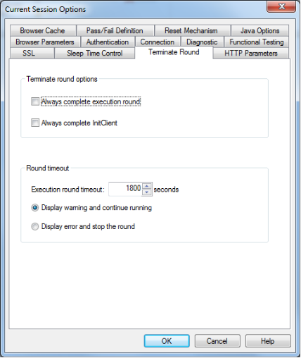

3. In the **Terminate round options** section, you can specify whether to complete a round even if a Stop command is received, as described in the following table.
4. In the **Round timeout** section, you can set the timeout period of a single round and the behavior of the system in cases where the timeout is reached, as described in the following table.

|**Field**|**Description**|
| :- | :- |
|*Terminate round options*||
|**Always complete execution round**|If a Stop command is received, complete the current round before stopping.|
|**Always complete InitClient**|If a Stop command is received, complete the InitClient phase of the current round before stopping.|
|*Round timeout*||
|**Execution round timeout**|The timeout period for a single round. Default value: 1800 seconds.|
|**Display warning and continue running**|Specifies that if the timeout has been reached and the round has not yet ended, the system will display a warning but will not stop the round. This is the default setting.|
|**Display error and stop the round**|Specifies that if the timeout has been reached and the round has not yet ended, the system will display an error, stop the round, and start a new round.|

## Setting the Browser Cache

The WebLOAD Recorder enables you to define the behavior of the cache that WebLOAD Console uses in order to simulate the behavior of a browser’s cache. WebLOAD can cache JavaScript files, style sheets, images, applets, and XML files.

**To define the browser cache behavior:**

1. Click **Default/Current Session Options** or **Script Options** in the **Tools** tab of the ribbon,

   -Or-

   Select **Default/Current Session Options** or **Script Options** from the Console System button.

1. Select the **Browser Cache** tab.

   The Browser Cache tab moves to the front of the dialog box.
   
   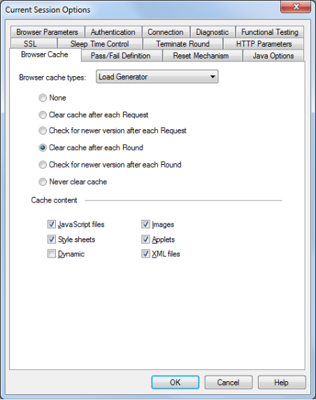

3. From the **Browser Cache Types** drop-down list, select **Load Generator** or **Probing Client**. .
4. Select the type of cache and the content to filter according to the following table and click **OK**.

|**Field**|**Description**|
| :- | :- |
|Browser cache types||
|**None**|All Virtual Clients simulate a browser with no available cache.|
|**Clear cache after each Request**|Defines that the cache will be cleared after each request.|
|**Check for newer version after each Request**|
Defines that WebLOAD will check for a newer version of the cached item with every request.

Whenever the engine has a request for a cached resource, the engine sends the request with an “if-modified-since” header. If the server responds with a 200 status, the engine will refresh the cache.
|
|**Clear cache after each Round**|Defines that the cache will be cleared after each script execution round. This is the default setting.|
|**Check for newer version after each Round**|
Defines that WebLOAD will check for a newer version of the cached item after each round.

Whenever the engine has a request for a cached resource, the engine sends the request with an “if-modified-since” header. If the server responds with a 200 status, the engine will refresh the cache.
|
|**Never clear cache**|Defines that the cache will never be cleared. Each client maintains its own cache.|
|*Cache content*|
You can select a filter, enabling you to indicate specific content types to be cached in the script. The available filters are:

- JavaScript files

- Style sheets

- Images

- Applets

- XML files

- Dynamic
|

## Configuring Browser Parameter Settings

The Browser Parameters option enables you to define Virtual Client behavior, such as:

- Browser type
- SSL encryption strength
- HTTP version
- Keep-Alive status
- Character encoding

Each of these configuration options is described in this section.

**To configure the Browser Parameters options:**

1. Click **Default/Current Session Options** or **Script Options** in the **Tools** tab of the ribbon,

   -Or-

   Select **Default/Current Session Options** or **Script Options** from the Console System button.

1. Select the **Browser Parameters** (default) tab.

   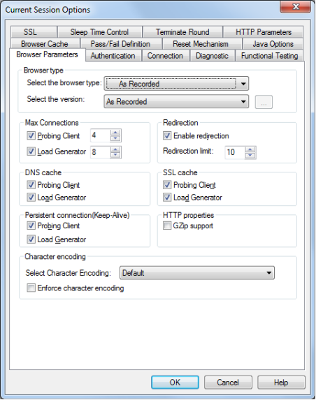

3. Check the browser features you wish to use. Each option is described in this section.

4. Click **OK** to accept the modifications, or **Cancel** to reject them, and exit the Default/ Current Session Options dialog box.

   > **Note:** The script (coded to account for a particular option) always overrides the Browser Parameters options. WebLOAD recommends always setting these options through the Console user interface.

### Setting the Browser Type and Version

The browser type and version settings specify the type of browser the WebLOAD Virtual Clients should emulate. You can set WebLOAD Console to emulate any of the standard browsers, or you can specify any specific application by supplying a custom user-agent that is included in all HTTP headers. By default, all Virtual Clients use the WebLOAD Default browser agent.

**To set the browser type and user-agent:**

1. Click **Default/Current Session Options** or **Script Options** in the **Tools** tab of the ribbon,

   -Or-

   Select **Default/Current Session Options** or **Script Options** from the Console System button.

1. Select the **Browser Parameters** (default) tab.
1. Select a browser type from the **Select the browser type** drop-down list.

   Note that by default, the browser type and version are **As recorded**, which means: as recorded in the WebLOAD Recorder.
   
   

4. You can select an alternative version from the drop-down list, or click the Browse button to add a new user agent definition. See [Adding a Browser Version Definitions ](#adding-a-browser-version-definitions).

#### Adding a Browser Version Definitions

The available browser version list is appropriate for the browser type you select. You can add to the browser version list.

**To add a browser version:**

1. Select **Custom** in the **Select the browser type** drop-down list within the **Browser Type** area of the Browser Parameters tab.
1. Click the browse button adjacent to **Select the version**. The User Agent dialog box appears.

3. Enter the new browser version definition.
4. Click **OK**.

### Setting Load Generator and Probing Client Max Connections

**To set the Load Generator and Probing Client multiple connection settings:**

1. Click **Default/Current Session Options** or **Script Options** in the **Tools** tab of the ribbon,

   -Or-

   Select **Default/Current Session Options** or **Script Options** from the Console System button.

1. Select the **Browser Parameters** (default) tab.
1. Set the max connection properties as follows in the **Max Connections** section:

   - To enable multiple connections for Probing Clients, check the **Probing Client** checkbox. If you enable multiple connections, select the number of connections from the drop down list.
   - To enable multiple connections for Load Generators, check the **Load Generator** checkbox. If you enable multiple connections, select the number of connections from the drop down list.

### Setting Redirection Limits

**To set a redirection limit:**

1. Click **Default/Current Session Options** or **Script Options** in the **Tools** tab of the ribbon,

   -Or-

   Select **Default/Current Session Options** or **Script Options** from the Console System button.

1. Select the **Browser Parameters** (default) tab.
1. Select **Enable redirection**.

4. In the Redirection limit field, type or select the desired redirection limit. The default limit is 10.

### Simulating DNS Cache

When DNS Caching is enabled (default), WebLOAD Console caches the IP addresses received from the domain name server, reducing the domain name resolution time. Disable DNS caching if you want to include the time for domain name resolution in the WebLOAD Console performance statistics.

**To simulate DNS cache:**

1. Click **Default/Current Session Options** or **Script Options** in the **Tools** tab of the ribbon,

   -Or-

   Select **Default/Current Session Options** or **Script Options** from the Console System button.

1. Select the **Browser Parameters** (default) tab.

   Under DNS Cache, select **Probing Client** and **Load Generator**.

### Simulating SSL Cache
When SSL Caching is enabled (default), WebLOAD Console caches the SSL decoding keys received from an SSL server, and WebLOAD Console only receives the key on the first SSL connection in each round. In subsequent connections, WebLOAD Console retrieves the key from cache. Enabling SSL Cache also reduces transmission time during SSL communication. Disable SSL caching if you want to measure the transmission time of the decoding key in the WebLOAD Console performance statistics for each SSL connection.

**To simulate SSL cache:**

1. Click **Default/Current Session Options** or **Script Options** in the **Tools** tab of the ribbon,

   -Or-

   Select **Default/Current Session Options** or **Script Options** from the Console System button.

1. Select the **Browser Parameters** (default) tab.

   Under SSL Cache, select **Probing Client** and **Load Generator**.

### Enabling Persistent Connection (Keep-Alive)
When enabled, WebLOAD Console keeps an HTTP connection alive between successive accesses in the same round of the main script. Keeping a connection alive saves time between accesses. WebLOAD Console attempts to keep the connection alive unless you switch to a different server. However, some HTTP servers may refuse to keep a connection alive. You should not keep a connection alive if establishing the connection is part of the performance test.

**To enable persistent connection:**

1. Click **Default/Current Session Options** or **Script Options** in the **Tools** tab of the ribbon,

   -Or-

   Select **Default/Current Session Options** or **Script Options** from the Console System button.

1. Select the **Browser Parameters** (default) tab.

   Under Persistent Connection, select **Probing Client** and **Load Generator**.

### Enabling GZip Support
Enabling GZip support sets the wlGlobals.AcceptEncodingGzip flag. For each request, WebLOAD Console sends the header “Accept-Encoding: gzip, deflate”. This tells the server that the client can accept zipped content. When this header is turned on, the server MAY send a response with the header “content-encoding: gzip” or “content- encoding: deflate”. If either of these headers is sent, it means that the response is zipped/deflated and WebLOAD Console will unzip/inflate the content.

> **Note:** Most servers will work correctly even if the client does not send the “Accept-

Encoding: gzip, deflate” header. Therefore, unless needed, it is recommended not to set the wlGlobals.AcceptEncodingGzip flag because it is performance heavy.

However, some servers will fail if it is not sent. Microsoft Internet Explorer/Mozilla sends it by default.

You can manually code the script to send the “Accept-Encoding: gzip, deflate” header even if the wlGlobals.AcceptEncodingGzip flag is not set. In this case, if the server returns zipped content, WebLOAD Console will not unzip it, so the content will not be available for WebLOAD Console to function properly.

> **Note:** Enabling GZip support sets the Browser Emulation Settings to the maximum browser emulation accuracy. Disabling GZip support sets the Browser Emulation Settings to the maximum Load Generator capacity.

**To enable GZip support:**

1. Click **Default/Current Session Options** or **Script Options** in the **Tools** tab of the ribbon,

   -Or-

   Select **Default/Current Session Options** or **Script Options** from the Console System button.

2. Select the **Browser Parameters** (default) tab.
3. nder HTTP Properties, select **GZip support**.

### Setting Character Encoding
The character encoding settings enable you to select a specific character set. You can indicate whether the parser should use the character set it parses in the HTML pages or override it using the specified character set.

**To specify character encoding:**

1. Click **Default/Current Session Options** or **Script Options** in the **Tools** tab of the ribbon,

   -Or-

   Select **Default/Current Session Options** or **Script Options** from the Console System button.

1. Select the **Browser Parameters** (default) tab.
1. Under Character encoding, in the Select Character Encoding drop-down, select the value corresponding to the character set that you want to use. The default value is Default (0), the regional settings of the computer.
1. Check the **Enforce character encoding** checkbox to override the character set parsed from the HTML pages with the value specified in the Select Character Encoding drop-down list. Uncheck the **Enforce character encoding** checkbox to indicate that the parser should use the character set it parses in the HTML pages. The default value is false (use the encoding from the HTML pages).

## Setting the HTTP Parameters

The HTTP Parameters option enables you to define HTTP client behavior on the HTTP protocol level.

**To set the HTTP Parameters options:**

1. Click **Default/Current Session Options** or **Script Options** in the **Tools** tab of the ribbon,

   -Or-

   Select **Default/Current Session Options** or **Script Options** from the Console System button.

1. Select the **HTTP Parameters** tab.

   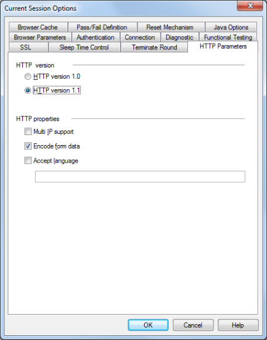

3. Set the HTTP version by clicking **HTTP version 1.0** or **HTTP version 1.1**.

   > **Note:** For the WebLOAD Console 7.x protocol engine, the default HTTP version is 1.1. For the WebLOAD Console 5.x protocol engine, the default HTTP version is 1.0.

4. Select one or more **HTTP Properties** checkboxes.
5. Click **OK**.

The following table describes the fields and buttons in the HTTP Parameters dialog box.

|**Field**|**Description**|
| :- | :- |
|**HTTP Version**|The appropriate HTTP protocol version (for example “HTTP/1.1”).|
|**HTTP version 1.0**|Sets the HTTP protocol version to 1.0.|
|**HTTP version 1.1**|Sets the HTTP protocol version to 1.1.|
|***HTTP Properties***||
|**Multi IP Support**|Sets the wlGlobals.MultiIPSupport flag to indicate that the HTTP protocol version supports more than one IP address.|
|**Encode Form Data**|
Sets the wlGlobals.EncodeFormdata flag.

In general, when an HTTP client (Microsoft Internet Explorer/Firefox or WebLOAD Console) sends a post request to the server, the data must be HTTP encoded. Special characters like blanks, “>“ signs, and so on, are replaced by “%xx”. For example, space is encoded as “%20”.

This encoding can be performance heavy for large data, so WebLOAD Console allows you to turn it off.

This should ONLY be done if you are sure that the data does not contain special characters. If it does, and the customer wants to improve performance via this flag, then you should replace the special characters within the script or use wlHttp.EncodeFormdata to set the flag for specific requests.
|
|**Accept Language**|Sets the wlGlobals.AcceptLanguage flag. This flag defines a global value for the “Accept-Language” header which will be sent with each request. Some applications/servers will behave differently depending on the setting. It is a simple string and WebLOAD Console does not enforce any checks on the values. It is similar to the wlGlobals.UserAgent property in the sense that it is a wlGlobals/wlHttp setting that affects the value of request headers.|

## Setting Authentication

The Authentication option enables you to define the Global and Proxy authentication settings.

**To set authentication:**

1. Click **Default/Current Session Options** or **Script Options** in the **Tools** tab of the ribbon,

   -Or-

   Select **Default/Current Session Options** or **Script Options** from the Console System button.

1. Select the **Authentication** tab.

   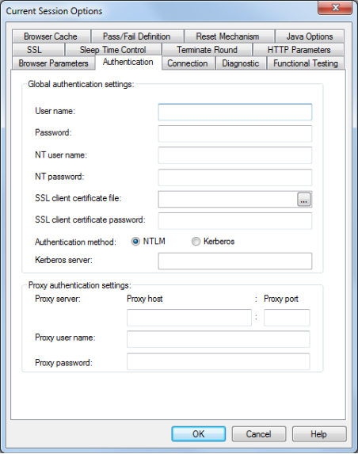

3. Type the appropriate user names and passwords into the corresponding Global Authentication Settings input text boxes:

|**Field**|**Description**|
| :- | :- |
|**User name** and **Password**|
The user name and password the script should use to log onto restricted HTTP sites.

**Note:** User names must be entered using one of the following formats:

- Domain\User

- Domain\\User

- Domain/User
|
|**NT user name** and **NT password**|The user name the script should use for Windows NT Challenge response authentication.|
|**Proxy user name** and **Proxy password**|The user name and password the script should use for proxy servers that require user authorization.|
|
**SSL client certificate file** and

**SSL client certificate password**
|The filename (optionally including a directory path) and password of the certificate WebLOAD Console makes available to SSL servers.|
|**Authentication method**|
The authentication method supported by the server:

- NTLM (default).

- Kerberos.
|
|**Kerberos server**|The Kerberos server Fully Qualified Domain Name (FQDN). For example, specify “qa4” rather than “qa4.radview.co.il”. This field is only enabled when the authentication method is set to Kerberos.|

4. Type the appropriate proxy host name, port number, user name, and password into the corresponding Proxy Authentication input text boxes when working with proxy authentication.
5. Click **OK** to accept the modifications, or **Cancel** to reject them, and exit the Default/Current Session Options dialog box.

## Bandwidth Settings

WebLOAD Console enables you to simulate various systems and connection configurations, including setting a ‘virtual limit’ on the bandwidth available during a test. Setting a limit on bandwidth allows testers to test applications for users that may be limited in their workplace connections speeds.

**To configure the connection speed:**

1. Click **Default/Current Session Options** or **Script Options** in the **Tools** tab of the ribbon,

   -Or-

   Select **Default/Current Session Options** or **Script Options** from the Console System button.

1. Select the **Connection** tab.

   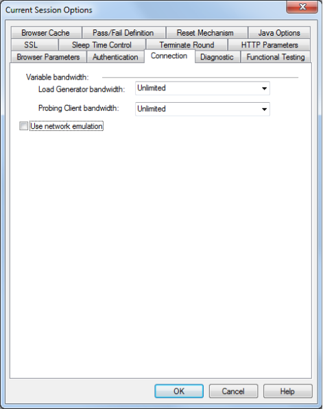

   The Variable Bandwidth feature enables you to set the bandwidth for the load and emulate users connecting through different modem connections (14400, 28800…).

4. Select the desired bandwidth from the **Load Generator Bandwidth** drop-down list.

5. Select the desired bandwidth from the **Probing Client Bandwidth** drop-down list.

6. Check the **Use network emulation** option if you wish to view and control the emulation settings (download/upload bandwidth, delay, and packet loss) that are used to emulate each of the selections you make in the **Load Generator Bandwidth** and **Probing Client Bandwidth** fields.

7. You can click any of the emulation settings to manually set it to a custom value:

   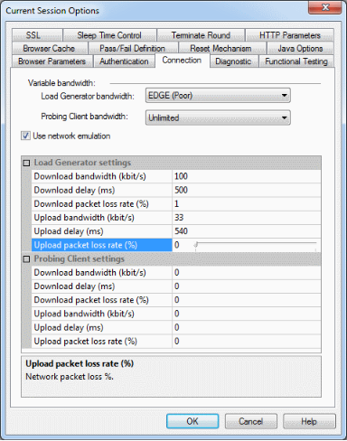

   

8. Click **OK** to accept the modifications, or **Cancel** to reject them, and exit the Default/Current Session Options dialog box.

## **Enabling Network Emulation**

Network Emulation services are supported by WebLOAD through the open source ipfirewall (ipfw) engine. To use network emulation, you need to install ipfw, as described below.

Network emulation is performed by the Load Generators. Ipfw needs to be installed on each Load Generator in which you want to run network emulation. Installation depends on the Load Generators type:

Cloud Load Generators – The default WebLOAD native Amazon cloud image includes the network emulation engine, therefore no action is required in order to use the network emulation in this option.

Physical Load Generators – the procedure depends on whether the Load Generator is installed on a Windows or Linux machine.

### Installing ipfw on a Windows Load Generator
On each Load Generator.

**To install ipfw on a Windows machine:**

1. Download [https://s3.amazonaws.com/radview/dummynet.zip. ](https://s3.amazonaws.com/radview/dummynet.zip)The zip file includes two folders: 32bit and 64bit. You need the folder that corresponds to the Windows version installed on the Load Generator – either 32-bit or 64-bit.
1. Change the name of the relevant folder to ipfw, and place it under the directory

   C:\Program Files (x86)\RadView\WebLOAD\bin.

   Alternatively, copy the ipfw folder to any other location, and in the C:\Program Files (x86)\RadView\WebLOAD\bin\networkemulation.ini file, set IPFW\_PATH="`<path>`/ipfw.exe".

1. Install the NDIS driver as follows:
   1. Open the configuration panel for the network card in use by right-clicking the icon on the systray, or by selecting **Control Panel** -> **Network** and then selecting the card.
   1. Select **Properties** > **Install** > **Service** > **Add**.
   1. Click **Driver Disk** and select netipfw.inf in this folder.
   1. Select **ipfw+dummynet** which is the only service you should see.
   1. Click **Accept** when warnings appear regarding the installation of an unsigned driver (typically two warnings per installed network card).
1. Verify installation is successful, as follows:

   1. Open a command prompt window by running cmd.exe as an Administrator.
   1. Run the cd command to navigate to the ipfw installation directory.
   1. Run ipfw.exe list
   1. Verify you get the following output: 65535 allow ip from any to any

5. Make sure to run TestTalk as administrator on the Load Generator machine.

**To remove ipfw from a Windows machine:**

1. Open the configuration panel for the network card in use by right-clicking the icon on the systray, or by selecting **Control Panel** -> **Network** and then selecting the card.
1. Select **Properties.**
1. Select **ipfw+dummynet**.
1. Click **Remove**.

### Installing ipfw on a Linux CentOS 7 Load Generator
On each Load Generator.

**To install ipfw on a Linux CentOS 7 machine:**

1. Install the following necessary prerequisites for building a dummynet kernel module:

   `$ sudo yum -y groupinstall "Development Tools"`

   `$ sudo yum -y install glibc-devel.i686 glibc-devel`

2. Install a kernel source matching the specific kernel on the machine, as follows:

   1. If you are not sure which kernel version you have, run the following command:

      `$ sudo uname -r`

   1. Download the kernel sources as follows (replace the version in the example with your version):

      `$ cd /tmp`

      `$ wget [http://vault.centos.org/7.1.1503/centosplus/Source](http://vault.centos.org/7.1.1503/centosplus/Source/SPackages/kernel-plus-3.10.0-229.el7.centos.plus.src.rpm)`

      `[/SPackages/kernel-plus-3.10.0-229.el7.centos.plus.src.rpm](http://vault.centos.org/7.1.1503/centosplus/Source/SPackages/kernel-plus-3.10.0-229.el7.centos.plus.src.rpm)`

      `$ mkdir -p /tmp/rpmbuild/{BUILD,RPMS,SOURCES,SPECS,SRPMS}`

      `$ echo "%\_topdir /tmp/rpmbuild" > ~/.rpmmacros`

   3. Run the following commands, using the kernel version of the kernel you downloaded in the previous step:

      `$ rpm -i <downloaded file name> 2>&1 | grep -v mockb`

      `$ sudo tar xvfvJ /tmp/rpmbuild/SOURCES/linux-<kernel id/name>.tar.xz -C /usr/src/kernels/`

      `$ cd /usr/src/kernels/linux-<kernel id/name>`

      `$ sudo make oldconfig`

      `$ sudo make prepare`

      `$ sudo make scripts`

      `$ sudo make`

3. Build the ipfw, as follows:
   1. Compile the ipfw\_source\_package.zip, which is part of WebLOAD installation package, by running the following commands:

      `$ cd /tmp/`

      `$ cp`

      /opt/share/radview/webload<version>/linux/ipfw\_source\_pac kage.zip

      `$ unzip ipfw\_source\_package.zip`

      `$ cd dummynet-master`

      `$ make KERNELPATH=/usr/src/kernels/linux-<kernel id/name>/`

   1. If the build is successful, a dummynet kernel module called ipfw\_mod.ko will be created in the dummynet-master/kipfw-mod directory. Try loading the module into the kernel by running the following commands:

      `$ cd kipfw-mod`

      `$ sudo insmod ipfw\_mod.ko`

   1. If successful, install the dummynet module in the global modules repository by running the following commands:

      `$ sudo cp ipfw\_mod.ko /lib/modules/<kernel id/name>/kernel/net/netfilter`
      
      `$ sudo depmod`

   4. Optionally, have it automatically loaded upon boot by running the following commands:

      `$ sudo sh -c 'echo modprobe ipfw\_mod >> /etc/rc.modules'`

      `$ sudo chmod +x /etc/rc.modules`

## Diagnostic Settings

Diagnostic options can be enabled while developing a script or for tracking problems in existing scripts.

**To configure the diagnostic options:**

1. Click **Default/Current Session Options** or **Script Options** in the **Tools** tab of the ribbon,

   -Or-

   Select **Default/Current Session Options** or **Script Options** from the Console System button.

1. Select the **Diagnostic** tab.

   

   > **Note:** Running a Load Session with the diagnostic options enabled may affect system performance. Therefore, we recommend that these options remain disabled while running a Load Session with multiple threads.

3. Check the diagnostic features you wish to use. Each diagnostic option is described in this section.
4. Click **OK** to accept the modifications, or **Cancel** to reject them, and exit the Default/Current Session Options dialog box.

### Enabling Syntax Checking
Enable Syntax Checking to perform the following tests on a script while it is running.

**To enable syntax checking:**

1. Click **Default/Current Session Options** or **Script Options** in the **Tools** tab of the ribbon,

   -Or-

   Select **Default/Current Session Options** or **Script Options** from the Console System button.

1. Select the **Diagnostic** tab.
1. Select **Enable syntax checking**.

The following diagnostics are performed:

- **Type inspections** ‒ WebLOAD Console checks that each property receives the correct type.

  For example, wlLocals.ParseForms = 14 prompts the following log message:

  “Wrong type for the property ParseForms. The correct type is Boolean. Legal values are: “Yes”/”No” or true/false.”

- **Value inspections** ‒ WebLOAD Console checks to ensure that each property is assigned a legal value.

  For example, wlHttp.Version = “2.1” prompts the following log message:

  “2.1 is an illegal value for the property Version. Legal values are: 1.0, 1.1.”

- **Scope inspections** ‒ WebLOAD Console checks that each property is assigned a permitted scope.

  For example, wlLocals.ConnectionSpeed = 28800 prompts the following log message:

  “The property ConnectionSpeed is not valid for the object wlLocals.”

- **Case inspections** ‒ WebLOAD Console objects and properties are case sensitive. When Syntax Check is enabled, WebLOAD Console checks to ensure that all objects and properties are written correctly.

  For example, wlLocals.parse = “No” prompts the following log message:

  “The property parse should be written as Parse.”

It is recommended that a syntax check be run at least once while developing your script.

### Log Report Diagnostics

Log reports are used to see the script flow, and the response headers received while a script is running. When log report is enabled, an outfile is automatically created for each get and post transaction and for each frame received.

**To enable log report diagnostics:**

1. Click **Default/Current Session Options** or **Script Options** in the **Tools** tab of the ribbon,

   -Or-

   Select **Default/Current Session Options** or **Script Options** from the Console System button.

1. Select the **Diagnostic** tab.
1. Select **Enable log report** to configure WebLOAD Console to create a Log Report.

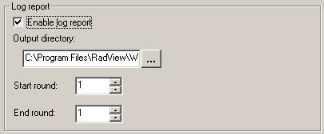

4. Click in the Output directory field and select the directory for saving Log Report files.

   The default directory is: C:\Program Files\RadView\WebLOAD\User\Log.

5. Select which rounds should generate the Log Report in the Start round and End round fields.

The log report displays the time a request was made, the round number, the request number, the URL received and the response headers. If GetContents = “Yes” the same information is displayed for each frame.

A message is sent to the Log Window for each request. The message appears in the following format:

`\### Thread:000, Round Num:001, Request Num:001 ### URL`

Each request is numbered sequentially for each thread and round number.

### Enabling enhanced RadView Support Diagnostic
Enabling the enhanced RadView Support Diagnostic option creates large files in the WebLOAD\User\Log directory and may affect Load Generator performance.

**To enable enhanced RadView support diagnostic:**

1. Click **Default/Current Session Options** or **Script Options** in the **Tools** tab of the ribbon,

   -Or-

   Select **Default/Current Session Options** or **Script Options** from the Console System button.

1. Select the **Diagnostic** tab.
1. #### Select **Enable the enhanced RadView Support Diagnostic**.

### Enabling Show Performance Warnings
Enable the **Show Performance Warnings** option if you want WebLOAD to automatically send warning messages when Load Generators are getting overloaded. This can enable you to better utilize the Load Generators in your current and future tests.

**To enable showing performance warnings:**

1. Click **Default/Current Session Options** or **Script Options** in the **Tools** tab of the ribbon,

   -Or-

   Select **Default/Current Session Options** or **Script Options** from the Console System button.

1. Select the **Diagnostic** tab.
1. Select **Show Performance Warnings**.

## Functional Testing Options

Functional testing enables you to insert verification tests into the script to verify that the links, images, forms, tables and frames in your Web application continue to act as expected.

**To access and configure the functional testing options:**

1. Click **Default/Current Session Options** or **Script Options** in the **Tools** tab of the ribbon,

   -Or-

   Select **Default/Current Session Options** or **Script Options** from the Console System button.

1. Select the **Functional Testing** tab.

3. Select the functional testing tools you wish to use. Each testing option is described in this section.
4. Click **OK** to accept the modifications, or **Cancel** to reject them, and exit the Default/ Current Session Options dialog box.

### Setting Automatic Data Collection

Setting automatic data collection instructs WebLOAD Console to handle every page, object and HTTP object in the Script as a transaction. The name of the transaction is the name of the page or object and data is gathered for each transaction.

**To set automatic data collection:**

1. Click **Default/Current Session Options** or **Script Options** in the **Tools** tab of the ribbon,

   -Or-

   Select **Default/Current Session Options** or **Script Options** from the Console System button.

1. Select the **Functional Testing** tab.

1. Select one of the following:

   - **All Pages** or **Failed Pages** to turn all page transactions in the script into Named Transactions. The transaction name will be the page name (the URL being accessed without the query string) with the HTTP method used to retrieve it (GET or POST). The following statistics will be gathered for all page transactions: total number of transactions (counter), number of failed and successful transactions (counter), and the page time for each transaction (timer). Transaction Data Drilling will be available for all transactions if you select All Pages or for failed transactions only if you select Failed Pages. Select one or more of the following to specify whether to collect data at object or HTTP level or both.
      - **Object level** – Creates sub transactions for all content (for example, gif, ico, and js).
      - **HTTP level** – Breaks down every transaction, including sub transactions, into HTTP elements (for example, open connection, send, time to first byte, and receive).
      - **None** to disable turning page transactions in the script into Named Transactions. Statistics are not gathered for page transactions.

**Note:** For the WebLOAD Console 7.x protocol engine, the default automatic data collection setting was None. For the WebLOAD Console 5.x protocol engine, the default automatic data collection setting was Failed Pages.

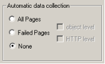

### Setting Page Time Verifications
Setting page time verifications enables you to define a limit to the maximum amount of time a page should take to load. If the maximum time is exceeded, a message or error entry appears in the log window, depending on the severity level set for page time verifications.

> **Note:** You cannot set page time verifications unless automatic data collection is active. See [*Setting Automatic Data Collection* ](#setting-automatic-data-collection)

**To set page time verification:**

1. Click **Default/Current Session Options** or **Script Options** in the **Tools** tab of the ribbon,

   -Or-

   Select **Default/Current Session Options** or **Script Options** from the Console System button.

1. Select the **Functional Testing** tab.

1. Check **Verification**.

   

4. Specify the maximum amount of time that a page should take to load in the Max Time field.
5. Specify the severity level if the page exceeds the specified time in the Severity Level field.

> **Note:** It is important to specify a meaningful time period. For example, if you specify 3 seconds for a page which is likely to take longer, numerous essentially meaningless failures will result. Conversely, if you specify 10 seconds for a page which should take less than 1 second, the test becomes meaningless.

### Inserting a Text Verification Test
Use Text verifications to verify the absence or presence of selected text expressions within your Web page.

**To insert a text verification test into your script:**

1. Click **Default/Current Session Options** or **Script Options** in the **Tools** tab of the ribbon,

   -Or-

   Select **Default/Current Session Options** or **Script Options** from the Console System button.

1. Select the **Functional Testing** tab.

1. Under Verification, check the **Verification** checkbox.

1. Select the percentage of time the tests should be performed. This is the percentage of Virtual Clients that will perform the verification tests.

   > **Note:** For backward compatibility of scripts that were recorded with the AAT and support table comparisons, you can select only the Verification checkbox, without selecting any additional options.

5. Check the Text Search checkbox.

6. Enter a literal string with the text for which you are searching in the Text field

   > **Note:** The text string is case sensitive.

7. Select the type of test to run from the drop-down list in the Option field:

   - **Find** ‒ The verification test will pass if the selected text is found in the current Web page.

   - **Not to Find** ‒ The verification test will fail if the selected text is found in the current Web page.

     For example, to ensure that the word “error” does not appear on the page during runtime, enter the word “error” in the Text field, and select **Not to Find**. If the text error is found on the page, WebLOAD Console will report the error.

8. Select the severity level from the Severity level drop-down list. For further information, see [*Verification Function Return Values](#functional-testing-options).

9. Click **Add** to add another string to the list of Text Search strings,

   -Or-

   Click **Delete** to delete a selected string from the list of Text Search strings.

## Pass / Fail Definition Settings

The Pass / Fail Definition options enable you to set test failure conditions.

> **Note:** This option is not available for individual scripts. It can only be set for the entire session though the Default Options or the Current Session Options dialog boxes.

**To configure pass/fail definition options:**

1. Click **Default/Current Session Options** in the **Tools** tab of the ribbon,

   -Or-

   Select **Default/Current Session Options** from the Console System button.

1. Select the **Pass/Fail Definition** tab.

   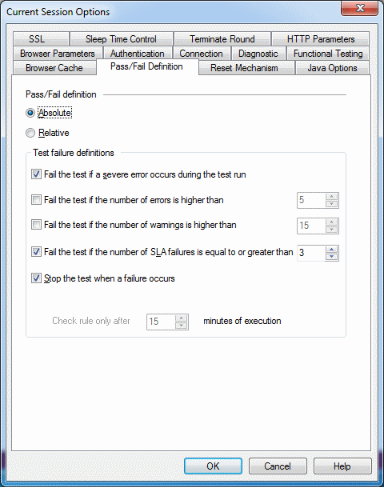

   You can set WebLOAD Console to declare a test as failed based on a number of criteria. First, you must decide if you want the test to be professed a failure after an absolute number of failures or a relative number of failures. Then you set the conditions upon which a test is declared a failure.

1. Select **Absolute** (default) to set the total number of failures required for a test to be declared failed,

   -Or-

   Select **Relative** to set the percent of failed transactions need for a test to be declared failed.

1. Set the conditions upon which to declare a test failed and the action to take if a test fails.

   - **Fail the test if a severe error occurs during the test run** ‒ Sends a failure message and declares the test failed in the event of a severe error.

   - **Fail the test if the number of errors is higher than** ‒ Declares the test failed if the number of errors received is higher than the number stated. If the pass / fail definition is set to relative then the percentage of errors is considered rather than the absolute value.

   - **Fail the test if the number of warnings is higher than** ‒ Declares the test failed if the number of warnings received is higher than the number stated. If the pass / fail definition is set to relative then the percentage of warnings is considered rather than the absolute value.

   - **Fail the test if the number of SLA failures is equal to or greater than** – Declares the test failed if the number of SLA breaches received is equal to or higher than the number stated. If the pass / fail definition is set to relative then the percentage of warnings is considered rather than the absolute value.

   - **Stop the test when a failure occurs** ‒ Stops the test if the test is declared failed.

   - **Check rule only after 	minutes of execution** ‒ This option is only enabled when the pass / fail definition is set to relative. Use this option to set a stabilizing period for the test when it starts. Errors or warning received during this time frame will not fail the test, and the rules set for failing the test will only be checked after this timeframe has expired.

5. Click **OK** to accept the modifications, or **Cancel** to reject them, and exit the Default/Current Session Options dialog box.

## Configuring Reset Mechanism Settings

The Reset Mechanism options enable you to set the reset values.

> **Note:** This option is not available for individual scripts. It can only be set for the entire session though the Default Options or the Current Session Options dialog boxes.

**To configure reset mechanism options:**

1. Click **Default/Current Session Options** in the **Tools** tab of the ribbon,

   -Or-

   Select **Default/Current Session Options** from the Console System button.

1. Select the **Reset Mechanism** tab.

   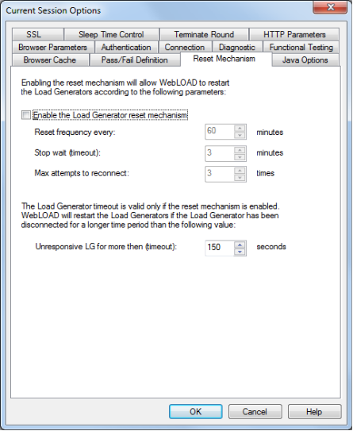

1. Check the **Enable the Load Generator reset mechanism** checkbox to allow WebLOAD Console to restart the Load Generators.

1. Set the number of minutes for Reset Frequency (Every) and Stop Wait (Timeout).

1. Set the number of times for Max attempts to reconnect.

1. Set the number of seconds for Unresponsive LG for more than (Timeout).

   **Note:** The Load Generator Timeout is valid only if the Reset Mechanism is enabled.

1. Click **OK** to accept the modifications, or **Cancel** to reject them, and exit the Default/Current Session Options dialog box.

## Configuring the Java Options

The Java options enable you to define the Java Virtual Machine to be used by WebLOAD Recorder, for executing Java classes.

#### **To configure Java Option settings:**

1. Click **Default/Current Session Options** in the **Tools** tab of the ribbon,

   -Or-

   Select **Default/Current Session Options** from the Console System button. The Default/Current Session Options dialog box appears.

1. Select the **Java Options** tab.

   The Java Options tab moves to the front of the dialog box.
   
   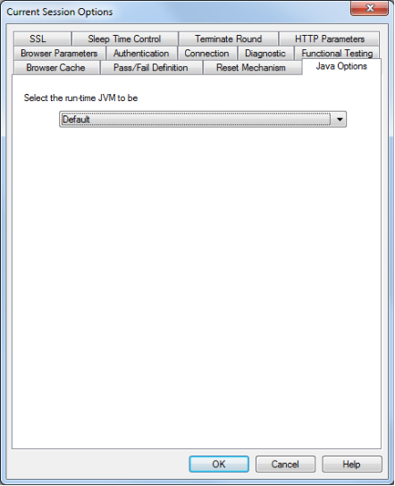

3. In the Select run-time JVM to be drop down, select one of the available Java Virtual Machines.

   The default setting is the WebLOAD standard Java Virtual Machine. The selected value is passed to wlGlobals.JVMtype and is the key for WLJVMs.xml. This XML file (located on every WebLOAD Machine in the `<WebLOAD Installation Directory>`\extensions\JVMs directory) contains the following parameters for each JVM:

   - Type (the value from the flag)

   - Path (should be machine-agnostic)

   - Options

     When Type is “Default”, the RadView default (installed) JVM will be used. The default JVM’s path is defined in webload.ini, as it depends on the WebLOAD Console installation path.

4. Click **OK**.

   The Java Options are saved.

