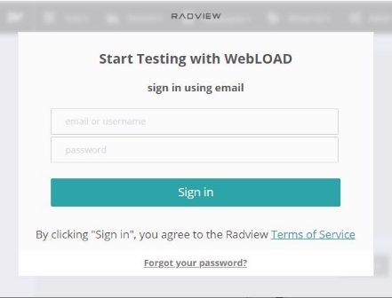

# Getting Started

## Launching WebLOAD Dashboard

**To launch WebLOAD Dashboard:** 

1. Select **Start** > **Programs** > **RadView** > **WebLOAD** > **Utilities**-> **Start WebLOAD Dashboard**. 

   This launches the WebLOAD Dashboard server. 

2. Navigate to **http://localhost:3000/** 

   The WebLOAD Dashboard login window appears. The default user is ‘**admin’** with password ‘**admin’**. 

   Note that the default user is a Super Admin, as explained in[` `*Super Administrators* ](#_page86_x109.00_y567.04)(on page[ 81)](#_page86_x109.00_y567.04). 

   

After login, the homepage appears, showing the latest sessions and tests with links to those sessions and tests, as well as links to creating new load tests in WebLOAD Dashboard.  

## Using the menu bar 

The menu bar provides access to the various WebLOAD Dashboard functions. Note that the Admin menu is available only for[` `*Super Administrators*.](#_page86_x109.00_y567.04) 

### Menu bar

The main components of the WebLOAD Dashboard menu bar include: 

| **Item**       | **Description**                                              | **For more information, see**                                |
| -------------- | ------------------------------------------------------------ | ------------------------------------------------------------ |
| **Tests**      |                                                              |                                                              |
| **Search**     | View the list of Load  Tests and their definitions, and perform operations on a selected Load Test:  Ÿ Run test  Ÿ Pause test  Ÿ Edit test  Ÿ View this test’s sessions  Ÿ Show this test’s  last session  Delete test | [*Viewing Tests* ](#_bookmark14)(on page [12](#_bookmark14)) |
| **New**        | Create a new Load Test                                       | [*Creating a new load test* ](#_bookmark16)(on page [13](#_bookmark16)) |
| **Sessions**   |                                                              |                                                              |
| **Search**     | Select a session for  viewing and analysis                   | [*Viewing Load Sessions* ](#_bookmark29)(on page [*28*](#_bookmark29)) |
| **Upload**     | Import a session into the  database                          | [*Uploading a session* ](#_bookmark32)(on page [30](#_bookmark32)) |
| **Dashboards** |                                                              |                                                              |
| **Home**       | The  Home dashboard, as configured in  the  user’s Profile   | [*Setting the Default (Home)*](#_bookmark81) [*Dashboard* ](#_bookmark81)(on page [64](#_bookmark81)) |
| **Playlists**  | Create and play a  dashboard that rotates through a list of dashboards | [*Creating and Playing a Playlist* ](#_bookmark94)(on page [72](#_bookmark94)) |
| **+ New**      | Create a new dashboard                                       | [*Creating a New Dashboard* ](#_bookmark79)(on page [62](#_bookmark79)) |
| **+ Import**   | Import a dashboard that  was saved in JSON file format       | [*Importing a Dashboard* ](#_bookmark78)(on page [60](#_bookmark78)) |
| **Resources**  |                                                              |                                                              |
| **Search**     | View the list of resources                                   | [*Viewing Resources* ](#_bookmark34)(on page [31](#_bookmark34)) |
| **Upload**     | Upload resources into the database                           | [*Uploading Resources* ](#_bookmark36)(on page [33](#_bookmark36)) |

**Admin – this tab is available only for Super Admin users**  

| **Global Users**         | Manage users                                                 | [*User Management by a Super*](#_bookmark111) [*Admin* ](#_bookmark111)(on page [82](#_bookmark111)) |
| ------------------------ | ------------------------------------------------------------ | ------------------------------------------------------------ |
| **Global Orgs**          | Manage organizations                                         | [*Adding an Organization* ](#_bookmark117)(on page [88](#_bookmark117)) |
| **Load Generators**      | Define the available load generators                         | [*Managing Load Generators* ](#_bookmark99)( on page [76](#_bookmark99)) |
| **Data Sources**         | A data source is a statistics data source. There are two types:  Ÿ WebLOAD Data  source – get information from a WebLOAD session. By default, this is the  local installation, but it can be changed  to point to a different one. Note – only one WebLOAD data source can  be used at a time per organization (the default one) – to use more than one,  create another organization and switch to  it.  Other –WebLOAD Dashboard can access other  time based data sources and show  them alongside the WebLOAD data. | [*Changing   the Back-End Server’s*](#_bookmark123)  [*Listening Port* ](#_bookmark123)(on page [95](#_bookmark123)) |
| **Plugins**              | List the installed plugins                                   |                                                              |
| **Server Settings**      | Show the current configuration                               |                                                              |
| **Server Stats**         | Show the usage stats                                         |                                                              |
| **Logged in user**       |                                                              |                                                              |
| **You**                  |                                                              |                                                              |
| **Profile**              | Change your user name, password, and UI preferences          |                                                              |
| **See EULA**             | View the End User License Agreement                          |                                                              |
| **Sign out**             | Sign out                                                     |                                                              |
| **Logged in user’s Org** |                                                              |                                                              |
| **Preferences**          | Change preferences at the Organizational level               | [*Managing Organizations* ](#_bookmark116)(on page [88](#_bookmark116)) |
| **Users**                | Manage the organization’s users,  including their roles (permissions) | [*Managing Users* ](#_bookmark108)(on page [82](#_bookmark108)) |
| **API Keys**             | Manage  API access                                           |                                                              |
| **Switch to**            | Switch  between organizations in which you are a member. Note that when you switch to  an organization, your permissions are the ones dictated by your role in that  particular organization. | [*User Editing by a Super Admin –*](#_bookmark113) [*Editing   User’s Permissions,*](#_bookmark113) [*Organizations, Roles and Details*](#_bookmark113) |
| **+ New Organization**   | Add  an organization                                         | [*Adding an Organization* ](#_bookmark117)(on page [88](#_bookmark117)) |

