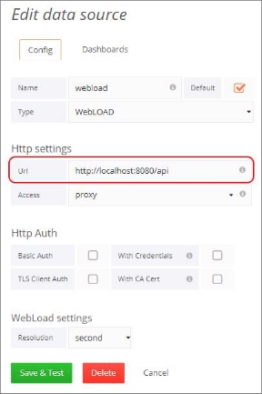

# Appendix A: Editing WebLOAD Dashboard Configuration

## WebLOAD Dashboard Components

The WebLOAD Dashboard includes the following main components: 

- Back-end server, which listens on port 3000 by default.  
- Datasource server, which listens on port 8080 by default 
- Database server 

## Editing Back-end Configuration 


### Changing Back-end configuration

You can change the back-end configuration by creating a file called `custom.ini` in 
`C:\Program Files (x86)\RadView\WebLOAD\dashboard\grafana\conf`. 

Use the `default.ini`, located in the same location, to see the available configuration options. The following lists some common options. For a full description of all options, refer to the [Grafana documentation](./grafana/installation/configuration.md)


```json
[server] 

#Protocol (http or https) 

protocol = http 

#The ip address to bind to, empty will bind to all interfaces 

http\_addr = 

#The http port to use 

http\_port = 3000 

#The public facing domain name used to access from a browser 

domain = localhost 

[security] 

#default admin user, created on startup

admin\_user = admin 

#default admin password, can be changed before first start of grafana, or in profile settings 

admin\_password = admin 

[users] 

#disable user signup / registration 

allow\_sign\_up = true 
```


### Changing the Back-End Server’s Listening Port

You can change the port that the back-end server listens on, which is 8080 by default. **To change the back-end server’s listening port:** 

1. Change the listening port value in the datasource configuration file, located in: `C:\Program Files (x86)\RadView\WebLOAD\dashboard\webdashboard\dashboard.settings.bat.` 

1. If you change the listening port in the datasource configuration file, you must reflect that change in the datasource configuration, as follows: 
    1. Select **Admin** > **Data Sources** in the WebLOAD Dashboard menu bar. 

    1. Click the **WebLOAD** data source, 

    1. In the Edit Data Source window that appears, change the **URL** to reflect the new address. 





### Changing the WebLOAD Dashboard Database

You can set which database the WebLOAD Dashboard is using, by specifying the database in the datasource configuration file, located in 

`C:\Program Files (x86)\RadView\WebLOAD\dashboard\webdashboard\dashboar d.settings.bat`

Note that also the remote database itself must be configured for remote connections. Refer to *Configuring PostgreSQL to Allow Remote Database Connections* in the *WebLOAD Installation Guide*. 

In addition, if you wish to import remote database sessions from the WebLOAD Console to the WebLOAD Dashboard while the sessions are running, do the following in the WebLOAD Console:  

1. Select **Tools** > **Global Options** > **Database**.

    

1. In the **Database configuration** section, enter the details of the remote database.