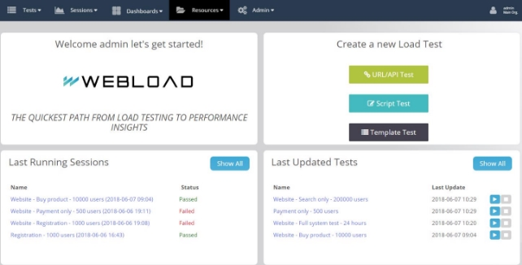

# Getting Started

## Launching WebLOAD Dashboard

**To launch WebLOAD Dashboard:** 

1. Select **Start** > **Programs** > **RadView** > **WebLOAD** > **Utilities**-> **Start WebLOAD Dashboard**. 

   This launches the WebLOAD Dashboard server. 

2. Navigate to **http://localhost:3000/** 

   The WebLOAD Dashboard login window appears. The default user is ‘**admin’** with password ‘**admin’**. 

   Note that the default user is a Super Admin, as explained in[` `*Super Administrators* ](managing_organizations.md#organizational-administrators). 

   

After login, the homepage appears, showing the latest sessions and tests with links to those sessions and tests, as well as links to creating new load tests in WebLOAD Dashboard.  

## Using the menu bar 

The menu bar provides access to the various WebLOAD Dashboard functions. Note that the Admin menu is available only for[` `*Super Administrators*.](managing_organizations.md#organizational-administrators) 

### Menu bar

The main components of the WebLOAD Dashboard menu bar include: 

| **Item**       | **Description**                                              | **For more information, see**                                |
| -------------- | ------------------------------------------------------------ | ------------------------------------------------------------ |
| **Tests**      |                                                              |                                                              |
| **Search**     | View the list of Load  Tests and their definitions, and perform operations on a selected Load Test:  Ÿ Run test  Ÿ Pause test  Ÿ Edit test  Ÿ View this test’s sessions  Ÿ Show this test’s  last session  Delete test | [*Viewing Tests* ](manage_tests.md#viewing-tests) |
| **New**        | Create a new Load Test                                       | [*Creating a new load test* ](manage_tests.md#creating-a-new-load-test) |
| **Sessions**   |                                                              |                                                              |
| **Search**     | Select a session for  viewing and analysis                   | [*Viewing Load Sessions* ](manage_sessions.md#viewing-load-sessions) |
| **Upload**     | Import a session into the  database                          | [*Uploading a session* ](manage_sessions.md#uploading-a-session) |
| **Dashboards** |                                                              |                                                              |
| **Home**       | The  Home dashboard, as configured in  the  user’s Profile   | [*Setting the Default Dashboard*](managing_dashboards.md#setting-the-default-home-dashboard) |
| **Playlists**  | Create and play a  dashboard that rotates through a list of dashboards | [*Creating and Playing a Playlist* ](creating_playlist.md) |
| **+ New**      | Create a new dashboard                                       | [*Creating a New Dashboard* ](managing_dashboards.md#creating-a-new-dashboard) |
| **+ Import**   | Import a dashboard that  was saved in JSON file format       | [*Importing a Dashboard* ](managing_dashboards.md#importing-a-dashboard) |
| **Resources**  |                                                              |                                                              |
| **Search**     | View the list of resources                                   | [*Viewing Resources* ](managing_resources.md#viewing-resources) |
| **Upload**     | Upload resources into the database                           | [*Uploading Resources* ](managing_resources.md#uploading-resources) |

**Admin – this tab is available only for Super Admin users**  

| **Global Users**         | Manage users                                                 | [*User Management by a Super User*](managing_organizations.md#user-management-by-a-super-admin) |
| ------------------------ | ------------------------------------------------------------ | ------------------------------------------------------------ |
| **Global Orgs**          | Manage organizations                                         | [*Adding an Organization* ](managing_organizations.md#adding-an-organization) |
| **Load Generators**      | Define the available load generators                         | [*Managing Load Generators* ](managing_load_generators.md) |
| **Data Sources**         | A data source is a statistics data source. There are two types:  Ÿ WebLOAD Data  source – get information from a WebLOAD session. By default, this is the  local installation, but it can be changed  to point to a different one. Note – only one WebLOAD data source can  be used at a time per organization (the default one) – to use more than one,  create another organization and switch to  it.  Other –WebLOAD Dashboard can access other  time based data sources and show  them alongside the WebLOAD data. | [*Changing   the Back-End Server’s*](appendix_a.md) |
| **Plugins**              | List the installed plugins                                   |                                                              |
| **Server Settings**      | Show the current configuration                               |                                                              |
| **Server Stats**         | Show the usage stats                                         |                                                              |
| **Logged in user**       |                                                              |                                                              |
| **You**                  |                                                              |                                                              |
| **Profile**              | Change your user name, password, and UI preferences          |                                                              |
| **See EULA**             | View the End User License Agreement                          |                                                              |
| **Sign out**             | Sign out                                                     |                                                              |
| **Logged in user’s Org** |                                                              |                                                              |
| **Preferences**          | Change preferences at the Organizational level               | [*Managing Organizations* ](managing_organizations.md) |
| **Users**                | Manage the organization’s users,  including their roles (permissions) | [*Managing Users* ](managing_organizations.md) |
| **API Keys**             | Manage  API access                                           |                                                              |
| **Switch to**            | Switch  between organizations in which you are a member. Note that when you switch to  an organization, your permissions are the ones dictated by your role in that  particular organization. | [*User Editing by a Super Admin*](managing_organizations.md#user-editing-by-a-super-admin-editing-users-permissions-organizations-roles-and-details) |
| **+ New Organization**   | Add  an organization                                         | [*Adding an Organization* ](managing_organizations.md#adding-an-organization) |

