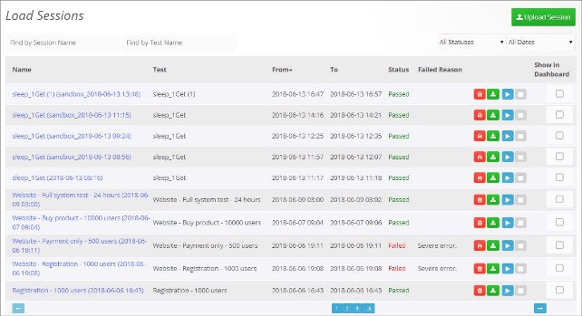

# Managing Sessions

In WebLOAD Dashboard you can manage the following types of sessions: 

- The sessions of load tests created and run in the WebLOAD Dashboard 
- Sessions that were created in the WebLOAD Console, and uploaded to the WebLOAD Dashboard. For instructions how to upload sessions to the WebLOAD Dashboard, see[` `*Uploading a session* ](#uploading-a-session). 

## Viewing Load Sessions

**To view the load sessions:** 

- In the menu bar, select **Sessions** > **Search**. The Load Sessions table appears. 

The Load Sessions table provides the following information and available actions, for each Load Session: ![ref10]

| **Item**                                              | **Description**                                              |
| ----------------------------------------------------- | ------------------------------------------------------------ |
| **Name**                                              | The name of the load  session.  Clicking the name opens the Dashboard page  for this session. enabling you to view the results of this session. |
| **Test**                                              | The name of the corresponding load test.                     |
| **From**                                              | The date and time when the  load session started running.    |
| **To**                                                | The date and time when the  load session finished running.   |
| **Status**                                            | Whether the test passed or failed test  execution.           |
| **Failed  Reason**                                    | If the test failed, displays the reason for  failure.        |
|  | Instructs WebLOAD to  delete this load session.              |
|     | Instructs WebLOAD  to download the session results to the local  computer. The results are downloaded as a zip file that contains the  following files: .ls, .mdb, .sdb, .isd, .dat.  You can then open  the session in WebLOAD Console or  WebLOAD Analytics. |
|           | Enables manually running a  test created in WebLOAD Dashboard,  now or at a specified time. Refer to [*Scheduling a one-time test run*](manage_tests.md#scheduling-a-one-time-test-run). |
|       | Instructs WebLOAD to stop  running the test.                 |
| **Show  in Dashboard**                                | Enables specifying which  sessions to display in the dashboard. This is very useful for comparing the  statistics from multiple sessions. |

## Filtering the Load Sessions display

The Filter bar, above the Load Sessions table, provides various options for filtering the display. 

You can filter the Load Sessions table display by: 

- Session name, using the **Find by Session Name** box. 
- Test name, using the **Find by Test Name** box. 
- Test status, using the **All Statuses** drop-down box 
- Test date, using the **All Dates** drop down box 

## Uploading a session

You can upload to WebLOAD Dashboard, sessions that were created in the WebLOAD Console. Each session created in the WebLOAD Console consists of the following four types of files; to upload the session, you need to upload all four files: 

- .ls - Load Session files 
- .dat - Load Session data files 
- .sdb - Statistics database files 
- .isd - Index statistics database files 

**To upload a session:** 

1. Do one of the following: 

   - In the menu bar, select **Session** > **Upload** 

     Or 

   - In the Load Sessions table, click **Upload Session** 

   The Session Upload page is displayed. 

   

2. Click **Select session files**. 

3. In the file explorer dialog that appears, navigate to the load session’s files, select them, and click **Open**.