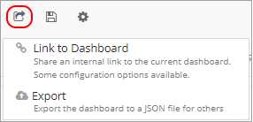
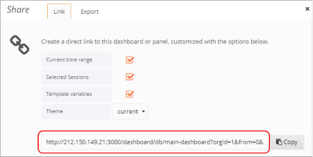
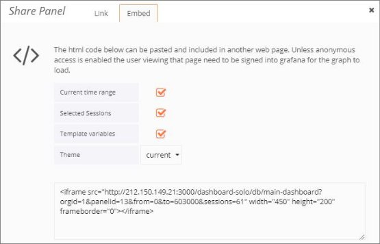

# Sharing a Dashboard or Panel

The WebLOAD Dashboard provides several options for sharing a dashboard or a panel. 

## Sharing a Dashboard

There are several options for sharing a dashboard: 

- **Link to Dashboard** – Produce a link for sharing a dashboard with other WebLOAD Dashboard users. 
- **Export** – Export the dashboard as a JSON file. 

### Accessing the Share Dashboard Options 

**To access the dashboard sharing options:**

1. Select the **Share Dashboard** icon  in the dashboard header. A Share window appears, displaying a link to the dashboard. 

   
   

2. Click any of the options: **Link to Dashboard**, or **Export** A Share Dashboard window appears. 

   

### Sharing a Link to a Dashboard

You can easily share an entire dashboard, by providing the appropriate URL. **To share a link to a dashboard:** 

1. Access the Share Dashboard window [(Figure)](#share_dashboard), as described in[*Accessing the Share Dashboard Options*.](#accessing-the-share-dashboard-options) 

1. Select the **Link** tab [(Figure)](#share_dashboard). 

1. Using the options in the Share Link window, you can produce a link to various variants of the dashboard, as described in the following table.

   | **Item**           | **Description**                                              |
   | ------------------ | ------------------------------------------------------------ |
   | Current time range | Determines whether the linked page will display data for the selected  time range or for the entire session time range. |
   | Selected Sessions  | Determines whether the  linked page will displays the data for the currently selected session(s), or  for the sessions appearing when the dashboard was last saved. |
   | Template variables | Determines whether the  linked page will include template variables. |
   | Theme              | Determines whether the linked page will display the current theme,  the default light theme, or the default dark theme. |

   

1. Click **Copy** to copy the URL displayed in the window, and send it to those with whom you want to share the dashboard.  

## Exporting a Dashboard as a JSON File

You can export a dashboard as a JSON file, and import dashboards that were saved in JSON file format. For instructions how to import a dashboard that was saved as a JSON file, refer to [*Importing a Dashboard*.](./managing_dashboards.md#importing-a-dashboard) 

**To export a dashboard as a JSON file:** 

1. Access the Share Dashboard window [(Figure 77)](#share_dashboard), as described in[*Accessing the Share Dashboard Options*.](#accessing-the-share-dashboard-options) 

1. Select the **Export** tab.

   An Export dashboard window appears. 

   

1. Optionally click **View JSON** to view the file. 

3. Click **Save to file** to save in a desired location. 

   A JSON file of the dashboard is created in your Downloads directory. Its name is the dashboard name followed by the current timestamp. 

Note that you can view the contents of the JSON file in the dashboard. To do so, click the Manage Dashboard Settings icon ![ref26] in the middle of the dashboard header, and select **View JSON**. 

## Sharing a Panel

Sharing a panel is similar to sharing a dashboard. Panel sharing is often useful when you want to share a specific segment (time range) of a panel. The following panel sharing options are available: 

- **Link** - Produces a link for sharing, with other WebLOAD Dashboard users, this panel with the current time range and selected template variables. 
- **Embed** - Produces the HTML code that you need to use if you wish to embed a panel using an iframe on another web site. ![ref10]

### Accessing the Share Panel Options

When you share a specific panel, you are actually sharing the dashboard, with the specific panel enlarged. 

**To access the panel sharing options:** 

1. Optionally select a specific time range in the panel. Refer to[*Specifying the Zoom* ](./using_dashboards.md#specifying-the-zoom)

1. Click the panel’s title and select **share**. 

A Share Panel window appears, with the **Link** tab selected. 

### Sharing a Link to a Panel

The Link option produces a link that will take you to exactly this panel with the current time range and selected template variables. 

**To share a link to a panel:** 

1. Access the Share Panel window as described in[*Accessing the Share Panel Options*.](#accessing-the-share-panel-options) 

1. Select the **Link** tab. 

   Using the options in the Share Link window, you can produce a link to various variants of the panel, as described in the following table. 

   | **Item**           | **Description**                                              |
   | ------------------ | ------------------------------------------------------------ |
   | Current time range | Determines whether the  linked page will display data for the selected time range or for the entire  session time range. |
   | Selected  Sessions | Determines whether the  linked page will displays the data for the currently selected session(s), or  for the sessions appearing when the dashboard was last saved. |
   | Template variables | Determines whether the  linked page will include template variables. |
   | Theme              | Determines whether the  linked page will display the current theme, the default light theme, or the  default dark them. |

1. Click **Copy** to copy the URL displayed in the window, and send it to those with whom you want to share the dashboard. 

### Sharing a Panel by Embedding its HTML Code

You can embed a panel using an iframe on another web site. The Embed option produces the HTML code that you need to use. Note that unless anonymous access is enabled, the user viewing that page needs to be signed into WebLOAD Dashboard for the graph to load. 

**To share a panel by embedding its HTML code:** 

1. Optionally select a specific time range in the panel.
2. Access the Share Panel window [(Figure 79)](#share_panel), as described in[*Accessing the Share Panel Options*.](#accessing-the-share-panel-options) 
3. Select the **Embed** tab. 

Using the options in the Embed window, you can produce the source HTML code of various variants of the panel, as described in the following table. 

| **Item**           | **Description**                                              |
| ------------------ | ------------------------------------------------------------ |
| Current time range | Determines whether the  HTML code will be rendered as a page that displays data for the selected time  range or for the entire session time range. |
| Selected Sessions  | Determines whether the  HTML code will be rendered as a page that displays the data for the currently  selected session(s), or for the sessions appearing when the dashboard was  last saved. |
| Template variables | Determines whether the  HTML code will be rendered as a page that will include template variables. |
| Theme              | Determines whether the  HTML code will be rendered as a page that will display the current theme, the  default light theme, or the default dark them. |

