# Using Dashboards

The **Dashboards** tab enables viewing, analyzing and comparing load sessions, with full control and customization of the display. 

- For explanations of the various measurements in the graphs, refer to the *WebLOAD Console User’s Guide*. 
- For explanations of the log messages in the tables, refer to the *WebLOAD Console User’s Guide*. 

## Dashboards tab components

The high level UI components of the **Dashboards** tab include: 

- [***Header*** ](#_page42_x192.00_y413.04)– Provides global settings, filters and controls 
- [***Rows*** ](#_page43_x109.00_y382.04)– Each row contains panels for data display 
- [***Panels*** ](#_page44_x109.00_y78.04)– Display data in graph, text, table, singlestat, Alert list, Dashboard list, or Plugin list format ![ref10]

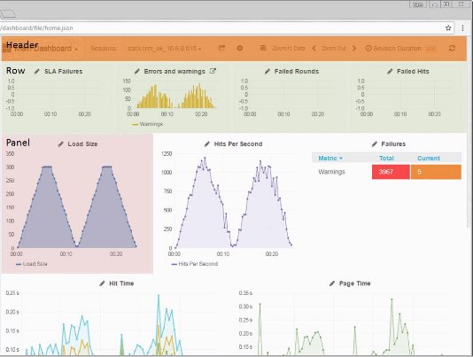

### Dashboard Header

The main components of the dashboard tab header include: 

| **Item** | **Description**                                              | **For more information, see**                                |
| -------- | ------------------------------------------------------------ | ------------------------------------------------------------ |
| 1        | Dashboard name and selection                                 | [*Loading a Dashboard* ](./managing_dashboards.md#loading-a-dashboard) |
| 2        | Select session – Enables  selecting the session(s) to be viewed and analyzed. | [*Specifying the Sessions to view in   the Dashboard* ](#specifying-the-sessions-to-view-in-the-dashboard) |
| 3        | Star or unstar a dashboard  – Enables marking/unmarking a dashboard as a favorite for filtering purposes. | [*Loading a Dashboard* ](./managing_dashboards.md#loading-a-dashboard) |
| 4        | Share dashboard – Enables  sharing the current state of the dashboard | [*Sharing a Dashboard* ](./sharing_dashboards.md#sharing-a-dashboard) |
| 5        | Save                                                         | [*Saving your Customized Dashboard*](./managing_dashboards.md#saving-your-customized-dashboard)   |
| 6        | Settings – Enables  configuring the  dashboard’s general  settings | [*Customizing General Dashboard Settings* ](./customizing_dashboard.md#customizing-general-dashboard-settings) |
| 7        | Time format:  **Relative Time** – Show the time since session start. Useful for session  comparison   **Absolute Time** –  Show the real time of the session  when it ran. Useful for currently running sessions | [*Selecting the Time Format* ](#selecting-the-time-format) |
| 8        | Zoom to Data – Sets the time filter to the extent of the data. This  is done automatically when selecting data or a new session. |                                                              |
| 9        | Zoom out                                                     |                                                              |
| 10       | Time picker                                                  | [*Setting the Time Picker*](#setting-the-time-picker)  |
| 11       | Refresh data                                                 |                                                              |

### Rows

A row is a horizontal container for panels. A row can be hidden (collapsed) and its height controls its panels’ height. 

- To add a new row, click **+ ADD ROW** at the bottom of a dashboard page. 
- To edit a row, click the three grey dots and select the desired option. For more information, refer to[` `*Customizing Rows* ](#_page51_x54.00_y289.04)(on page[ 46)](#_page51_x54.00_y289.04). 

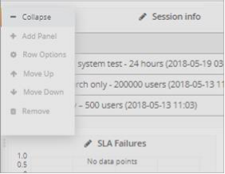

### Panels

A panel is a data display unit. There are various types of panels – such as graph, text, table, singlestat, Alert list, Dashboard list, and Plugin list. 

- To add a new panel, click the three grey dots of the desired row and select **Add Panel** [(Figure 34)](#_page43_x54.00_y695.04). 
- To edit a panel, click the panel title and click **edit** in the box that appears. For more information, refer to[` `*Customizing Panels* ](#_page52_x54.00_y463.04)(on page[ 47)](#_page52_x54.00_y463.04). 

#### Graph Panel

A graph panel presents session measurement data in graphic format. In each graph panel you can display multiple measurements from multiple sessions. You can also set various display options, such as colors, graph style (lines, bars, points), Y-axis formats (bytes, milliseconds, etc.) and more. 

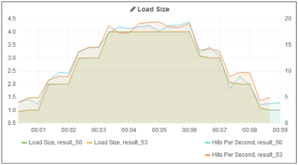

#### Table Panel

A table panel presents data in table format; by default the log messages from specified sessions. You can sort the display by various parameters, and filter the display by severity. 

#### Text Panel

A text panel presents text. You can edit the text. 

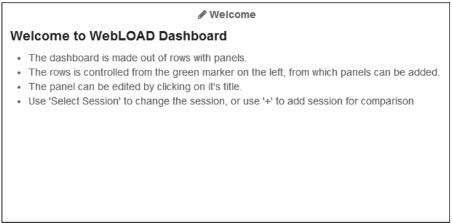

#### Singlestat Panel

A singlestat panel is similar to a graph panel, but shows only a single statistic, usually in numeric form. It may contain a ‘sparkline’, and may appear as a gauge. 

Note that because a singlestat panel displays only one measurement, it is not suitable when comparing two or more sessions. 

 

## Specifying the Sessions to view in the Dashboard

WebLOAD Dashboard dashboards are useful both for analyzing the results of a specific session, and for comparing the results of different sessions.  

**To select a session for viewing in the dashboard tab:** Do any of the following: 

- In the Load Sessions table [(*Figure 23*)](#_page33_x54.00_y697.04), click the session name.  

  The session appears in the currently selected dashboard. 

- In Load Tests table [(*Load Test Table*)](./manage_tests.md#load_test_table), click the Show Last Session button . That last session appears in the currently selected dashboard. 

  

**To select multiple sessions for viewing in the dashboard tab:** 

Do any of the following: 

- In the Load Sessions table [(*Figure 23*)](#_page33_x54.00_y697.04), click **Show in Dashboard** for each session you wish to view in the Dashboard. As soon as you select a dashboard, the dashboard refreshes to show the selected sessions’ data in the panels. 

- In the **dashboard** page, select the session from the **Sessions** drop-down list [(*Figure 39*)](#_page47_x54.00_y285.04). You can select as many sessions as you wish. You can use the search box to aid you in finding the sessions you wish to view.  

  As soon as you select a session or sessions, the dashboard refreshes to show the sessions’ data in the panels. 

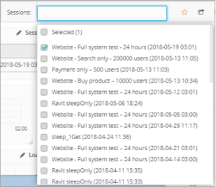

## Specifying the Zoom

Using a graph panel’s zoom option, you can set the time period for which all panels display information. For example, if you select to zoom into the time period from 00:30 to 01:00, all panels will refresh to show information for that time period only, and the metric panels, for example, will display metrics for that time period only. 

**To zoom in:** 

- Use the mouse to select a specific time range in the panel. 

  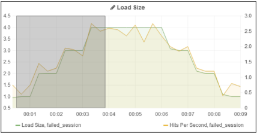

The dashboard refreshes to show the graph for the selected time range only. 

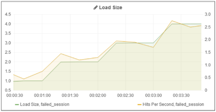

**To zoom out:** 

Use the **Zoom to Data** or **Zoom Out** options in the dashboard[` `*Header*.](#_page42_x192.00_y413.04) 

## Selecting the Time Format

You can view dashboard data in either Relative time or Absolute time (see item ‡ in [Figure 33)](#_page42_x54.00_y540.04). This affects the graphs’ display as follows: 

*If you are viewing data for a single session:* 

- **Relative time** – The start time is shifted over to zero.  
- **Absolute time** – Shows the real time. This format is useful for viewing currently running sessions. ![ref8]

*If you are comparing sessions:* 

- **Relative time** – The graph shows the two sessions as if they occurred concurrently (within the same timeframe). 

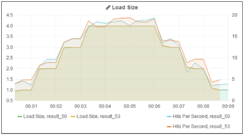

- **Absolute time** – The graphs shows the real time. 

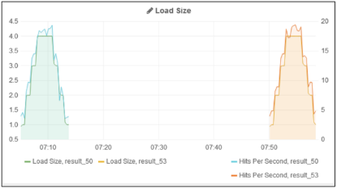

`                             `

## Setting the Time Picker

If you selected the Time Picker, you can set various time settings. 

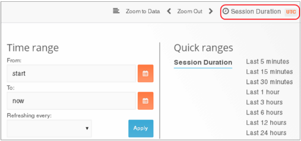

You can for example set the auto-refresh frequency. 

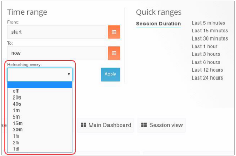

