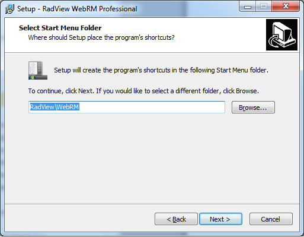
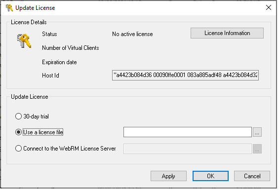
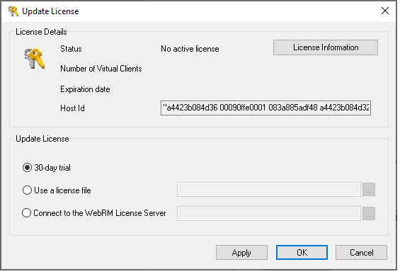
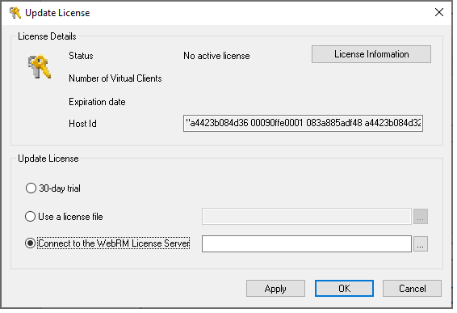

# Introduction

Welcome to WebLOAD, the premier  performance, scalability, and reliability testing solution for internet applications.  

WebLOAD is easy to use and delivers maximum testing performance and value. WebLOAD verifies the scalability and integrity of internet applications by generating a load composed of Virtual Clients that simulate real-world traffic. Probing Clients let you refine the testing process by acting as a single user that measures the performance of targeted activities, and provides individual performance statistics of the internet application under load.  

## System Requirements

WebLOAD has the following system requirements. WebLOAD Console, WebLOAD Recorder, WebLOAD Analytics, WebLOAD Probing Client, and WebRM can only be run on Windows platforms. WebLOAD Load Machines can be run on Windows, and Linux platforms. 

**Note:** For any installation, you must have Administrator rights for the computer on which you are installing. 

### Windows Platforms

**WebLOAD System Requirements**

| **Requirements**     | **WebLOAD Console, WebLOAD Recorder, WebLOAD Analytics, WebLOAD  Probing Client, and WebRM** | **Load Machine**                                             |
| -------------------- | ------------------------------------------------------------ | ------------------------------------------------------------ |
| Computer / Processor | 2 Core CPU | 2 Core CPU (4 Core CPU Recommended) |
| Operating System     | Windows supported version: (Windows 7, 8, 10, 11, Server 2012, 2016, 2019, 2022)  | Windows supported version: (Windows 7, 8, 10, 11, Server 2012, 2016, 2019, 2022)  |
| Memory               | 2 GB RAM (minimum); 4 GB  is recommended                     | 2 GB RAM (minimum); 16 GB is recommended                      |
| Free Disk Space      | 20 GB                                                         | 20 GB                                                         |

### Linux Platforms (for WebLOAD Load Machines)

*Table 4: WebLOAD Load Machine System Requirements* 

| **Requirements** | **Load  Machine**                                            |
| ---------------- | ------------------------------------------------------------ |
| Hardware         | 2 Core CPU (4 Core CPU Recommended) |
| Version          | Linux RHEL 7 and up or equivalent  |
| Free Disk Space  | 20 GB                                                         |
| Swap Space       | RAM*2                                                        |
| Memory           | 2 GB RAM (minimum); 16 GB is recommended                      |

> **Notes:**
>
> WebLOAD components in each major version will work with all other components of the same version. WebLOAD components are not compatible with other components of a different version. Verify that the WebLOAD components have been upgraded to Version 10.0 on all participating hosts. Running WebLOAD Console Version 10.0 with an earlier version of Load Generator (running on different Hosts) may cause unexpected behavior. 
>
> The WebLOAD license file is limited to the computer system (machine) on which WebLOAD is initially installed. Before installing WebLOAD, make sure you are installing on the machine with which you intend to work. 
>
> When installing WebLOAD with Unicode support on a system running an English MS Windows, Japanese must be configured as the default Windows language.

## Installing WebLOAD for Windows

This chapter provides step-by-step instructions for installing WebLOAD on a PC running Windows systems. 

### Installing WebLOAD for Windows 

You can choose either of the following installation methods: 

- [*Command Line Installation* ](#command-line-installation)
- [*Using the Installation Wizard* ](#using-the-installation-wizard)

#### Command Line Installation

To perform a command line installation, run the following command: 

`< WebLOAD executable installation file > [flags]` 

Where the flags (case sensitive) are: 

| Option                          | Description                                                  |
| ------------------------------- | ------------------------------------------------------------ |
| /SILENT                         | Silent mode                                                  |
| /DIR="<destination  directory>” | Destination directory                                        |
| /TYPE=Agent                     | Install a Load Generator only                                |
| /TYPE=Dashboard                 | Install the Web Dashboard only                               |
| /SERVICE                        | Install TestTalk as a service                                |
| /DOMAIN="<domain name>"         | The domain in  which to install for service installation     |
| /USERNAME="<user  name>"        | The user name for service  installation                      |
| /PASS="<user password>"         | The password of the service  installation                    |
| /MANUAL                         | How to start the  service. If not set, the service will start automatically |
| /NOCHECK                        | Do not check for a previous installation                     |

#### Using the Installation Wizard

When you install WebLOAD on your computer, the installation program asks you for the components to install. As part of the installation process, WebLOAD installs a database management system (PostgreSQL 8.3) for use with WebLOAD Analytics. For more information about PostgreSQL, refer to[ www.postgresql-support.de.](http://www.postgresql-support.de/) 

Install the WebLOAD components as follows: 

- Install the full WebLOAD product on computers that will be used to run the WebLOAD Console. 
- Install only the Load Generator or the Probing Client software on a computer that will be a dedicated Load Machine. There is no need to install the full product on computers that will be used as Load Machines. 

**To install WebLOAD on your system:** 

1. Browse to the location of the WebLOAD executable (\*.exe) installation file. 
1. Double-click the file. The WebLOAD Installation Wizard appears. 
1. Follow the instructions in the Installation Wizard. 
1. In the Select Components screen. 
- Select the type of installation. For Load Machines and Probing Clients, select **Load Generator only**. 
- Specify whether to install the **Load Generator As Service**.  
  - If you select this option, TestTalk is installed as a service. Since a service can be started automatically, this is especially useful for machines that serve only as Load Generators.  
  - If you do not select this option, TestTalk is installed as an executable file. 
- Specify whether to also install the WebLOAD Cloud. The Web Cloud enables viewing, analyzing and comparing load sessions in a web browser, with full control and customization of the display. 

> **Note:** The installation process is the same for Load Machines and Probing Clients. ![ref2] When the WebLOAD installation is complete, the WebLOAD License dialog box automatically opens to complete the registration process. License registration is discussed in[Registering and Updating the WebLOAD License](#registering-and-updating-the-webload-license). 

Installing WebRM

**To install WebRM:** 

1. Browse to the location of the WebRM-10.0.xxx.en.exe installation file. 

2. Double-click the file. The WebRM Installation Wizard appears. 

3. The WebRM Installation Wizard displays the Select Destination Location dialog box. On the Select Destination Location dialog box, browse to the location where you would like WebRM installed. By default, this location is C:\Program Files\RadView\WebRM. 

4. Click **Next**. 

5. The WebRM Installation Wizard displays the Select License Location dialog box. This dialog box displays your HostID and enables you to browse to the License location. 

   **Note:** If you have already received your WebRM License file, skip to step 9.

6. If you have not received your License file, copy the HostID displayed in the text box into an email, together with your name, company, address, and phone number. Send the email to[ support@radview.com.](mailto:support@radview.com) 

   A WebRM license file (\*.lic) will be sent to you.  

7. After receiving the file, save it on the hard drive of your WebRM machine and then double-click the WebRM executable installation file to restart the installation process. 

8. On the Select License dialog box, browse to the location where you saved your WebRM license, select the file and click **Next.**

   

10. WebRM begins the installation. When the WebRM installation process is complete, a dialog box appears stating that the WebRM installation has completed successfully. Click **Finish**. 

    

#### Upgrading WebLOAD

**To upgrade WebLOAD:** 

1. Close TestTalk. 
1. Close all browser windows that are open.  
1. Uninstall the existing WebLOAD version. 

   For instructions on the uninstall procedure, see[` `*Uninstalling WebLOAD* ](#uninstalling-webload). 

4. Install the new version of WebLOAD. 

   For installation instructions, see[` `*Installing WebLOAD for Windows* ](#installing-webload-for-windows). 
   
   

### Installing and Configuring the WebLOAD Analytics

WebLOAD stores information from Load Sessions in a Postgre SQL database for use with WebLOAD Analytics. You can install Postgre SQL and the WebLOAD Analytics database during the WebLOAD installation or manually after WebLOAD has already been installed. You might want to perform manual installation in the following situations: 

- If Postgre SQL is already installed on your machine and you only need to create the WebLOAD Analytics database. For instructions, refer to[` `*Creating the Database when Postgre SQL is Already Installed* ](#creating-the-database-when-postgre-sql-is-already-installed). 
- If you want to use a different machine as the database server and have several WebLOAD Analytics applications connect to the database. For instructions, refer to [*Installing and Configuring the Database on a Dedicated Machine* ](#installing-and-configuring-the-database-on-a-dedicated-machine). 

#### Creating the Database when Postgre SQL is Already Installed

If Postgre SQL is already installed on your machine, you do not have to reinstall it during the WebLOAD installation. However, you must complete the following steps in order to create the WebLOAD Analytics database in Postgre SQL so that it can be used by WebLOAD Analytics. 

**To create the WebLOAD Analytics database after WebLOAD was installed:** 

- Run deploy–database.bat from the C:\Program Files\RadView\WebLOAD\bin\database folder. 

#### Installing and Configuring the Database on a Dedicated Machine

You can run the Postgre SQL database using a dedicated machine with several WebLOAD Analytics client applications. 

**To install and configure the database on a dedicated machine:** 

1. Install Postgre SQL.  

   > **Note:** It is recommended to install Postgre SQL Version 8.3. You can download the application from[ http://www.postgresql.org/download/ ](http://www.postgresql.org/download/)and install it using its default installation settings. 

2. Copy all the files from the C:\Program Files\RadView\WebLOAD\bin\database directory to a temporary folder on the dedicated server. 

3. Run deploy–database.bat from the temporary folder to which you copied the files in the previous step. The WebLOAD Analytics database is created. 

4. Configure Postgre SQL to allow remote connections. For more information, see [*Configuring Postgre SQL to Allow Remote Database Connections* ](#configuring-postgre-sql-to-allow-remote-database-connections).  

5. Configure the relevant WebLOAD Analytics clients to work with the remote database. For more information, see[*Configuring Clients to Work with the Remote Database* ](#configuring-clients-to-work-with-the-remote-database). 

   

### Configuring Postgre SQL to Allow Remote Database Connections

For WebLOAD Analytics clients to work with the remote database, you must perform the following configuration steps on the host machine.  

**To configure a remote database connection through Postgre SQL:** 

1. Run **Start** > **PostgreSql 8.3** > **PgAdmin III**. The PgAdmin III application opens. 
2. Edit the postgresql.conf file, as follows: 
   1. Select **File** > **Open**.  
   2. Browse to C:\program files\Postgres\Data\, select postgresql.conf, and click **Open**. The postgresql.conf configuration file opens. 
   3. Change the value of listen\_address to \*. This configures the server to listen to all addresses. 
   4. Enable the value and save the file. 

3. Edit the Pg\_hba.conf file, as follows: 
   1. Select **File** > **Open**.  
   2. Browse to C:\program files\Postgres\Data\, select Pg\_hba.conf, and click **Open**. The Pg\_hba.conf configuration file opens. 
   3. Add a new entry with the following parameters:
      - Type = host 
      - Database = all 
      - User = all 
      - IP address = <IP subnet mask>.0.1.1/24, where <IP subnet mask> is your organization’s IP subnet mask. 
      - Method = md5 
   4. Enable the entry and save the file. 

### Configuring Clients to Work with the Remote Database

**To configure a remote database connection through Postgre SQL:** 

1. Open WebLOAD Analytics on the client machine. 

1. Select **Window** † **Preferences** † **Database**. 

1. Enter the server’s IP address and name in the Database host name field. 

1. Click **OK**. 

   

### Installing Third Party Software for Server-side Monitoring

WebLOAD Console provides a Performance Measurements Manager (PMM) for monitoring the performance of various data sources such as server-side applications, databases, stream technology, system, and Web server measurements in real-time while your test is running. 

Some data sources require initial configuration to enable monitoring by the PMM. For more information, see the *Enabling Data Sources Monitoring* section in the *WebLOAD Console User’s Guide*. 

## Installing WebLOAD for Linux

This chapter contains the instructions for installing the WebLOAD Load Engine on a machine running a Linux operating system. 

### Installing the WebLOAD Load Engine for Linux 

**To install the WebLOAD Load Engine on your system:** 

1. Select or create a directory for installing the WebLOAD Load Engine. This directory will be referred to as the working directory. 
1. Download the WebLOAD-linux.version.tar.gz compressed file from a server to the working directory. 
1. Uncompress and extract the tar file in the working directory using the following command: 

   tar –zvxf WebLOAD-linux-version.tar.gz 

4. Change directories by typing the following: 

   cd radview/webload<version number>/linux/bin 

5. Run setup by typing the following: 

   ./setup 

   During the setup process, the webload.ini configuration file is created. 

6. When prompted, enter the path to the Java runtime libraries. The default path to the libraries is displayed. If you are working with a different version of Java, enter the path of the libraries using the following: 

   /usr/java/jre/lib/i386/server:/usr/java/jre/lib/i386/native-threads  

   The path information is stored in the LD\_LIBRARY\_PATH variable. 

> **Note:** The directories containing the Java libraries are separated with a colon (:). 

> **Important:** The WebLOAD Load Generator will not function properly without the correct paths for the Java libraries. 

### Running the Load Engine on Linux

When running the Load Engine on Linux, Load Engine runs with TestTalk. TestTalk enables communication between the different components of the WebLOAD module. When running the Load Generator through Linux you generally need to connect with other WebLOAD modules running on a remote Windows machine (for example WebLOAD Console). To connect with these remote modules, you must run TestTalk. Once TestTalk is running, you can access the remote WebLOAD modules. The remote module then initiates the communication with TestTalk and then TestTalk loads the Load Generator. 

> **Note:** If the Load Generator is running and TestTalk is not running, the remote ![ref8] WebLOAD application will not be able to access the Load Generator. 

**To run TestTalk on your system:** 

1. Open the linux/bin directory within your working directory by typing the following: 

   cd <working-directory>/linux/bin 

2. Run TestTalk by typing the following: ./starttestalk 

   TestTalk starts running. 

**To stop running TestTalk:** 

- From the linux/bin directory, run ./stoptesttalk  

### Installing Third Party Software for Server-side Monitoring

WebLOAD Console provides a Performance Measurements Manager (PMM) for monitoring the performance of various data sources such as server-side applications, databases, stream technology, system, and Web server measurements in real-time while your test is running. 

Some data sources require initial configuration to enable monitoring by the PMM. For more information, see the *Enabling Data Sources Monitoring* section in the *WebLOAD Console User’s Guide*. 

## Registering and Updating the  WebLOAD License 

Your WebLOAD license must be registered before you can start working with WebLOAD. WebLOAD licenses that have expired must also be renewed or updated before you can continue working with WebLOAD. When installing a new major or minor version of WebLOAD, make sure that you have an adequate license for that specific version. All license registration and updating is accomplished through the Update License dialog box. 

You can register and update your WebLOAD license either through an Update License application, or through the Command Line Interface. 

### License administration through the UI

### Standard License Registration

**To open the Update License dialog box:** 

- At the time of WebLOAD installation, when the WebLOAD Installation Wizard is finished, the** License** dialog box opens automatically, ![ref10]

  **Note:** After a WebLOAD installation, you may be prompted to restart your computer before the Update License dialog box appears. In this case, the License dialog box will appear automatically after the computer restarts. 

  -Or- 

  At any other time, from the Windows desktop, select **Start** > **Programs** > **RadView** > **WebLOAD** > **Utilities** > **Update License**. 

The License dialog box includes the following sections: 

- License Details 
- Update License ![ref2]

These sections are used to register and update your WebLOAD authorization license information. 

**To complete or update your license registration:** 

1. If you are registering a new license after an initial WebLOAD installation, access the Update License dialog box. The Update License dialog box is opened automatically after a successful WebLOAD installation is completed. 

   -Or- 

   If you are updating your license registration after your current license has expired, from the Windows desktop, select **Start** > **Programs** > **RadView** > **WebLOAD** > **Utilities** > **Update License**. 

   The Update License dialog box appears. 
   
   

2. Create an email message with the following information: 
   1. Copy the Host ID displayed in the text box into the email. 
   1. Add your name, company, address, and phone number to the email message. 
2. Send the email to license@radview.com. 

   A WebLOAD license file (*.lic) will be sent to you. 

4. Select **Start** > **Programs** > **RadView** > **WebLOAD** > **Utilities** > **Update License** to open the Update License** dialog box and install the license key. 
4. By default, the **Use a license file** radio button is selected. This assumes that your license file is located on your local computer system. 

   For information on installing a floating license, or connecting to a license server, see[` `*WebRM Server* ](#webrm-server). 

   For information on installing a license for an evaluation of WebLOAD, see[ Trial License ](#trial-license). 

5. Click the browse button next to the **Use a license file** text box to browse to the location of the license (\*.lic) file sent to you by a RadView representative. 
6. Select the correct license file and click **Open** to return to the Update License dialog box. 
7. Click **OK** to load the new license. 

   If the license registration was successful, a message box appears indicating a successful license update. 

   You can now begin working with WebLOAD. 
   
   

> **Note:** After loading the license, you can optionally click **License Information** to view the license’s full details.

If the license registration was not successful, an error message appears. 

If you are not able to successfully register a valid license file, contact RadView Support for assistance. 

### Trial License

You can install a trial version of WebLOAD, which provides 50 virtual clients, and is available for 30 days. 

**To use the WebLOAD evaluation:** 

1. After installing WebLOAD, the Update License** dialog box opens,  -Or- 

   To open the Update License dialog box manually, select **Start** > **Programs** > **RadView** > **WebLOAD** > **Utilities** > **Update License.** 

   The Update License dialog box appears. ![ref2]

2. Select **30-day trial**. 
2. Click **OK** or **Apply** to install the license for the trial. 

   You can now begin working with the trial version of WebLOAD. 

### WebRM Server

The WebRM Server is a stand-alone tool that manages all resource distribution to WebLOAD Console, which is the machine used to run loads in a WebRM environment. It is the method that controls the number of users allowed to access the product concurrently. 

WebRM for virtual clients is available and defined as a pool of virtual (probing) clients that can concurrently be used by members of a testing team and monitored by the WebRM Server. 

During installation of the WebRM server, you are prompted for the WebRM file that defines: 

- The number of concurrent applications for the WebLOAD Console. 
- The number of concurrent Virtual and Probing Clients. 

Installation also creates a FlexLM Service that controls the operation. ![ref2]

The WebRM Server displays a list of the number of resources (Virtual and Probing Clients) that the Console is using. The WebRM Server enables a testing team to share resources. 

This section describes how to connect to the WebRM Server and how to view the license details. 

***Connecting to the WebRM Server*  To connect to the WebRM Server:** 

1. After installing WebLOAD, the Update License dialog box opens, 

    -Or- 

   To open the Update License dialog box manually, select **Start** > **Programs** > **RadView** > **WebLOAD** > **Utilities** > **Update License.** 
   
   The Update License dialog box appears. 

2. Select **Connect to the WebRM License Server**. 
2. Click the **Browse** button and select the machine where WebRM is installed. 
2. Click **OK**. 

A connection to the selected license server is attempted. 

- If the connection is successful, a success message appears. 
- If the connection is not successful, a failure message appears. 

***Viewing License Details*** 

After selecting the license server, you can view the current license details in the License Details section of the Update License dialog box.  

### License administration through the Command Line Interface

You can register or upload a WebLOAD license through a command line interface. You can enter the wlUpdateLicenseApplicationCmd command into a batch file or into an external script to automatically launch a WebLOAD License action, without user intervention, using the parameters you specify. 

## Configuring Connection to the Oracle  Database using WebLOAD

Connecting to the Oracle Database using WebLOAD requires that you install the Oracle Data Access Components (ODAC) on your computer. For information on ODAC, refer to the appropriate Oracle documentation. 

> **Note:** You need to be assigned a valid username and user privileges for Oracle so that ![ref8] you can connect to the Oracle database. 

The following procedure is confirmed to work with Oracle Database version 11*g*, and is also expected to work with Oracle Database version 10*g*. 

**To configure your computer to enable connection to the Oracle database using WebLOAD:** 

1. Navigate to $ORACLE\_HOME\NETWORK\ADMIN. 

1. Open tnsnames.ora for editing. 

   > **Note:** If tnsnames.ora does not exist, create it. ![ref8]
   >
   > The default content is as follows: 
   >
   > `<tns\_name> =`  
   >
   > `(DESCRIPTION =`  
   >
   > `(ADDRESS = (PROTOCOL = TCP)(HOST = <host or ip>)(PORT = 1521))    (CONNECT\_DATA =`  
   >
   > `(SERVER = DEDICATED)` 
   >
   > `(SERVER\_NAME = <instance\_name>)` 
   >
   > `)` 
   >
   > `)` 

1. Make the following definitions in the file: 

​		tns\_name = <tns name configured in the listener on the server (default orcl)> host = <hostname or IP address of the server> 

​		instance name = <instance configured on the server (default orcl)> 

​		Log out and log in, or restart, to activate the environmental variables. 

## Uninstalling WebLOAD

When you uninstall WebLOAD, you are prompted to remove PostgreSQL 8.3, which is used to manage the WebLOAD Analytics database. RadView Software recommends that you keep PostgreSQL 8.3 installed in order to maintain all the information stored in the database. 

**To uninstall WebLOAD:** 

1. Close all WebLOAD modules including TestTalk. 
1. Close all browser windows that are open.  
1. Select **Start** > **Settings** > **Control Panel**. 
1. Double-click the **Add/Remove Programs** icon. 
1. Click the **Change or Remove Programs** tab. 
1. Click **Radview WebLOAD Professional**, and then click **Change/Remove**. 

   The Uninstall Wizard appears. Once the uninstall procedure is complete, you may be prompted to restart your machine. 

> **Note:** Uninstalling WebLOAD removes all the WebLOAD program file directories, including all the WebLOAD installation files. User files that are copied into these directories (such as user-defined extensions) are not deleted. WebLOAD load templates, load sessions, and script files are not removed – they can be used with all WebLOAD upgrades.

> **Caution:** Close TestTalk and all browser windows before uninstalling WebLOAD. Failure to close TestTalk and all browser windows results in outdated files remaining on your disk, which could adversely affect future installations of the program. 
>

**To uninstall WebRM:** 

1. Select **Start** > **Settings** > **Control Panel**. 

1. Double-click the **Add/Remove Programs** icon. 

1. Click the **Add or Remove Programs** tab. 

1. Click **RadView WebRM**, and then click **Change/Remove**.

   The Uninstall Wizard appears. The uninstall procedure is completed following a confirmation request. 

