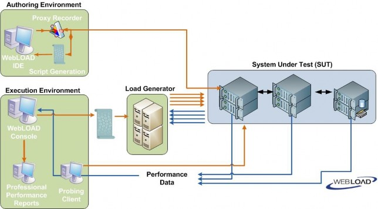
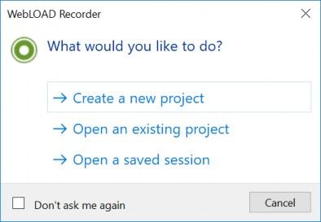
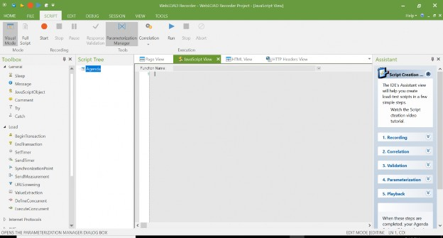
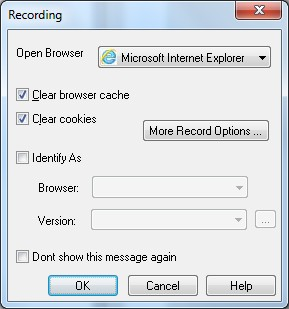
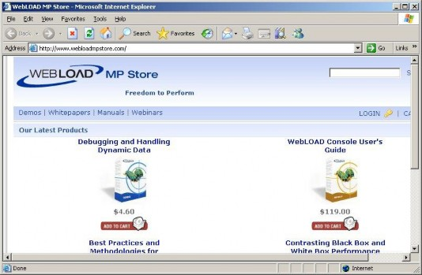
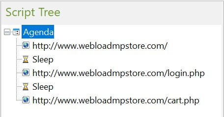
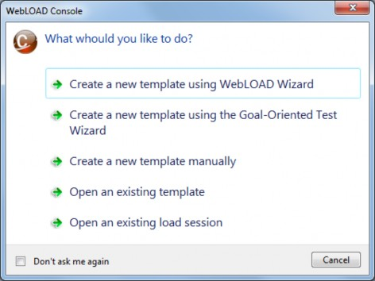
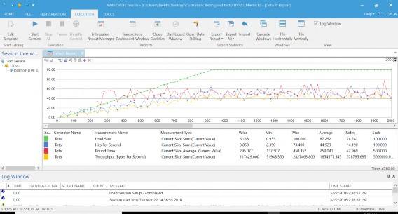

# WebLOAD Quick Start

Welcome to WebLOAD Professional,the premier performance, scalability,and reliability testing solution for Internet applications.

WebLOAD is easy to use and delivers maximum testing performance and value.WebLOAD verifies the scalability and integrity of Internet applications by generating a load composed of Virtual Clients that simulate real-world traffic. Probing Clients let you refine the testing process by acting as a single user that measures the performance of targeted activities, and provides individual performance statistics of the Internet application under load.

A WebLOAD script is also called an "Agenda".

WebLOAD Recorder was formerly referred to as WebLOAD IDE.

## How WebLOAD Works

WebLOAD tests Web applications by generating Virtual Clients that simulate real-world loads. Virtual Clients emulate the actions of human users by performing typical actions on your Web application. By increasing the number of Virtual Clients, you increase the load on the system. You create visual JavaScript-based test scripts that define the behavior of the Virtual Clients and WebLOAD executes these test scripts,monitoring the application response graphically and statistically, and presenting the test results in real time.

WebLOAD incorporates functional verification into the scalability testing process allowing you to accurately verify the scalability and integrity of your Web applications at the per-client, per-transaction, and per-instance level under defined load conditions.WebLOAD saves the test results, including data from the Load Machines and the hosting hardware's performance monitor. You can view all or part of the data in real time, or after the test session is complete, in tabular or graphical format.

### WebLOAD Architecture

The following diagram illustrates the configuration for a typical WebLOAD test.

The Console sets up, runs, and controls a test session. At the Console, you can:

- Define the hosts participating in the load test.

- Specify the test scripts that the load test executes.

- Schedule tests.

- View performance reports.

*Load Machines* are hosts that run Load Generator software simulating multiple Virtual Clients simultaneously accessing your *System Under Test (SUT)*.One Load Machine can run multiple Load Generators.

Load Generators execute tests that "bombard" the SUT with a large load, to enable complete scalability and stress testing. The tests consist of multiple simultaneous requests made by Virtual Clients (which emulate Web browsers) to Web servers. Load Machines can run multiple threads.

The System Under Test(SUT) is where the Web system under test resides. The SUT does not require that WebLOAD software be installed on it.

The Probing Client Machines are also hosts. They run Probing Client software,which simulates a single Virtual Client accessing the SUT and runs at the same time as Load Machines, to further measure the performance of the SUT under load. WebLOAD returns exact values for Probing Client performance, in contrast to Load Machines,which return average values of Virtual Client performance.

## Quick Start Steps

This section shows you how you can get started quickly using WebLOAD by designing and executing a performance test of the RadView Software test site at http://www.webloadmpstore.com. Then you can refer to the complete WebLOAD documentation set to learn more techniques for using WebLOAD.

In this Quick Start, you perform the following steps:

1. Create a script (see Creating a script).
2. Configure a Load Template using the WebLOAD Wizard (see Configuring a Load Template using WebLOAD Wizard).
3. Configure session options (see Setting Session Options).
4. Run a test (see Running the Test).
5. Analyze test results (see Analyzing Test Results).

> **Note:** We recommend that you follow the steps in the order they appear. All examples are interrelated and dependent on earlier steps.

## Creating a script

The first step in creating a script is to record your actions as you interact with your Web application.

**To create a script:**

1. Start WebLOAD Recorder by selecting Start &gt; Programs &gt;RadView&gt;WebLOAD&gt;WebLOAD Recorder.

   WebLOAD Recorder opens.

   

   

2. Select Create a new project.

   The WebLOAD Recorder main window opens in Editing Mode for you to begin creating your script.

3. In the main window, in Editing Mode, click the Start Record  toolbar button to begin recording.

   The following dialog appears.

4. Click OK.

   WebLOAD Recorder begins recording all actions you perform in the browser,as indicated by the recording notification in the WebLOAD Recorder status bar.

   

   A browser window opens.

5. In the address bar, enter the Web address www.webloadmpstore.com to go to the WebLOAD test site.

   

6. Navigate through the site, performing the actions you want to test. For example:

   1. Click a product to view the product details.

   2. Click **Add to Cart** to add the product to your shopping chart.

      Your actions are recorded and appear in the Script Tree as you navigate the site.(If you see additional nodes in the Script Tree with different URLs, this may be traffic generated by browser plug-ins or extensions, for example, third-party toolbars.)

7. Click the **Stop Record** toolbar button in WebLOAD Recorder to stop the recording.

8. Click the **Save** toolbar button to save your script.

9. Type QuickStart as the name of the script in the Save As dialog box and click **Save**.

   The script is saved with the extension *,wlp.

You now have a basic script that can be used in a WebLOAD test configuration. For complete information on creating, editing and modifying scripts,and adding functionality to your script, see the *WebLOAD Recorder User Guide*.

## Configuring a Load Template using WebLOAD Wizard

Using the Quick Start,you will learn how to perform the following steps in order to configure a Load Template with the WebLOAD Wizard in the WebLOAD Console:

1. Opening the WebLOAD Wizard.
2. Selecting a script and a Performance Statistic to monitor.
3. Selecting a host on which to run the Load Machine.
4. Scheduling the test and selecting the number of Virtual Clients to run.
5. Setting session options.

For more details about each of these steps, see the WebLOAD Console User's Guide.

### Opening WebLOAD Wizard

The first step in defining a Load Template with the WebLOAD Wizard is defining the type of script to run. The script is the test script that defines the actions that the Virtual Clients perform during the test. WebLOAD supports both single scripts (lone test scripts) and Mix scripts (a group of scripts simulating groups of users performing different activities on the application simultaneously). In this Quick Start, we will create a template running a single script. For information on creating templates with multiple scripts or Mix scripts, see Creating Load Templates with the WebLOAD Wizard in the WebLOAD Console User's Guide.

**To open WebLOAD Wizard:**

1. Start the WebLOAD Console.

   Select **Start &gt;All Programs &gt;RadView &gt;WebLOAD&gt;WebLOAD Console**.

   The WebLOAD Console opens,and the WebLOAD Console dialog box appears.

   

   

2. Select **Create a new template using WebLOAD Wizard**.

   The WebLOAD Wizard opens.

3. On the Welcome screen, click **Next**. The script/Mix Type screen appears.

   

### Selecting a script and a Performance Statistic to Monitor

**To select a script and a performance statistic to monitor:**

1. On the script/Mix Type screen, select **Single Script,** and click **Next**. 

2. On the script/Mix Selection screen, click the  button and browse to the location of the QuickStart.wlp script created earlier using WebLOAD Recorder. Select the script and click **Open**. 

3. Click **Measurements Manager** at the bottom of the screen to open the Performance Measurements Manager and define the statistics to monitor during the test. 

   > **Note:** In this simple example, we will monitor the CPU usage on your system during runtime. During a real test, you would probably monitor the CPU performance of your application server. 

4. Click the **Add data source** toolbar button. The Performance Measurements Manager Wizard opens. 

5. On the Welcome screen, click **Next**. 

6. Click the “**+**” adjacent to General to expand the tree, select **General Performance Monitor**, and click **Next**. 

7. Click **Browse…** to browse available hosts. In the Host selection dialog box, highlight the name of your computer in the list, and click **Select**. 

8. Click **Next**. 

   WebLOAD attempts to connect to the selected host and collect data. A tree of all available measurements to monitor appears. 

9. Expand the tree to select the measurement you want. Click **Processor** > **\_Total**, select the checkbox adjacent to **% Processor Time**, and click **Next**.

10. Click **Finish**.

   

   

11. Click the **Close & update** toolbar button to save the configuration with the template and return to the WebLOAD Wizard.

12. On the script/Mix Selection screen, click **Next**. The Host Selection screen appears.

### Selecting a Host

For the steps in this Quick Start, you use your own machine as the host load machine to generate Virtual Clients. The number of Virtual Clients that can be generated depends on the power of the host machine.

**To select a host:**

1. On the Host Selection screen, note that your computer is automatically listed as the default Load Machine.
1. Click **Next** to accept the default selection.

### Scheduling the Test

When you schedule the test,you define the load to be generated throughout the test and the total testing time. The Load Profiler provides a quick and easy way to select different testing patterns.

**To schedule the test:**

1. On the Schedule screen, select **Collective scheduling**, and click **Next**. The wizard progresses to the Collective Scheduling screen. 

2. Click All Machines. The Load Profiler buttons becomes enabled. 

3. Click **Load Profiler**. The Load Profiler opens. 

4. Select **Linear** from the Select scheduling model drop-down list. 

5. Enter 10 in the Concluding number of Virtual Clients field and accept the defaults for the Total time in minutes and Starting number of Virtual Clients fields. 

   The test will run for 10 minutes, starting with a load of 5 Virtual Clients and increasing to a maximum of 10. 

6. Click **Replace**. 

   The Linear Schedule model now appears in the row below your host computer name in the Schedule Manually screen. 

7. Click **Next**. 

8. Clear the **To run this Load Template immediately, select this checkbox and then click Finish** checkbox, and click **Finish**. 

You have now created a Load Template using WebLOAD Wizard.

### Setting Session Options

Before you run the template you created, you can select options for verifications to execute during runtime. You can set WebLOAD to perform the following tasks: 

- Collect data at the page level. 
- Verify the time required to receive a page (default 20 seconds). 
- Verify that the links in your Web application act as expected. 

When you select page verification, WebLOAD collects transaction data under the Title name, in this case[ http://www.webloadmpstore.com.](http://www.webloadmpstore.com/) You can observe statistics, such as the response times for this page, as the load increases. You can also gather performance data about the objects on a page by setting WebLOAD to collect object level data. For example, you can determine whether pictures or other embedded objects are taking a long time to download. 

**To set options for these verification tests:** 

1. On the WebLOAD Console ribbon bar, select the **Tools** tab, click the **Current Session Options** icon. 

2. Select the **Functional Testing** tab. 

3. Under Automatic Data Collection, select the **Pages** radio button. 

4. Under Page Time, select the **Verification** checkbox, enter 20 in the Max Time field, and select **Minor Error** from the Severity Level drop-down list. 

   If the time required to receive a page exceeds 20 seconds, a Minor Error message appears in the Log Window and the event appears in the WebLOAD data drilling report. 

5. Under Verification, select the **Verification** checkbox, and enter 5 in the **%** field. 

   Five percent of the Virtual Clients will perform the selected verification tasks. This percentage lets you balance data gathering with the need to maintain performance during the test. 

6. Click **OK**. 

## Running the Test

You are now ready to start the test. As you run the test, you can view the data gathered by WebLOAD in real time. 

**To run the test:** 

1. Click the **Start Session**  icon on the Console ribbon bar. 

1. At the prompt, click **Yes** to save the template. Type the filename QuickStart.tpl, and click **Save**. You can now reuse this template, with its script, schedule, and options at a later time.  

   The test begins. !

## Analyzing Test Results

You can view test results in real time while the test is running or after the test session has completed. Once the test begins, the WebLOAD Wizard default report displays in the Results window. 

### Viewing the Results in Real Time 

Data on load size, hits per second, round time (one run through the script), and throughput (bytes per second) appear in the Chart View window, with a color legend underneath the chart. Each data point represents a 20 second slice. Data is gathered every 20 seconds and is then either averaged (for hits, round time, and throughout) or summed (for load size). The graphs are all normalized to scale so they can be viewed in a single Chart View window. You can access several kinds of test details: 

- Hover over any data point to see actual values. 
- Select the **Dash Board Window**  icon on the Console ribbon bar to view a quick overview of the status of the test including the following: 
  - Elapsed time 
  - Current load size (number of running Virtual Clients) 
  - Rounds executed 
  - Failed rounds 
  - Failed hits 
  - Hits per second
  - Pages per second 
  - Throughput 
- Select the **Open Statistics**  icon on the Console ribbon bar. A Statistics tab appears in the results window. Scroll through the data and double-click a cell to drill-down to further detail. 

Each of these views opens in a new tab window. Please close all windows except the Default Report tab. 

### Creating Integrated Reports 

Create an Integrated report to view the results for additional metrics gathered by WebLOAD. This can be done while the current session is still running. 

**To create an Integrated Report:** 

1. On the WebLOAD Console ribbon bar, select **Session**  tab, and click the **Report Manager**  icon. 

   The Integrated Report dialog box opens. 

2. In the Integrated Report dialog box, click **New**. 

3. In the tree, expand the **QuickStart::Total** branch. 

4. Expand the **Performance Measurements** branch. 

5. Click the ''**+**'' sign adjacent to Hit Time to expand the branch and then expand Current Slice. Select the checkbox adjacent to **Average (Current Value)**. 

   Checkmarks appear next to **Hit Time**, **Current Slice**, and **Average (Current Value)**. 

6. Expand **Successful Hits** and then expand **Current** Slice. Select the checkbox adjacent to **Sum (Current Value)**. 

7. Expand **Successful Connections** and then expand **Current** Slice. Select the checkbox adjacent to **Sum (Current Value)**. 

8. Scroll to the PM@your-system-name branch at the bottom of the tree (PM stands for performance monitor). Click the ''**+**'' sign adjacent to it to expand the branch. 

9. Expand **Processor:%Processor Time:\_Time** and then expand **Current Slice**. Select the checkbox adjacent to Average (Current Value). 

   This choice displays the statistics on CPU processor usage that were collected during the load test. 

10. Click **OK**. 

    The Save dialog box appears.

11. Type MyReport as the name of the report, click **Predefined Report**, and click **OK**.  The new report is added to the list of Predefined Reports. 

12. To open the newly created report, select **MyReport** in the list of Predefined Reports, and click **Open**. 

    In the WebLOAD Console Results window, the MyReport tab appears displaying the report data. The name of the tab is the name of the report you selected. 

13. If the test is still running, click the  **Stop All** icon . 

14. Click the **Save Load Session**  icon to save the data from the test along with the template information (script, options, and schedule). Specify a filename (QuickStart) and location and click **Save**. 

### Viewing Results with WebLOAD Analytics 

WebLOAD Analytics creates analysis reports based on your session data. Even after you complete a session, you can use this data to create both predefined reports and custom reports of your own. You can create portfolios, which are collections of custom reports to run on other sessions. You can also export reports to PDF, Excel, RTF, HTML, or TXT formats to share with others, store with test plans, or mail to team members. 

**To view results with WebLOAD Analytics:** 

1. Click the **WebLOAD Analytics**  icon on the Console ribbon bar. 

   Data for the last session saved is automatically selected and imported into the WebLOAD Analytics sessions database. WebLOAD Analytics automatically creates a new report based on the Summary Portfolio and generates the report. You can optionally perform any of the following: 

- **Modify the report** - Select the **Report Settings** tab and edit the parameters you wish to change. 
- **Print the report** - Select the **Preview** tab from the Reports area. Click the **Print** button to open the Print dialog and print the report. 
- **Publish the report** - Click the **Publish**  to publish your report as the default format specified in the Preferences window. Select a location and name for your report and click **Save**. The report is published in the format chosen and saved to the location specified in the Preferences window. 

2. Close WebLOAD Analytics. 
3. Close the WebLOAD Console. 

This concludes our Quick Start guide for WebLOAD. For additional information please refer to the *WebLOAD Console User’s Guide*, to RadView’s website at [http://www.radview.com/support.](http://www.radview.com/support) 

