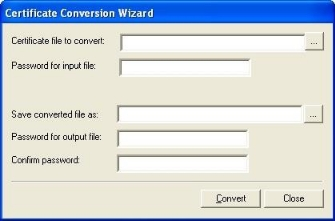

# Appendix D: Converting Certificate Files

WebLOAD Recorder supports the use of SSL Client Certificates. WebLOAD Recorder requires that the certificate file be in \*.pem format. If the certificate file is in \*.pfx or

\*.p12 format, use the Certificate Conversion Wizard application to convert the file to

\*.pem format.

> **Note:** You can use your web browser to export certificates to \*.pfx or \*.p12 format.

**To convert certificate files:**

1. Select **Start** > **Programs** > **RadView** > **WebLOAD** > **Utilities** > **Certificate Conversion Wizard**. The Certificate Conversion Wizard appears.

    

1. In the Certificate file to convert field, enter the path and file name of a certificate file to convert.

    -Or

    Click  and browse to the file.

1. In the Password for input file field, enter the password for the certificate file.

    > **Note:** If you do not know the password, contact your IT manager.

1. In the Save converted file as field, enter a path and file name for the converted certificate file.

    Or

    Click  to open a standard Windows® Save As window.

   

1. In the Password for output file field, enter a password for the converted certificate.

    > **Note:** It is recommended that you use the same password as the one used for the original certificate file.

1. In the Confirm password field, enter the password that you entered in the Password for output file field.

1. Click **Convert**. The file is converted.

