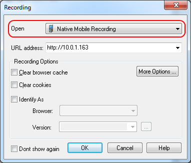
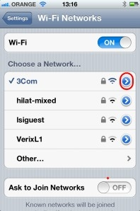
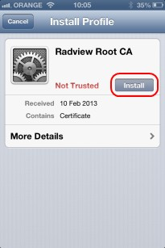

# Appendix E: Recording Mobile Applications

WebLOAD enables recording mobile applications in two ways:

- Native Mobile Recording – recording traffic from an actual mobile device. This works for both mobile web applications and native mobile applications.
- Simulate mobile in browser – records mobile web applications in the desktop by simulating a mobile browser. Does not require a mobile device, but only works for mobile web applications.

In addition, you can playback a recording as if it were a recording from a mobile application. This is performed in the WebLOAD Console using the Current Project Options window. In the **Browser Type** tab, specify the mobile application in the **Browser Parameters** section. The browser type you select overrides the settings that were defined during the recording, and plays back the recording according to the new settings.

## Native Mobile Recording

**To record traffic from an actual mobile device:**

1. Start native mobile recording, as follows:

   1. In WebLOAD Recorder, click **Start** in the **Home** tab of the ribbon. The Recording dialog appears.

      

   2. In the **Open** drop-down list, select **Native Mobile Recording**.

   3. Click **OK**.

2. Set up the mobile device proxy, as follows:

   1. Connect the mobile device to a Wireless network that can access your WebLOAD machine.

   2. Configure the device’s wireless proxy settings to go through the WebLOAD machine, on the noted port.

      This step depends on the device OS type and version. For example, see [*Setting](#_bookmark358) *[Proxy Settings in iPhone* ](#_bookmark358)*(on page [377](#_bookmark358)) and [*Setting Proxy Settings in Android* ](#_bookmark360)(on page [380](#_bookmark360)).

3. Perform actions in your mobile device application or web browser; the HTTP requests will be recorded in the test script.

4. Stop recording, as follows:

   1. In WebLOAD Recorder, click **Stop Recording**.
   2. In the mobile device, change the Proxy settings back to off.

> **Note:** 
>
> You may need to open you firewall to accept connections to proxynator.exe, on port 9884.
>
> To record secure traffic (HTTPS), the root certificate needs to be imported to the phone. For example, see [*Recording HTTPS Traffic on iPhone* ](#_bookmark359)(on page [379](#_bookmark359)) and [*Recording](#_bookmark361) *[HTTPS traffic on Android (4.0 and above)* ](#_bookmark361)*(on page [380](#_bookmark361)).
>
> When not recording, the mobile device will not be able to access the network (because the proxy is not available) – to use the network normally, revert the **HTTP Proxy** setting back to **Off**.

### Setting Proxy Settings in iPhone

**To set iPhone proxy settings:**

1. Open **Settings**, and access the **Wi-Fi** network settings:

   

2. Select edit current Wi-Fi Network settings:

   

3. Scroll down the **HTTP Proxy** section. Change proxy to **Manual** and set the **Server** and **Port** to point to the WebLOAD machines.

   The default port for the proxy-recorder is 9884. You may need to use the machine’s IP-address instead of name.

   

#### **Recording HTTPS Traffic on iPhone**

In order to record HTTPS traffic, the WebLOAD root certificate needs to be trusted by the phone. To import the root certificate:

1. Locate the root certificate, in:

   `c:\Program Files\RadView\WebLOAD\bin\Certificates\root.pem`

1. Open the root.pem file on the phone. This can be done by sending the file via e-mail, or accessing the file from a web-server.

1. Click **Install**.

   

1. A warning will appear; click **Install**. The certificate should now be trusted

   

1. After recording is completed, the certificate may be removed. To remove the certificate, select the following: **Settings** > **General** > **Profile ‘RadView Root CA’** > **Remove**.

### Setting Proxy Settings in Android

**To set Android proxy settings:**

1. Using the menu button, select **Settings**.

1. Select **Wireless & networks**.

1. Select **Wi-Fi settings**.

1. Switch on and connect to your designated Wi-Fi network.

1. Once connected, press the Menu button again and select **Advanced**.

1. Set **Proxy** to the WebLOAD machine IP-address, and **Port** to 9884.

#### Recording HTTPS traffic on Android (4.0 and above)

In order to record HTTPS traffic, the WebLOAD root certificate needs to be trusted by the phone. To import the root certificate:

1. Locate the root certificate, in:

   c:\Program Files\RadView\WebLOAD\bin\Certificates\root.pem

1. Copy locally, as root.crt.

1. Copy root.crt from your computer to the root of your device's internal storage (that is, not in a folder).

1. From a Home or All Apps screen, tap the **Settings** icon.

1. Go to **Personal** > **Security** > **Credential storage** > **Install from storage**.

## **Simulating a Mobile in a Browser**

In Simulate mode, the recording is done using the desktop browser, identified to the server as a mobile user agent.

**To simulate a mobile:**

1. In WebLOAD Recorder, click **Start Recording**.

   

2. Check the **Identify As** checkbox.

3. Select the **Browser** family and **Version**.

4. Click **OK**.

> **Notes:** 
>
> - This approach is only applicable to some mobile web-sites, which rely on server- side mobile detection
> - Some mobile sites may not render as expected in the desktop browser.
> - For best results, use a Chrome browser.

