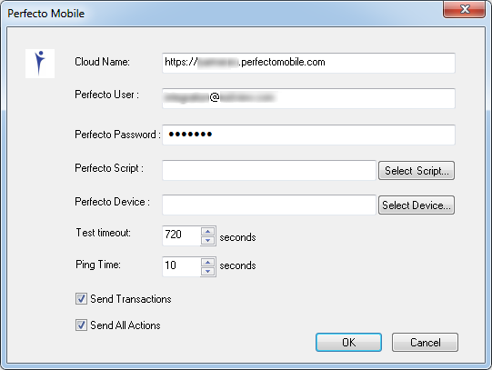
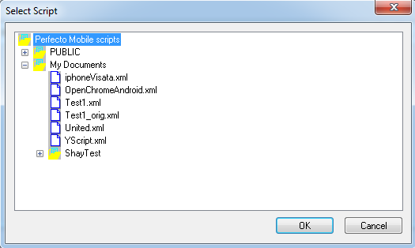
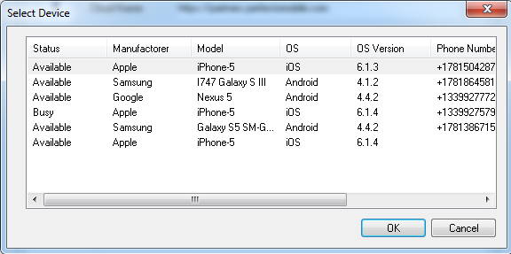
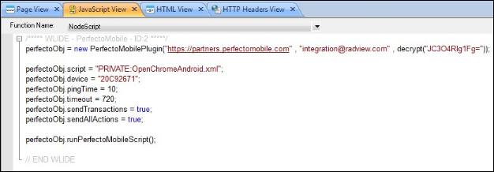
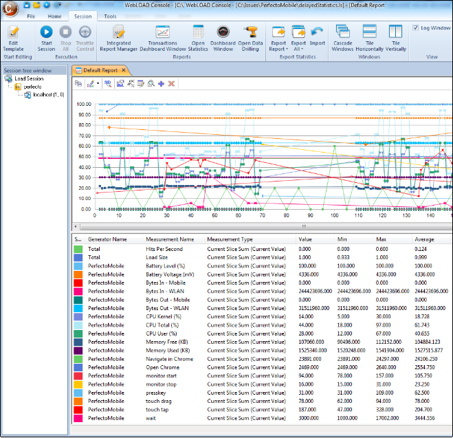

# Appendix F: Integrating with Perfecto Mobile

Perfecto Mobile is a cloud-based real-device mobile testing solution. It tests mobile apps on real devices, in real time, on live carrier networks.

WebLOAD enables creating and running scripts that run Perfecto Mobile scripts on mobile devices in the Perfecto Mobile cloud.

Note that you can only use this feature if you have an account in Perfecto Mobile.

## Creating a Perfecto Mobile Script

In order to create a Perfecto Mobile script, you must first create a Perfecto Mobile script in Perfecto Mobile. The WebLOAD script will execute this Perfecto Mobile script, and gather statistics from the s Perfecto Mobile cript and from the device.

For instructions on how to create a Perfecto Mobile script please refer to Perfecto Mobile tutorials.

**To create a Perfecto Mobile WebLOAD script:**

1. Drag the **Perfecto Mobile  **    icon from the Real Clients toolbox into the Script Tree at the desired location.

    The Perfecto Mobile dialog box opens.

   

    

   

1. In the **Cloud Name** field, enter the URL for Perfecto Mobile.

1. Enter the Perfecto Mobile credentials:

    - In **Perfecto User**, enter your user name.
    - In **Perfecto Password**, enter your password.

1. Click **Select Script**. WebLOAD accesses the Perfecto Mobile scripts and displays them in the Select Script dialog box.

    Select a desired script and click **OK**.

    

   

1. Click **Select Device**. WebLOAD accesses Perfecto Mobile and displays the list of available devices in the Select Device dialog box.

    Select a desired device and click **OK**.

    

1. Set the **Test timeout**. This is the maximum number of seconds that the test is allowed to run.

1. Set the **Ping Time**. This is the frequency in seconds with which WebLOAD will check test status during test running.

1. Specify whether to **Send Transactions** to WebLOAD. That is, whether to send a list of all the transactions (Groups) that are written in the Perfecto Mobile script (such as: ”Open Chrome”, “Navigate to my application”).

1. Specify whether to **Send All Actions** to WebLOAD. That is, whether to send a list of all the actions that the script performs (such as: ”Press Key”, “Touch Drag”).

1. Click **OK**. The script is created, and is ready to be run.

    

If you run the Perfecto Mobile script in WebLOAD Recorder, all you see are the periodic pings. In order to gather device, transaction and action statistics, you need to run the script in the WebLOAD Console, as described in the following section.

## **Viewing Session Results of a Perfecto Mobile Session**

To gather statistics about the Perfecto Mobile script, create in the WebLOAD Console a Load template that runs the Perfecto Mobile script repetitively but for a single user (Probing Client).

The following figure shows an example results window. Note that the example displays also Actions and Transactions. That is, in addition to the various device statistics (such as Battery Level), statistics are also displayed for actions (such as Touch Drag) and transactions (such as Navigate in Chrome).

