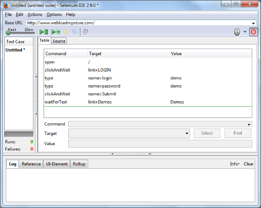
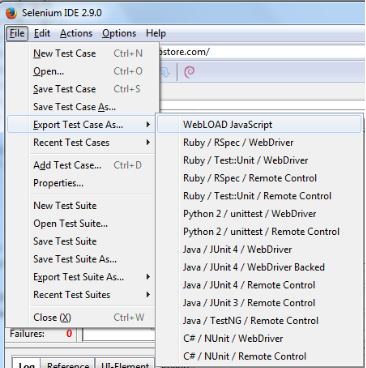
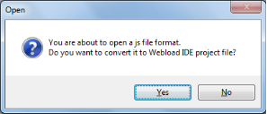

# Selenium Integration

Selenium is a browser automation tool, enabling you to record and playback your interactions with a browser. Its development environment (IDE) is a Firefox add-on, and it can run various browser drivers, such as IE, Chrome, and Firefox. Selenium is open-source software, and can be used without charge.

WebLOAD enables integration of a Selenium script into WebLOAD, and the gathering of navigation timing statistics. This is useful for gathering information regarding user experience, such as how long it takes to login, or how long it takes a page to render.

While WebLOAD simulates the load on a server, Selenium simulates the end-user experience. A hybrid WebLOAD-Selenium solution can thus give you the advantages of both simulation types. To implement such a solution, you can run a WebLOAD load session that does the following:

- Runs a regular WebLOAD script with many users.
- Run a Selenium script that simulates the same actions, for a single user.

The template will gather and display statistics from both scripts in the WebLOAD reports. In order to easily distinguish between the statistics from the regular WebLOAD script and those from the Selenium script, it is recommended to give the transactions in each of the two scripts a different distinctive name. For example:

- Selenium-user-login in the Selenium script
- WL-user-login in the WebLOAD script

> **Note:** This appendix is intended for users creating Selenium code to be used in WebLOAD only. If you wish to use Selenium as usual and add WebLOAD navigation- timing functionality, refer to the *Working with Java Selenium Scripts* section in Chapter 3 *Advanced JavaScript Script Features* of the *WebLOAD Scripting Guide*.

## Using Selenium Scripts

This section describes how to use Selenium scripts in WebLOAD.

### Prerequisites
1. Download the Selenium required jars:
   1. In the selenium web-site (<http://www.seleniumhq.org/>), select the **Download**

      tab.

   1. In ‘Selenium Client & WebDriver Language Bindings’, download the Java version (selenium-java-x.x.zip).
1. Unzip the downloaded file in a temporary location.
1. Copy the selenium-java-x.x.jar and all jars in the ‘libs’ folder to the WebLOAD Java extensions folder: c:\ProgramData\RadView\WebLOAD\extensions\java
1. If there are duplicate jars (same base name with different number), delete the older versions.

> **Important:** Selenium dependencies include jar files that are already shipped with WebLOAD, but not always the same version. Make sure there are no duplicates by deleting the older versions. For example, if you have both commons-codec-1.9.jar and commons-codec-1.3.jar, delete the commons-codec-1.3.jar file.

> **Note:** Version numbers are not decimal numbers, so for example commons-codec- 1.10.jar is newer than commons-codec-1.3.jar.

### **Step 1: Create a WebLOAD Selenium Script**
Do one of the following:

- Record a Selenium script using the Selenium IDE, and export it to WebLOAD. Refer to [*Recording and Exporting a Selenium Script* ](#_bookmark370). It is recommended to record the script both in Selenium IDE and in WebLOAD simultaneously.
- Create a Selenium script in WebLOAD using the Selenium building blocks. Refer to [*Selenium Building Blocks* ](./appendix_a.md#selenium-building-blocks).

#### Recording and Exporting a Selenium Script

##### Prerequisites for Selenium IDE Export

1. Install Firefox.

1. Install the Selenium IDE plug-in for Firefox.

1. Go to [https://addons.mozilla.org/en-US/firefox/addon/selenium-](https://addons.mozilla.org/en-US/firefox/addon/selenium-ide-webload-formatter/)[ ide-webload-formatter/ ](https://addons.mozilla.org/en-US/firefox/addon/selenium-ide-webload-formatter/)and install the WebLOAD plug-in for Selenium that enables exporting Selenium scripts to WebLOAD.

   

##### Recording with Selenium IDE

1. Launch Selenium IDE by clicking the Selenium IDE button in the Firefox toolbar.

   

   The Selenium IDE is launched.

2. Record a desired script in the Selenium IDE.

   

   

   > **Note:** It is possible to record the same script both in Selenium and in WebLOAD simultaneously.

3. After you finish recording, export the Selenium script to WebLOAD format as follows:

4. In the Selenium IDE, select **Export Test Case As** > **WebLOAD JavaScript**.

   

   

5. Enter a name for the script. The script is saved as a WebLOAD .js file.

Note that the .js file contains a WebLOAD command, reportStatistics, which appears periodically throughout the script. The command instructs WebLOAD to collect navigation timing statistics from the browser regarding the current page.

> **Note:** By default, WebLOAD reports navigation timing statistics as an average across all pages accessed by the Selenium Driver. If you wish to also display the statistics for a particular page separately, use a modified reportStatistics command, as described in [*Selenium Report Statistics* ](#_bookmark344).

### Step 2: Create a WebLOAD Recorder Project File from the Selenium Script
Perform one of the following:

- [*Automatic Conversion to a Project File*](#_bookmark372)
- [Manual Conversion to a Project File](#_bookmark373)

###### ***Automatic Conversion to a Project File***

1. In the WebLOAD Recorder, click **Open** in the **File** tab of the ribbon and select the JavaScript .js file you exported from Selenium.

   The Open message appears.

   

2. Click **Yes** to convert the JavaScript file to a WebLOAD Recorder project file.

   

###### Manual Conversion to a Project File

1. Open the JavaScript .js file you exported from Selenium, in a text browser such as Notepad.

1. Copy the contents of the file to the clipboard.

1. In the WebLOAD Recorder, select **New Project** in the **File** tab of the ribbon.

1. Click **Full Script** in the **Home** tab of the ribbon.

1. Paste the copied contents into the JavaScript View pane.

1. Save the project as a .wlp file.

   

### **Step 3: Edit Both Scripts**
As mentioned above, it is possible to record the same actions both in Selenium and in WebLOAD simultaneously. Whether you do so or not, after creating a WebLOAD script that parallels the Selenium script, edit both scripts as desired.

At this point it is recommended to give the transactions in each of the two scripts different distinctive names so that you will be able to easily distinguish between the statistics of each when viewing the test results. For example, give the login action the following names:

- **Selenium\_user\_login** – in the Selenium script
- **WL\_user\_login** – in the WebLOAD script

### Step 4: Run Both Scripts in a Test Session
1. In the WebLOAD Console, define a load session template that does the following:

   1. Runs the Selenium script with a single user.
   2. Runs the regular WebLOAD script with many users.

   > **Note:** For instructions on how to define two different scripts in a single template, refer to *Adding a New Script/Mix to the Template*, in the *WebLOAD™ Console User’s Guide*.

2. Run the load session.

### Step 5: View the Test Results
View the load session test results in the WebLOAD Console, WebLOAD Analytics, or the WebLOAD Web Dashboard.

The following table describes the navigation timing measurements. These measurements are gathered by WebLOAD’s reportStatistics command. By default, these measurements report navigation timing statistics as an average across all pages for which the reportStatistics command was invoked.

If you added an optional Page Name parameter to a reportStatistics command (refer to [*Selenium Report Statistics* ](#_bookmark344)), the resultant measurement names will be displayed as <Measurement Name>-<Page Name>. Thus for example, the measurement Selenium Redirect – Home Page displays the redirect time for the home page.

Note that in all navigation timing measurements, time is reported in units of seconds.

|**Measurement Name**|**Type**|**Definition**|
| :- | :- | :- |
|Selenium Redirect Time|Timer|
Redirection Time.

The time from redirectStart to redirectEnd.
|
|Selenium App Cache Time|Timer|
Fetch from cache, if relevant.

The time from redirectEnd to fetchStart.
|
|Selenium DNS Time|Timer|
DNS Lookup time.

The time from domainLookupStart to domainLookupEnd.
|
|Selenium Connect Time|Timer|
TCP Connect time.

The time from connectStart to connectEnd.
|
|Selenium Request Time|Timer|
Request until first-byte.

The time from requestStart to responseStart.
|
|Selenium First Byte Time|Timer|
The time from navigationStart to responseStart.

Note that the First Byte is calculated since navigation start, and not since request end as in WebLOAD.
|
|Selenium Page Response Time|Timer|
Response download time. The time from responseStart to

responseEnd.
|
|Selenium domInteractive Time|Timer|The time from navigationStart to domInteractive.|
|Selenium domContentLoaded Time|Timer|
The time from navigationStart to

domContentLoadedEventStart.

Note that this measures the time until domContentLoadedEvent-Start but not event end, meaning until all content is loaded, but not including the javascript execution.
|
|Selenium Processing Time|Timer|The time from load responseEnd to loadEventStart.|
|Selenium onLoad Time|Timer|The time from loadEventStart to loadEventEnd.|
|Selenium Full Page Time|Timer|The time from navigationStart to loadEventEnd.|

The following figure explains the various timing attributes listed in [Table 104.](#_bookmark377)

