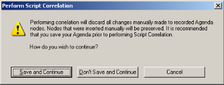
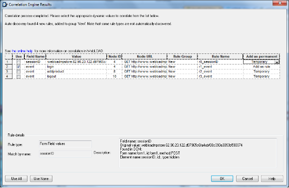
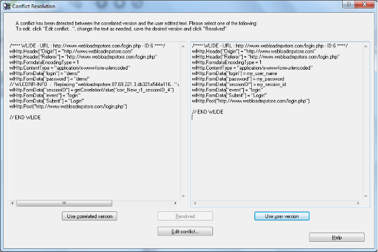
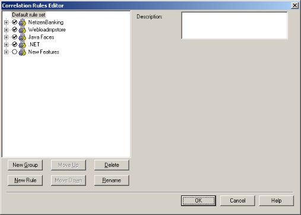
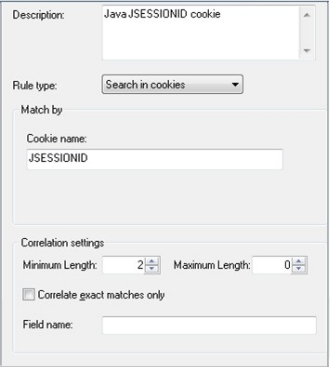

# Correlating Scripts

This section provides instructions for correlating scripts with WebLOAD Recorder. The WebLOAD correlation engine helps you overcome one of the main challenges of recording or replaying Web application load tests: dynamic data.

Dynamically generated data changes every time you run a Web application. For example, the session ID that uniquely identifies a user’s active session is allocated by the Web server or the application every time such a session is initiated. (The session ID is also used for session management. For more information, see [*Session Management* ](#session-management).) Such dynamic data cannot simply be recorded as is and played back, because the playback will inevitably fail.

WebLOAD enables you to correlate the most common methods used to pass dynamic data between a server and a client. The methods are:

- **Cookies** – This method is mostly used for session management, but cookies may also contain additional dynamic data sent from a server. In most situations, the browser returns the sent cookie in subsequent requests. This scenario is handled automatically by WebLOAD and no additional correlation activities are required. WebLOAD also supports cases where a value received in a cookie is sent as request data or a cookie is created in the client-side JavaScript.
- **URL rewriting** – This method is most commonly resolved by assigning the returned Session ID to a local variable and using this variable throughout the rest of the script.
- **Hidden form fields** – This method is most commonly used for passing localized dynamic data that is not necessarily within the scope of the full session.
- **Any response content** – Some applications return dynamic data within various types of HTTP responses, including client-side JavaScript and XML content.

## About Correlating Scripts with WebLOAD Recorder

WebLOAD contains a powerful rule based correlation engine. You can define rules that describe how dynamic values should be extracted in their application.

WebLOAD also provides automatic discovery of potential correlation rules. Using auto-discovery of rules eliminates the need to manually define correlation rules in some common cases.

WebLOAD Recorder identifies dynamic data using correlation rules. These rules can be configured to suit your correlation needs. For more information on correlation rules, see [*Configuring the Correlation Rules* ](#configuring-the-correlation-rules).

The WebLOAD correlation engine enables you to:

- **Automatically discover potential correlation rules** – WebLOAD can automatically suggest correlation rules for common scenarios, based on the values sent and received in the script, or for a specific value.
- **Reuse correlation logic** – Once the rules are defined or discovered, the correlation engine uses the rules to make all necessary changes to the script. The rules can be used unchanged in all future scripts with the same scenarios.
- **Re-run correlation at any time** – You can run the correlation process multiple times on previously recorded scripts. For example, if you perform correlation based on a particular set of rules, you can correlate that script another time based on a different set of rules, without re-recording the script.
- **Add comments to your JavaScript** – When dynamic data is correlated according to the correlation rules you define, WebLOAD Recorder can add comments to your JavaScript to help you keep track of the changes made by the correlation engine.
- **Keep a detailed correlation log** – The correlation engine can keep track of all the correlation operations performed on your script in the form of a textual log file. You can determine the location of this log file as well as the level of information it stores. Either you or RadView Technical Support can use the correlation log file to identify, investigate, and solve correlation problems.

### Correlating To and From Cookies
WebLOAD enables correlating to and from cookies.

Most cookies get their values from a previous response’s Set-Cookie header, originating from the server. These values are handled automatically by WebLOAD and do not require any action. They do not appear in the script.

Client-side cookies are created by the client using JavaScript in response to a user preference, client-side generated content, such as a random number, or for some other reason. These cookies appear in the script as wlCookie.Set() commands. The values of these cookies can be correlated like any other dynamic data.

## Performing Correlation

Correlation is performed on your script, based on the correlation rules. Correlation rules are defined in one of the following ways:

- **Auto-discovery of correlation rules** – When performing correlation with

  auto-discovery of correlation rules, the correlation engine compiles a list of the suggested correlation rules, enabling you to select the rules that are applicable to your application. For more information, see [*Approving the Correlation Engine Rules](#approving-the-correlation-engine-rules)* .

- **In the Correlation Rules Editor** – Before running the correlation engine, you can use the correlation rules editor to add and edit the rules.

> **Note:** You can turn discovered rules into permanent rules and then edit the rules in the correlation rules editor.

For more information, see [*Configuring the Correlation Rules* ](#configuring-the-correlation-rules).

> **Note:** Correlation cannot be performed on scripts that were not recorded.

### Performing Auto-discovery Correlation

**To perform correlation with auto-discovery of rules:**

1. Click **Correlation** in the **Home** tab of the ribbon and select **Correlate Script and Discover Rules** from the drop-down list.

   The Perform Script Correlation dialog box appears.

   

   

2. Click **Save and Continue** to save the changes in your script and perform correlation.

   -Or-

   Click **Don’t Save and Continue** to perform correlation without saving the changes in your script.

   -Or-

   Click **Cancel** to close the Perform Script Correlation dialog box without performing correlation in your script.

### Performing Auto-discovery Correlation for Specific Values
WebLOAD enables you to perform correlation with auto-discovery of rules for any value you select in a script. This provides correlation when normal auto-discovery is not sufficient. Auto-discovery correlation for specific values can be used instead of normal auto-discovery in the following cases:

- **Partial values** – Since auto-discovery only searches for exact matches, if the dynamic value you wish to correlate is part of the sent value, it is not found. For example, in `wlHttp.FormData[“data”]=”session\*1234” or wlHttp.FormData[“data”]=”`<xml>`<data sessionid= 1234/>`<xml>`”`, if only 1234 is dynamic, normal auto-discovery does not find this value.

  > **Note:** The only exception is in POST and GET commands, where the parameter name or values are replaced.

- **Dynamic URLs** – Similar to partial values, if a URL contains a dynamic value, it is not found. For example, in [http://www.mydomain.com/2131231/something.asp, ](http://www.mydomain.com/2131231/something.asp)if only 2131231 is dynamic, normal auto-discovery does not find this value..
- **Non-standard query strings** – Similar to partial values and dynamic URLs, if a value appears to be a URL but uses a different encoding method, it is not found. For example, in http://www.domain.com;strange=4342?normal=44&other=222, normal auto-discovery finds normal=44 and other=222, but does not find strange=4342.
- **Using the referer header** – When available, auto-discovery uses the referer header and only searches for values there. Values that need to be correlated may be elsewhere.
- **Filter noise** – By default, auto-discovery filters out values that are too short or have a low score. In some cases, required rules may also be filtered out.

**To perform correlation with auto-discovery of rules for a specific value:**

1. Select the value you wish to correlate in the script.

1. Click **Correlation** in the **Home** tab of the ribbon and select **Correlation Script for Specific Value** from the drop-down list.

   -Or-

   Right-click and select **Correlate Specific Value**.

   The Correlation Specific Value dialog box appears, displaying the selected value.

1. Click **OK**.

1. WebLOAD performs a regular correlation with auto-discovery of rules. The Perform Script Correlation dialog box appears ([Figure 61](#perform_script_correlation)).

1. Click **Save and Continue** to save the changes in your script and perform correlation.

   -Or-

   Click **Don’t Save and Continue** to perform correlation without saving the changes in your script.

   -Or-

   Click **Cancel** to close the Perform Script Correlation dialog box without performing correlation in your script.

### Setting the Default Correlation Action
You can control the default correlation action that WebLOAD should perform after recording.

**To control which correlation action is performed after recording:**

1. Click **Recording and Script Generation Options** in the **Tools** tab of the ribbon. The Recording and Script Generation Options dialog box appears in the ([Figure](#rec_script_gen_options)).
1. Select the **Correlation Options** tab.

   The Correlation Options tab moves to the front of the dialog box ([Figure](../images/corr_options.png))).

1. In the Correlation level drop-down, select one of the following:

   - **Do not run** – When recording is complete, go directly to the script without performing correlation. You can run the correlation engine at a later time.
   - **Use existing rules** – Run the correlation engine once the script recording is complete, only using the existing rules (do not try to auto-discover new rules).
   - **Discover rules** – Run the correlation engine using existing rules and try to discover new rules.
   - **Prompt** – A dialog that provides you with all of the options is displayed when the recording is complete. This is the default setting. For more information on using the Recording Complete dialog box, see [*Recording a script* ](./recording_scripts.md#recording-a-script).

## Automatic Discovery of Correlation Rules

WebLOAD enables you to automatically discover potential correlation rules.

The discovery process is based on reverse scanning of the script. The auto-discovery module searches for the sent values in previous responses and tries to formulate rules to extract the values.

> **Notes:**
>
> - Not all of the suggested rules are usually needed. Select the rules that are appropriate for your application. You can run auto-discovery as many times as
>
>   needed, and try different rules.
>
> - There are some rule types that are not automatically discovered and you must manually define a rule for them.
>

When running correlation with auto-discovery, the correlation engine uses the existing defined rules and does not discover them again. Inactive rules are also not rediscovered or used. Making a rule inactive can be used to prevent discovering rules that you already know are unneeded.

When the correlation process is complete, a review form is displayed for the user to choose which rules to use. For more information see [*Approving the Correlation Engine Rules* ](#approving-the-correlation-engine-rules)

## **Approving the Correlation Engine Rules**

When performing Auto-discovery correlation, the correlation engine compiles a list of the suggested correlation rules according to the dynamic values that were recorded in the script. This enables you to determine which rules to approve and use during the correlation.

**To approve the correlation engine rules:**

1. After running correlation with auto-discovery of rules, the Correlation engine results dialog box appears.

   

2. Edit the rules in the Correlation Engine Results dialog box according to the following table and click **OK**.

|**Column / Field**|**Description**|
| :- | :- |
|**Use**|
Select the rules to use in this script. You can click **Use All** to select all of the rules in the **Use** and **Add as permanent** columns, or **Use None** to deselect all of the rules in both columns.

**Note:** You can use the rule in the current script, without adding it as a permanent rule.
|
|**Field Name**|
The field name that was used to send the value in the request.

This field may be empty if it is defined in the rule.
|
|**Value**|The value extracted or replaced.|
|**Node ID**|
The node ID in the script. Each script node is marked with a comment indicating the node ID, for example:

/\*\*\*\*\* WLIDE - URL : [http://ww.mydomain.com/ ](http://ww.mydomain.com/)- **ID:42**

\*\*\*\*\*/
|
|**Node URL**|The GET or POST request of the value extracted or replaced.|
|**Rule Group**|The name of the group to which the correlation rule belongs.|
|**Rule Name**|The name of the correlation rule.|
|**Add as permanent**|
Specify how to use this rule:

- Never use – Do not use this rule in any script

- Add as rule – Add the rule to the permanent rules (always use)

- Temporary – Use the rule only in this run
|
|*Rule details*||
|**Rule Type**|
The method used to find the dynamic data to be correlated, according to the selected rule’s definition. To modify the rule, see [*Defining Correlation Rules* ](#defining-correlation-rules)

Possible values are:

- All body text

- Form field values

- User defined

- Replace with expression

- Search in cookies
|
|**…**|Additional rule type fields. These fields change according to the rule type.|
|**Description**|A summary of the selected rule’s details.|

## Resolving Conflicts between Manual Changes and Correlation Changes
Starting from WebLOAD 10.1, when you run correlation all the manual changes you may have made in the original JavaScript code are preserved by default (see [*Configuring the Correlation Options* ](./configuring_recorder_options.md#configuring-the-correlation-options)). However, the process of correlation also introduces some changes into the original JavaScript. Sometimes your manual changes conflict with the correlation changes. When this happens, a Conflict Resolution window appears in which you are asked to resolve the conflict.

The following [Figure](#conflict_resolution_window) shows a sample Conflict Resolution window.

The left side of the Conflict Resolution window displays the correlated version without any user changes, and the right side displays the user version without any correlation changes. You must do one of the following:

- Click **Use correlated version** – This keeps all correlation changes and discards all user changes.
- Click **Use user version** – This keeps all user changes and discards all correlation changes.
- Click **Edit conflict** – This enables editing the JavaScript to your satisfaction. When you select this option, a WinMerge window appears by default. For information, refer to [*Editing Conflicts between Manual Changes and Correlation Changes* ](#editing-conflicts-between-manual-changes-and-correlation-changes)below. When you finish editing, click **Resolved** in the Conflict Resolution window.

### Editing Conflicts between Manual Changes and Correlation Changes
When you select to edit conflicts between manual changes and correlation changes, a merge tool is automatically launched, displaying the two conflicting versions.

The default merge tool is the WinMerge application. Note that you can optionally specify a different merge tool, as described in [*Defining the Merge Tool Application* ](#_bookmark187).

1. Select the lines you wish to edit, and edit them as desired.
1. Save your changes.
1. Exit the WinMerge application.

## Configuring the Correlation Rules

WebLOAD Recorder enables you to configure the correlation rules used to define the correlation actions in your script with the Correlation Rules Editor. You can modify, create, and rename the correlation rules and groups.

### Opening the Correlation Rules Editor
Open the Correlation Rules Editor to view, create or edit correlation rules.

**To open the Correlation Rules Editor:**

- Click **Correlation** in the **Home** tab of the ribbon and select **Correlation Rules Editor** from the drop-down list.

  The Correlation Rules Editor opens, displaying application- and development framework-specific correlation rules by groups.

The following table describes the options in the Correlation Rules Editor.

|**Field**|**Description**|
| :- | :- |
|**Default rule set**|
Displays a tree of the correlation rules. Each node represents a correlation rule group. You can expand the group nodes to view the associated correlation rules.

The order of the correlation rules in the tree determines the order of their execution.

You can configure the correlation rules by selecting the checkbox adjacent to the rule that you want to apply in the correlation. You can expand or compress the tree using the **+/-** buttons. If an upper level component is selected, all of the subcomponents in that tree will be selected. If only some subcomponents in a tree are selected, the upper level component is selected and greyed.
|
|**Description**|Displays a description of the correlation group or rule. The type of information displayed in this area depends on the node selected in the Default rule set area.|
|**New Group**|Create a new correlation rule group below the selected group. If no group is selected, the new correlation rule group is created after the last group node.|
|**New Rule**|Create a new correlation rule below the selected rule. If no rule is selected, the new correlation rule is created after the last rule in the selected group.|
|**Move Up**|Move the selected correlation rule up inside its group or move the selected correlation group up in the tree.|
|**Move Down**|Move the selected correlation rule down inside its group or move the selected correlation group down in the tree.|
|**Delete**|Delete the selected correlation rule or group.|
|**Rename**|Rename the selected correlation rule or group.|
|**OK**|Accept your changes and close the Correlation Rules Editor dialog box.|
|**Cancel**|Discard your changes and close the Correlation Rules Editor dialog box.|

### **Creating Correlation Rules**
You can create correlation rules and groups to better suit your correlation requirements.

##### **To create a correlation rule:**

1. Click **Correlation** in the **Home** tab of the ribbon and select **Correlation Rules Editor** from the drop-down list.

   The Correlation Rules Editor dialog box opens (see the [Figure](#correlation_rules_editor)).

1. In the Default rule set area, select the correlation rule under which you wish to create your correlation rule and click **New Rule**,

   -Or-

   Right-click the correlation rule under which you wish to create your correlation rule and select **New Rule** from the pop-up menu.

   A new rule is created in the tree, at the specified location.

1. Modify the correlation rule parameters, as described in [*Defining Correlation Rules*](#defining-correlation-rules)

1. Click **OK**. The new correlation rule is added to the Default rule set.

##### **To create a correlation group:**

1. Click **Correlation** in the **Home** tab of the ribbon and select **Correlation Rules Editor** from the drop-down list.

   The Correlation Rules Editor dialog box opens (see the [Figure](#correlation_rules_editor)).

1. In the Default rule set area, select the correlation group under which you wish to create your group and click **New Group**,

   -Or-

   Right-click the correlation group under which you wish to create your group and select **New Group** from the pop-up menu.

   A new group is created in the tree, at the specified location.

1. Click **OK**.

### Defining Correlation Rules
You can modify the existing correlation rules and groups to better define your correlation requirements.

##### **To modify an existing correlation rule:**

1. Click **Correlation** in the **Home** tab of the ribbon and select **Correlation Rules Editor** from the drop-down list.

   The Correlation Rules Editor dialog box opens (see the [Figure](#correlation_rules_editor)).

1. In the Default rule set area, expand a correlation rule group. The correlation rules belonging to the group are displayed.

   

1. Click a correlation rule. The Correlation Rules Properties appear.

   

   

   > **Note:** The **Match by** fields vary according to the value selected in the **Rule type** field.

1. Modify the correlation rule properties according to the information in the following table:

   

   | **Field**                        | **Search Scope Value**      | **Match by Field**        | **Description**                                              |
   | :------------------------------- | :-------------------------- | :------------------------ | :----------------------------------------------------------- |
   | **Description**                  |                             |                           | A free text description of the selected rule.                |
   | **Rule type**                    |                             |                           | 
Determines the method used to find the dynamic data to be correlated. Possible rule type values are:

- All body text

- Form field values

- User defined

- Replace with expression

- Search in cookies
 |
   |                                  |                             | **All body text**         |                                                              |
   |                                  |                             | **Prefix**                | A text string that is used together with the Suffix parameter to uniquely identify the dynamic data string. The dynamic string should start immediately after the Prefix parameter. |
   |                                  |                             | **Suffix**                | A text string that is used together with the Prefix parameter to uniquely identify the dynamic data string. The dynamic string should end immediately before the Suffix parameter. |
   |                                  |                             | **Prefix Instance**       | The occurrence instance of the Prefix in the search scope. That is, if the Prefix parameter appears multiple times in the body text and you want to correlate only the second instance, select 2 |
   |                                  |                             | **Reverse**               | 
Search for dynamic data from the end of the search scope.

Note that if Reverse is selected, then Prefix Instance is also reversed. Thus, a value of 2 in Prefix Instance indicates the second from last occurrence instance.
 |
   |                                  |                             | **All instances**         | 
Search for all occurrences of the dynamic data.

When All Instances is selected, both Prefix Instance and Reverse are not meaningful and are disabled.
 |
   |                                  | **Form Field values**       |                           | Search for dynamic data in specific form fields, regardless of if they are hidden. You can specify either a form field name or ID. For example, if you specify a form field ID, then the correlation engine will only search for form field IDs and not for form field names. |
   |                                  |                             | **By ID**                 | Specify a form field ID to be searched.                      |
   |                                  |                             | **By Name**               | Specify a form field name to be searched.                    |
   |                                  | **User defined**            |                           | Search for dynamic data according to your own search criteria. |
   |                                  |                             | **JavaScript expression** | 
Specify a JavaScript expression to be used as an extraction logic. This can be a valid regular expression, DOM access function, or any other function call. For example:

extractValue (“prefix”, “suffix”,

document.wlSource )

To call a custom JavaScript function, the function must be accessible for both the execution engine and the correlation engine, so it should be included as an auto-discovered JavaScript code.

For more information on the auto-discovery of JavaScript files, see *JavaScript Language Extension*, in the *WebLOAD Extensibility SDK*.
 |
   |                                  |                             | **Save Source**           | Select this option if your JavaScript expression refers to the response body (document.wlSource). |
   |                                  | **Replace with expression** | **Expression**            | 
Replace data according to the Field name, regardless of the value. Replace the value with the value in Expression.

For example:

Rule type = Replace with expression

Expression = new Date().getTime() Field name = timestamp

During correlation, the timestamp value is replaced with “newDate().getTime()” instead of the date on which the script was recorded.
 |
   |                                  | **Search in cookies**       | **Cookie name**           | 
Search for dynamic data among the received cookies, according to the Cookie name.

Replace the dynamic data in the query string or post data request.

**Note:** In most cases, cookies sent by the server (in a Set-Cookie header) are echoed back by the client (in a Cookie header). WebLOAD’s engine automatically handles these cases and they do not require correlation.

Select this rule type when the value received in the cookie is used elsewhere in the request (using JavaScript) and correlation is necessary.
 |
   | *Correlation settings*           |                             |                           |                                                              |
   | **Minimum Length**               |                             |                           | Define the minimum length of the value to be considered for correlation. Shorter values, even if matched by a rule, are ignored. |
   | **Maximum Length**               |                             |                           | Define the maximum length of the value to be considered for correlation. Longer values, even if matched by a rule, are ignored. |
   | **Correlate exact matches only** |                             |                           | 
Select this option to replace the identified dynamic value with a variable only when the values are a complete match. If the value found is only a part of the sent value, the rule will be ignored.

For example, if the dynamic value found is “1234”and the variable replacing the dynamic value contains “123”:

- When **Correlate exact matches only** is unchecked, the value “1234” will be replaced by the variable and then a “4”.

- When **Correlate exact matches only** is checked, the value will not be replaced since it is not an exact match.

&emsp;**Note:** The values within a query string are also considered a complete match. For example, if the dynamic value is found in the following string, wl[Http.Get(http://domain?field=123), ](http://domain/?field=123\))the dynamic value “123” will be replaced by the variable regardless of whether the Correlate exact matches only is checked.

By default this is selected.
 |
   | **Field name**                   |                             |                           | 
Replace the dynamic value only when the value is sent with this field name.

**Note:** The **Field name** limits where the value can be replaced and is applicable to all rule types. Do not confuse this with the Search in: Form field values: by name field, which controls how the value is extracted

This field is optional, unless **Replace with Expression** is selected, in which case, this field is mandatory.
 |

   

1. Click **OK**.

The correlation rule is modified.

### Renaming Correlation Rules
You can rename correlation rules and groups to better organize the correlation rules according to your specific correlation requirements.

##### **To rename a correlation rule:**

1. Click **Correlation** in the **Home** tab of the ribbon and select **Correlation Rules Editor** from the drop-down list.

   The Correlation Rules Editor dialog box opens (see the [Figure](#correlation_rules_editor)).

1. Expand the correlation group to which your correlation rule is associated.

1. Slow double-click the correlation rule,

   -Or-

   Right-click the correlation rule and select **Rename** from the pop-up menu. The correlation rule’s name becomes editable.

1. Rename the correlation rule and click anywhere in the Default rule set area. The correlation rule is renamed.

   

##### **To rename a correlation group:**

1. Click **Correlation** in the **Home** tab of the ribbon and select **Correlation Rules Editor** from the drop-down list.

   The Correlation Rules Editor dialog box opens (see the [Figure](#correlation_rules_editor)).

1. Slow double-click a correlation group.

   -Or-

   Right-click a correlation group and select **Rename** from the pop-up menu. The correlation group’s name becomes editable.

1. Rename the correlation group and click anywhere in the Default rule set area. The correlation group is renamed.

## Session Management

The HTTP protocol has no built-in method of uniquely identifying or tracking a particular user or session within an application, without transmitting some data between the client and the server. The most common method for an internet

application developer to track a user’s interaction with a website is by providing the user with a unique session ID. This process is referred to as *session management*. Most Web servers generate such session IDs for internet application developers. In such cases, the Web servers can communicate the session IDs between the user’s internet browser and the server through:

- **Cookies** – When a server receives a request to create a session, it creates a session object and associates this object with a session ID. The session ID is then transmitted back to the browser as part of a response header and is stored with the rest of the cookies in the browser. On subsequent requests from the browser, the session ID is transmitted as part of the request header, which enables the application to associate each request for a session ID with the previous requests from that user. The entire interaction between the browser, application server, and the application is transparent to the end user.
- **URL rewriting** – The session ID information is embedded by the server in the URL and is then received by the application with the HTTP GET command (for example, when the client clicks on an embedded link within a page).
- **Hidden form fields** – The session ID information is stored within the fields of a form and submitted to the application. Typically, the session ID information is embedded within the form as a hidden field and is submitted with the HTTP GET/POST command.

The following sections provide information on how some of the most commonly used Web and application servers perform session management.

### IBM WebSphere Application Server
The IBM WebSphere Application Server (WAS) supports all the session management methods listed in [*Session Management* ](#session-management), but works best with cookies (which is its default method). The WAS implementation of this method differs from a pure cookie-based method by using only one cookie, JSESSIONID, that contains only the session ID information. (A pure cookie-based method would use multiple cookies, containing possibly sensitive user state information, such as an account number or user ID.) JSESSIONID is used by the server to associate the request with the information already stored on the server for that session ID.

In an HTTP session, all the attributes associated with a user’s request are stored on the server. Since the only information transmitted between the server and the browser is the session ID cookie, which has a limited lifetime, an HTTP session can provide a much more secure session management method than cookies, when configured in conjunction with SSL.

### Microsoft ASP.NET
Microsoft ASP.NET uses HTTP cookies to send a user a unique session key. For example, an ASP.NET application that uses sessions can respond to a user’s request with the following HTTP header:

`Set-Cookie: ASPSESSIONID=PUYQGHUMEAAJPUYL; path=/Webapp`

Any subsequent request made by this browser to the same server, in the virtual directory /Webapp, includes the following HTTP cookie header:

`Cookie: ASPSESSIONID=PUYQGHUMEAAJPUYL`

Each active ASP.NET session is identified and tracked using a 120-bit session ID string containing only the ASCII characters that are permitted in URLs. These session ID values are generated using an algorithm that guarantees a unique and random result. Such a guarantee is required to ensure that sessions do not collide and to prevent malicious user interference. These session ID strings are communicated between the client and server either by means of an HTTP cookie or a modified URL with the session ID string embedded, depending on how the application is configured.

### Apache Server
An Apache server (version 1.3 onwards) uses cookies to identify a new user and then records access to the application identified by this unique ID, through the mod\_usertrack module. When a user first visits the application, that user is sent a cookie with a unique ID. This unique ID is maintained until a predetermined timeout, thus enabling the server to track the user. This method enables the identification of different users even if they appear to originate from the same IP address. With Apache servers, the CookieName directive configures the name of the cookie that is stored.

