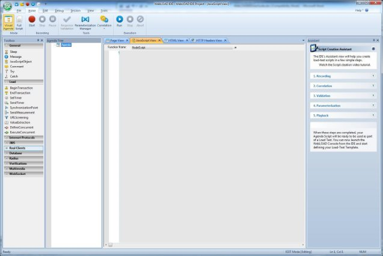
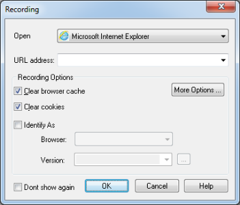
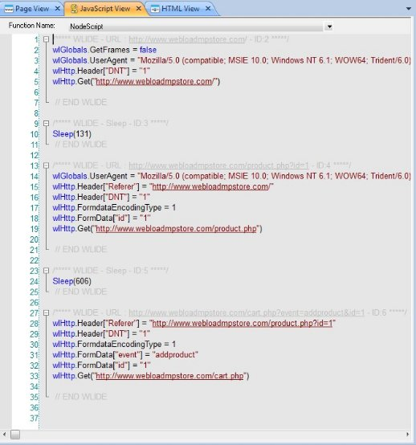
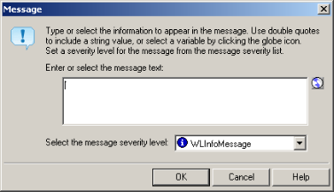
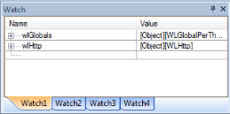
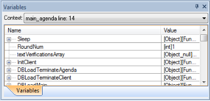
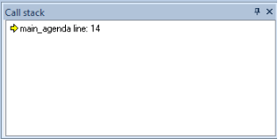

# WebLOAD Recorder Quick Start

Welcome to WebLOAD Recorder, part of the premier load testing tool that helps you quickly and easily test the functionality of your application under load. WebLOAD Recorder serves as the recorder for WebLOAD. Using an intuitive visual interface, WebLOAD Recorder helps you create, edit and debug your own test scripts, and prepare them for automatically testing your Web based applications.

WebLOAD Recorder’s visual environment gives you easy-to-use editing tools. Once you understand the components of the product and a few basic techniques, you can use these methods throughout WebLOAD Recorder.

This Quick Start explains how to start the program and use the features of the WebLOAD Recorder interface.

## Getting Started

This section shows you how you can get started quickly, using the RadView Software test site at [www.webloadmpstore.com.](http://www.webloadmpstore.com/)

You will be working with a test script. The basic steps are:

1. Recording your script – describes the steps in recording a basic script (see [*Creating](#creating-a-script)

1. Editing your script – explains how to edit and modify your script, insert new items into your script, and parameterize form data to create data driven tests (see [*Editing](#_bookmark26)[ Your Script* ](#_bookmark26)).

1. Running and debugging your script – explains run and debug your script (see

   

> **Note:** We recommend that you follow the steps in order. All examples are interrelated and dependent on earlier steps.

## Creating a Script

The first step in creating a script is to record your actions as you interact with your Web application.

**To create a script:**

1. Start WebLOAD Recorder by selecting **Start** > **Programs** > **RadView** > **WebLOAD**> **WebLOAD Recorder**. 

   WebLOAD Recorder opens.

   

2. Select **Create a new project.**

   The WebLOAD Recorder main window opens in Visual Editing Mode, for you to begin creating your script.

   When the WebLOAD Recorder main window first opens, it opens in Visual Editing Mode. In this mode, there are several active panes. The Script Tree appears on the left, and various view panes appear on the right: JavaScript View, Page View, HTML View, and HTTP headers View.

   In Visual Editing mode, you can simply record the actions in a browser without programming. Your interactions with your Web application are captured, recorded, and presented graphically in the Script Tree.

   Each node in the Script Tree is actually a visual representation of JavaScript code. You can view the contents of the nodes in the JavaScript view pane.

   To the left of the Script Tree are WebLOAD Recorder toolboxes that can be used to edit a script by dragging and dropping items from the WebLOAD Recorder toolboxes into the Script Tree. This makes programming easier by building the code behind an intuitive drag-and-drop interface.

   To the right of the View panes is the Assistant pane, which contains simple instructions to help you create your load test script. Click a link in the Assistant to go to the relevant item.

   
   

   

3. In the main window, in Visual Editing Mode, click **Start** in the **Home** tab of the ribbon to begin recording.

   The following dialog appears:

   

4. Click **OK**.

   WebLOAD Recorder begins recording all of the actions you perform in the browser, as indicated by the recording notification in the WebLOAD Recorder status bar.

   

   A blank browser window opens.

5. In the address bar, enter the Web address [www.webloadmpstore.com ](http://www.webloadmpstore.com/)to go to the WebLOAD test site.

   

   

   

6. Navigate through the site, performing the actions you want to test. For example:

   1. Click a product to view the product details.

   2. Click **Add to Cart**.

      Your actions are recorded and appear in the Script Tree as you navigate the site. (If you see more nodes in the Script Tree with different URLs, this may be traffic generated by browser plug-ins or extensions, for example, third-party toolbars.)

      

7. Click **Stop Recording** in the **Home** tab of the WebLOAD Recorder ribbon to stop the recording.

8. Click **Save** in the **Home** tab of the WebLOAD Recorder ribbon to save your script.

9. Type in QuickStart for the name of the script in the Save As dialog box and click **Save**.

   The script is saved with the extension \*.wlp.

You now have a basic script that can be used in a WebLOAD template. For complete information on creating, editing, modifying scripts, and adding functionality to your script, see the rest of the *WebLOAD Recorder User’s Guide*.

## Viewing Your Script

You can view the recorded script in four views:

- JavaScript View

  When the WebLOAD Recorder main window first opens, it opens in Visual Editing Mode. In this mode, there are several active panes. The Script Tree appears on the left, and various view panes appear on the right: JavaScript View, Page View, HTML View, and HTTP headers View.
  
  When recording, your interactions with your Web application are captured, recorded, and presented graphically in the Script Tree.
  
  Each node in the Script Tree is actually a visual representation of JavaScript code. You can view the contents of the nodes in the various View panes.
  
  In the JavaScript view pane, you can do the following:
  
  - Display the code for each node individually.
  
  - View code for the entire script as a whole.
  
  - View the code for different sections in the script, by clicking the Agenda root node in the Script Tree and selecting a section from the Function Name list at the top of the JavaScript view pane.
  

- HTTP Headers View

  Each node in the Script Tree also has a visual representation of response headers. These response headers were received when the script was recorded. You can view the headers of the nodes in the HTTP Headers view pane. Since each node has a correlated response header, but not all nodes contain HTTP methods, some headers will not have a response header. These nodes will have the message “This object does not have HTTP Headers” associated with them.
  
  In the HTTP Headers view pane, you can do the following:
  
  - Display the header for each node individually.
  
  - View headers for the entire script as a whole.
  

- HTML View – See [*Viewing the Recorded Script in the HTML View Pane* ](#_bookmark47).
- Page View – See [*Using the Page View to View Results* ](#_bookmark117).

## Editing Your Script

**To edit your script:**

1. Edit the runtime settings using the Default and Current Project Options.

1. Toggle between Visual Editing mode and JavaScript Editing mode. The default setting is the Visual Editing mode.

1. In Visual Editing mode, you can edit the Script Tree:
   1. Drag and drop items from the WebLOAD Recorder toolbox into the Script Tree.
   1. Right-click to insert new items.
   
1. In JavaScript Editing mode:
   1. Modify the JavaScript code.
   
      > **Important:** Each block of code starts with a comment that contains “WLIDE”, description, and ID number. The ID number is automatically generated by WebLOAD Recorder and is the connection between the script node and the specific header. It is recommended that you do not change the contents of this comment. If you do, important data might be lost.
   
   2. Right-click to insert functions and commands.
   
   3. Use the Syntax Checker to check the syntax of the code in your script file.
   
   4. Import JavaScript files.

> **Note:** For complete reference information on all JavaScript objects, variables, and functions used in WebLOAD Recorder scripts, see the *WebLOAD JavaScript Reference Guide*.

### Toggling Between Edit Modes

You can toggle between Visual mode and Full Script mode. The default setting is the Visual Editing mode.

**To toggle between Edit Modes:**

- Click **Visual Mode** in the **Home** tab of the ribbon,

  -Or-

​		Click the **Full Script** in the **Home** tab of the **ribbon**.

### Basic Editing Techniques

WebLOAD Recorder is designed for you to be able to create and edit your script easily, using the visual interface. Once you understand the basic techniques, you can use them throughout the WebLOAD Recorder interface.

Here are some simple techniques, described in this section, that you can use in WebLOAD Recorder:

- Drag and drop items into your Script Tree.
- Right-click within the script and select an available option from the Insert menu.

#### Drag and Drop

WebLOAD Recorder enables you to drag script items from the WebLOAD Recorder toolbox and drop them into your Script Tree.

**To drag and drop items into your script:**

1. Place the mouse pointer over the item in the WebLOAD Recorder toolbox that you want to add to your script, such as a Message.

1. Press and hold the left mouse button.

1. Drag the item into the Script Tree, and place the mouse pointer at the step in the script *after* which you want to add the item.

1. Release the mouse button.

   A dialog box to enter the parameters opens or the item appears in the Script Tree.

1. Click the script item in the Script Tree to view and/or edit the JavaScript code in the JavaScript view pane.

#### Right-Click Menus

Throughout WebLOAD Recorder, context-sensitive menus appear when you click the right mouse button, giving you the appropriate options to select at that point.

You can also right-click any script item in the Script Tree to display a menu.

**To insert a new item:**

1. Right-click the script item and click **Insert** from the menu.
1. Select an item from the options available.

### Adding Script Items

You can drag and drop an item, such as Message, from the WebLOAD Recorder toolbox. For the list of toolboxes, see [*The WebLOAD Recorder Toolbox Items* ](./appendix_a.md#the-webload-recorder-toolbox-items).

In the following instructions, adding a Message is used as an example. While running a test session, WebLOAD Recorder and WebLOAD Recorder’s Log windows display information about session execution. You can include Message nodes in your script, defining points at which to send error and/or notification messages to the Log window.

**To add a Message script item:**

1. Place the mouse pointer over the Message  icon in the WebLOAD Recorder toolbox.

1. Press and hold the left mouse button.

1. Drag the Message item into the script, and place the mouse pointer after the Web page to which you want to add the message.

1. Release the mouse button.

   The Message dialog box opens.

   

1. Enter the text you want to appear in the message.

1. To add a global variable to the message text, click the **globe** icon ( ) to the right of the input text box and select a global variable from the drop-down list.

   > **Note:** When entering a string value to the message, the string must be enclosed in quotation marks, for example, “Sample Message”.

1. Select a severity level for the message from the drop-down list. The following severity levels are available:

   - Information message (WLInfoMessage)
   - Minor error message (WLMinorError)
   - Error message (WLError)
   - Severe error message (WLSevereError)

1. Click **OK**.

   The Message item appears in the Script Tree.

## Running and Debugging Your Script

After your script has been developed, you run it to test for errors in your application. You can then debug your script.

### Running Your Script

**To run your script:**

1. Click **Run** in the **Debug** tab of the ribbon.

   As the script is running:

   - A yellow arrow points to the node being executed in the Script Tree.
   - If the JavaScript View tab is open, you will also see the yellow arrow pointing to the script.
   - If the Page View tab is open, you will see the pages that return from the Web server.
   - Nodes are added to the Execution Tree as they occur.
   - The GET and POST HTTP protocol commands are displayed in the HTTP Headers view pane.
   - Messages and errors generated by the test appear in the Log Window at the bottom of the screen.

1. At the prompt asking whether to save the changes to the project, click **Yes** and enter a file name to save your script file.

> **Note:** If there is more than one tester and the tests are to be shared between testers, the root directory (test plans and the results of the test plans) and the tests must be saved to a network drive.

### Debugging Your Script

WebLOAD Recorder provides an integrated debugger with a variety of tools to help locate bugs in your script. The debugger provides special menus, windows, dialog boxes, and grids of fields for debugging. You can pause the debugger and trigger WebLOAD Recorder to wait for user input before proceeding with running the script. In the script, you can set breakpoints and step into / over / out. You can also abort the debugger without executing the TerminateClient and TerminateAgenda functions, as opposed to stopping it completely.

**To debug your script:**

- Click **Step Into** or click **Run** in the **Debug** tab of the WebLOAD Recorder ribbon,

  -Or-
  
  Add breakpoints by clicking **Toggle Breakpoint** in the **Debug** tab of the WebLOAD Recorder ribbon, and then clicking **Run** to run the script.

> **Note:** If you stop the debugger prematurely (for example, by closing the WebLOAD Recorder or returning to edit mode), you can instruct WebLOAD, in the Settings dialog box, to prompt you to save the debugging session file. For more information about the Settings dialog box, see [*Configuring the Settings* ](#_bookmark181).

#### Debugging Using the Watch Window

You can use the Watch window to specify variables and expressions that you want to watch while debugging your program.

**To debug using the Watch window:**

1. Start debugging.
1. Select the **Watch Window** checkbox in the **Debug** tab

In the Name column, plus sign (+) or minus sign (-) boxes may appear. These appear if you added an array or object variable to the Watch window. Use these boxes to expand or collapse your view of the variable.

#### Debugging Using the Variables Window

The Variables window provides quick access to variables that are important in the scripts current context.

**To debug using the Variables Window:**

1. Start debugging.
1. Check the **Variables Window** checkbox in the **Debug** tab of the ribbon.

The Variables window displays variables used in the current statement and in the previous statement. It also displays return values when you step over or out of a function.

The Variables window contains a grid with fields for the variable name and value. The debugger automatically fills in these fields. You cannot add variables or expressions to the Variables window. The Context dropdown list displays the current scope of the variables displayed.

#### Debugging Using the Call Stack Window

The Call Stack window lists the function calls that led to the current statement, with the current function on the top of the stack.

**To debug using the Call Stack Window:**

1. Start debugging.
1. Select the **Call Stack** checkbox in the **Debug** tab of the ribbon.

This Quick Start has shown you an example of how to record, create, edit, run, and debug a script in WebLOAD Recorder. For more information about all the options available in WebLOAD Recorder, see the rest of the *WebLOAD Recorder User’s Guide* and the *WebLOAD Recorder Online Help*.

