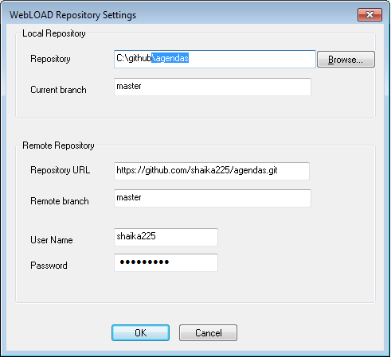
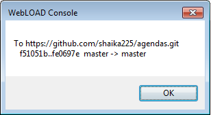
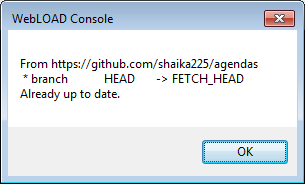

# Working with Git

Git is a free and open source distributed version control system for tracking changes in computer files and coordinating work on those files among multiple people.

WebLOAD supports basic Git operations, with easy access to Git operations from within WebLOAD Recorder and WebLOAD Console. WebLOAD assumes that you have downloaded and installed Git, and are familiar with the way it works.

## Prerequisites to working with Git

As prerequisites to working with Git, you need to:

1. Specify once in WebLOAD how to access the Git Local and Remote Repositories. Refer to [*Setting up Access to Git Local and Remote Repositories* ](#_bookmark131).

1. Make sure your WebLOAD files are saved in the directory defined as the Git local repository. This can be done in one of two ways:

   - Define the Git local repository directory to be the WebLOAD default directory.
   
   - Change the WebLOAD default directory to be the directory of the Git local repository.
   
     To do either of the above, you need to access the window where you can view or change the location of the WebLOAD default directory:
   
   - In the WebLOAD Console, navigate to **Global Options** > **File Locations**.
   
   - In the WebLOAD Recorder, navigate to **Settings** > **File Locations**.

Note that changing the WebLOAD default directory in either the Console UI or the WebLOAD Recorder UI, changes it for both.

## Setting up Access to Git Local and Remote Repositories
As a prerequisite to using Git operation from within WebLOAD, you need to once specify in WebLOAD how to access the Git Local Repository and Remote Repository.

> **Note:** You can perform this prerequisite task either from the WebLOAD Recorder, or from the WebLOAD Console. Once you perform it in one of them, Git operations will be accessible from both.

**To specify the Git local and remote repositories:**

1. Click **Repository Settings** in the **Tools** tab of the ribbon. 

   The WebLOAD Repository Settings window appears.

   

2. In the **Local Repository** section:

   1. Specify the location of the local repository.
   2. Specify the **current branch**.

3. In the **Remote Repository** section:

   1. Specify the location of the remote repository (either a URL or a directory).
   2. Specify the **remote branch**.
   3. Specify the **User Name** and **Password** for accessing the remote repository.

4. Click **OK**.

## Performing a Commit action

If you setup WebLOAD to support Git, you can perform a Commit, that is, save to the Git local repository, any WebLOAD objects you are currently working on. This functionality is available in both the WebLOAD Recorder and the WebLOAD Console.

- When you select Commit in the WebLOAD Recorder, the script you are currently working on as well as all its additional information, are saved to the Git local directory.
- When you select Commit in the WebLOAD Console, the test definition of the test you are currently working on, as well as the session created by test execution, are saved to the Git local directory

**To Commit a WebLOAD object:**

1. Click **Commit** in the **Tools** tab of the ribbon.

   A window appears in which you can enter a Commit comment. 

   

2. Optionally enter a comment, and click **OK**.

## Performing a Commit Dir action

If you setup WebLOAD to support Git, you perform a Commit dir, that is, save to the Git local repository an entire folder (with all its descendants). This folder must be located under the local repository folder. This functionality is available in both the WebLOAD Recorder and the WebLOAD Console.

**To perform a Commit dir:**

1. Click **Commit dir** in the **Tools** tab of the ribbon.

1. In the File Explorer window that appears, specify the directory you wish to commit.

   A window appears in which you can enter a Commit dir comment.

   

   

   

1. Optionally enter a comment, and click **OK**.

## Performing a Push action

If you setup WebLOAD to support Git, you can perform a Push, which causes all Commits you had made to the Git local repository, to be pushed to the Git remote repository. This functionality is available in both the WebLOAD Recorder and the WebLOAD Console.

**To perform a Push:**

1. Click **Push** in the **Tools** tab of the ribbon.

2. A window appears, informing you of the Git Push operation and its success status.

   

3. Click **OK**.

4. If the Push operation is rejected, for example because a conflict has arisen due to changes made by two different users, a window appears, displaying the Git rejection message. Follow the instructions in the message, and resolve the rejection using your chosen Git UI.

   

## Performing a Pull action

If you setup WebLOAD to support Git, you can perform a Pull, which pulls data from the remote repository to the local repository. This functionality is available in both the WebLOAD Recorder and the WebLOAD Console.

A Pull operation pulls the entire branch from the remote repository and updates the local repository and directories.

**To perform a Pull:**

1. Click **Pull** in the **Tools** tab of the ribbon.

   A window appears, informing you of the Git Pull operation and its success status.

   

2. Click **OK**.

## Opening the Git UI

If you setup WebLOAD to support Git, you can launch your Git UI from within WebLOAD. This functionality is available in both the WebLOAD Recorder and the WebLOAD Console.

**To launch the Git UI:**

1. Click **Open Git Gui** in the **Tools** tab of the ribbon.

   The Git UI is launched.

